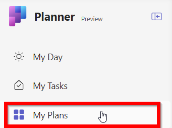

# Downgrading premium plans to basic plans

There are currently capabilities that are available in basic plans that aren’t yet available in premium plans. For example, teams that rely on recurring tasks will need to work in basic plans until that feature becomes available in premium plans.

Teams that have upgraded a basic plan to a premium plan, but need to restore functionality only available in basic plans can choose to downgrade their premium plan.

## What to know before downgrading

**The basic plan doesn’t have all the features in the premium plan.**
Features such as Timelines, Custom fields, and Goals are only available in premium plans. After the plan is downgraded back to a basic plan, users will not have access to these features.

**Downgrading the plan restores it to the point in time the basic plan was upgraded.**
Any edits that were made in the premium plan will need to be manually copied back into the basic plan.

**After downgrading, the premium plan will no longer be shared with a group.**
Only the user who downgraded the plan will see both the premium plan and the basic plan in their “My Plans” view within the Planner App in Teams. They will be able to open the premium plan. Other members of the team will not be able to open the premium plan. The premium plan can be shared again to give others access to it.

**Other users will not see the tasks that were assigned to them in the premium plan.**
Because the premium plan is no longer shared with the group, other users of the premium plan will no longer be able to open it or edit tasks that have been assigned to them. This also means that other users will no longer see their tasks in the “My Tasks” view in Planner in Teams. Only the user who downgraded the plan will see and edit tasks that were assigned to them in the premium plan.

## Completing the downgrade

1. To get started with downgrade first, open the details pane for the premium plan. Click on the title of the plan to open the pane. 

2. Scroll down to the bottom of the pane and click on the “Switch back to basic” link.

3. To begin the downgrade, press the “Downgrade plan for everyone” button in the dialog that pops up. 

The process can take a few minutes to complete. Once it is done, the user will be in the downgraded, basic plan. Both the premium plan and the basic plan will be visible in the “My Plans” view for the user who triggered the downgrade. 

