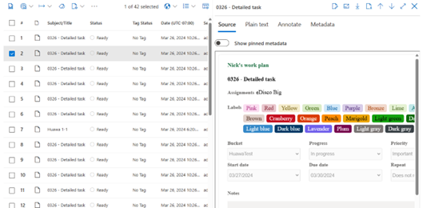

# Microsoft Planner support in Microsoft Purview

This documentation will cover considerations unique to Planner. For general usage of Microsoft Purview, consult the resources available here, [Microsoft Purview | Microsoft Learn](https://learn.microsoft.com/purview/).

## Data and capabilities available in Microsoft Purview

* eDiscovery content search and legal hold
* Supported Planner content: Tasks in Plans that are shared with groups.
* Includes Tasks, comments, and attachments.

Unsupported: Personal (roster) plans, plans in Loop components, premium plans (formerly projects)

## eDiscovery for Planner Data

### Applying a hold

A hold is a way to preserve content that is relevant to a case and prevent it from being deleted or modified by users. To apply a hold in Microsoft eDiscovery, go to the Holds tab of the case and click New hold. Select the locations where you want to apply the hold. You can choose from Exchange mailboxes, SharePoint sites, OneDrive accounts, Teams messages, and Planner plans. For Planner data, select the SharePoint site associated with the plan and check the box for Planner tasks. Review the summary of the hold and click Create this hold to apply it to the selected locations and content.

To validate that the hold is working, you can try to delete a Planner task that matches the hold conditions and then run a new collection and add it to the review set. When a hold is applied, the task should not be deleted but moved to the Preservation Hold Library of the SharePoint site. The compound path of the task in the review set should include ``PreservationHoldLibrary`` in the path.

### Creating a collection

Collections in eDiscovery help you quickly scope a search for content across email, documents, and other content in Microsoft 365. Click *New Collection* and provide a name and description for the collection. Select custodial data sources or choose any additional locations not set up as custodial or non-custodial data sources for the case. To filter for Planner data, define the search query to be ``ItemClass = “IPM.File.Tasks”``.

> [!NOTE]
> Do not use the *Tasks* item type in the Query Builder. This will only return tasks that created in Outlook. This type does not include tasks created in Planner.

 

### Committing to a Review Set

Once the collection settings are reviewed and submitted, the collection will be added to a review set as a draft collection. You should be able to see a collection estimate and a preview of the collected items so you can validate the size and scope of the results before committing to a review set. Once a review set is created, Planner Tasks will appear as *Documents*. The source view of the document is designed to mimic the formatting of Planner Tasks. All Planner tasks will be rendered as a tree in the review set where joining comments, attachments and tasks can be viewed. All data for the tasks will be visible in the *Metadata* tab.

### Exporting data

To export data from the review set, select export, give the export a name, and then click *export*.

Exit the review set, click the *export* tab within the case and monitor the export job. After the export job is finished, click *download*. In the downloaded file, the basic rendering should be json files and the content should be the same as the source tab you see in the review set. If rich rendering and the ``exportModel`` settings are configured as ``exportModel: "Meta"``, then the files should export as the file extension you set in export model. Otherwise it will export as plain text with json.
