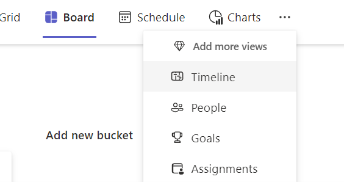

# Converting basic plans into premium plans

There are several capabilities that are available in premium plans that don't exist in basic plans. For example, premium users can create dependencies between tasks in a premium plan such that when one task is moved out (by any user), dependent tasks also move out. More details on the differences between basic and premium plans can be found [here](https://support.microsoft.com/office/comparing-basic-vs-premium-plans-5e351170-4ed5-43dc-bf30-d6762f5a6968).

The following plans are eligible to be converted into premium plans:
- Basic plans that are shared with a Microsoft 365 group.
- Basic plans, which aren't yet shared (coming soon).
  
Plans created outside of Planner core application or have business rules can't be converted. Examples include:

- Published Plans
- Loop task list plans

Any member of an eligible basic plan can convert it to a premium plan. Premium plans that were converted can be downgraded back to basic plans. Learn more about [Downgrading a premium plan](plan-downgrade.md).

Users with a Planner premium license can convert a basic plan to a premium plan. In scenarios where a Microsoft 365 user is viewing a basic eligible plan and starting a Planner premium trial, the basic plan will be converted into a premium plan.

## What to know before downgrading

- A new premium plan is created with all the data from the basic plan.  
- The plan is upgraded in-place. Users who have access to the basic plan can access the premium plan once the conversion is complete.  
  - Users and guest who have Microsoft 365 licenses can continue to work in premium plans as before. See Microsoft 365 User access and guest access for more information.
  - Users accessing plans from places that don't support premium plans will either be automatically directed to a location that supports premium plans, or given instructions on how to access premium plans. See redirection information in this article.

- The basic plan becomes read-only, is archived for 90 days, and can't be accessed. Users in the premium plan have 90 days to downgrade back to their basic plan. After 90 days, the basic plan is removed. Details about why and how to downgrade back to a basic plan can be found in this article.
- If there's data incompatibility between the basic and premium plan, the conversion logic falls back to an import flow:
  - The basic plan isn't modified and access to the members remains the same. The team can continue to work on the basic plan without being affected.
  - A new premium plan is created with a copy of the compatible data and understands what was incompatible. The user who initiated conversion has access to the premium plan copy.
  - Possible next steps:
    - Modify the basic plan to remove compatibility issues and attempt to convert again.
    - Review the premium plan copy and share with the team if it meets your requirements.
Review [Import a plan](https://prod.support.services.microsoft.com/office/import-a-plan-into-a-project-for-the-web-016f9e4d-28c6-4f61-a1b1-82187185977d) to understand scenarios and limits where the system will fall back to the import flow.
- Power Automate workflows and 3rd party applications need to be modified to work with premium plans.  See [Use V2 Project schedule APIs with Power Automate](/dynamics365/project-operations/project-management/scheduling-apis-powerautomate-v2) and [Project schedule API](/dynamics365/project-operations/project-management/schedule-api-preview) for more information.

## Converting to a premium plan

> [!NOTE]
> The ability for premium users to convert basic plans into premium plans is beginning to roll out.

1. Open the basic plan in the new Planner application.
2. Select **More** (…).
 
 

3. Choose a premium view.
4. Select **Convert to premium for everyone**.
5. Once completed, everyone will be working on the premium plan.

The process can take a few minutes to complete. Once complete, the user and their team will be redirected to the premium plan.

## Redirection to premium plans

After plan conversion, the following is how Planner endpoints will function.

| **Entry Point** | **Flow** |
|--------------|--------------|
| Planner in Teams       | Premium plans are rendered in-place.|
| Planner Web | Users are redirected to the premium plan in Project for the web.|
| Planner Mobile App | Users can still see all the tasks in the **Assigned to me view**. In the premium plan, users are asked to open the premium plan in Project for the web.|
| Planner in Teams Mobile | Users can still see all the tasks in the **Assigned to me view**. In the premium plan, users are asked to open the premium plan in the Teams Desktop app. |
| Basic plans added to Loop | Users are asked to open the premium plan in Project for the web by following the provided link.|
| Basic plans added SharePoint sites | Users are asked to open the premium plan in Project for the web by following the provided link.|
| Links directly to a basic plan or task within the plan | Users are redirected to the premium plan in Project for the web and to the specific task if specified. |
