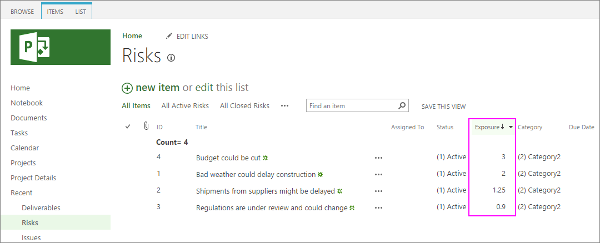
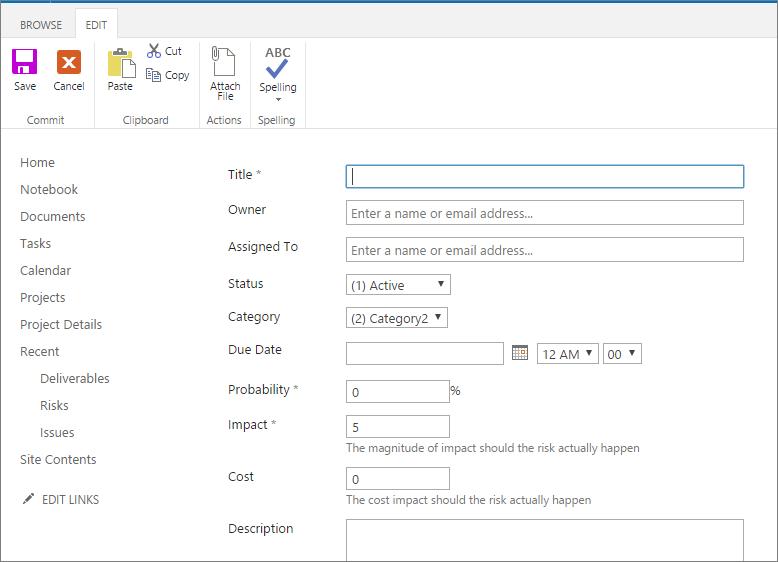
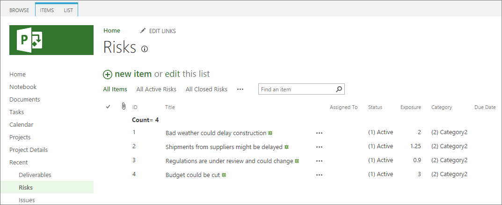

# Project Online: Best practices for managing risks

Part of the natural landscape of every project is risk—some level of uncertainty that comes from not knowing how future events will unfold as you and your team implement the project. To keep your project from being derailed by an unfortunate happening or even an unexpected opportunity, develop a risk management plan for your project and track it in Project Web App through your Project Online subscription.
  
    
    

## In this topic

-  [What is risk management and how does it relate to project management?](0523899d-1d3a-4561-8d42-acb0951602ba.md#_what)
    
  
-  [Best practices in risk management for projects](0523899d-1d3a-4561-8d42-acb0951602ba.md#_best)
    
  
-  [Record and track risks in Project Online](0523899d-1d3a-4561-8d42-acb0951602ba.md#_record)
    
  

## What is risk management and how does it relate to project management?

A risk is any level of uncertainty that can have an adverse effect on your project. Ordinarily, we think of risks in terms of bad things that could happen, for example, a hurricane delaying a construction project. However, risks can also be positive and lead to greater opportunities, for example, a marketing campaign so successful that customer response overloads the company's website.
  
    
    
Risk management, then, is the process of identifying and planning for risks that could potentially affect your project in terms of scope, activities, schedule, costs, resources, quality, and so on. Here are some examples: 
  
    
    

- The product or service under development depends on new technology that's not fully tested.
    
  
- Subcontractors and other resources might not be available when you need them.
    
  
- Shipments from suppliers might be delayed.
    
  
- An unknown competitor could get its version of the product or service to market first.
    
  
- Construction is scheduled during the winter, when snowy conditions could cause delays.
    
  
- Vague project requirements might cause scope creep.
    
  
- There's a steep learning curve on the software tools being used in the project.
    
  
 [Part of the natural landscape of every project is risk—some level of uncertainty that comes from not knowing how future events will unfold as you and your team implement the project. To keep your project from being derailed by an unfortunate happening or even an unexpected opportunity, develop a risk management plan for your project and track it in Project Web App through your Project Online subscription.](0523899d-1d3a-4561-8d42-acb0951602ba.md#_top)
  
    
    

## Best practices in risk management for projects

This section details techniques to help you define the risk management plan for your project.
  
    
    

### Identify the risks

The following are ways that you and your team can identify project risks. Remember to consider positive risks, or opportunities, that could arise.
  
    
    

- Call the project team together for the purpose of identifying risks. Have a facilitator and a recorder so that everyone has a voice and all risks are captured.
    
  
- Review the major phases of the project plan with an eye toward risks.
    
  
- Review lessons learned from past similar projects, looking at what went wrong on those projects and determining if that could happen in your current project. Also look at what went particularly well, and see if any of those were surprises that might be a positive risk for your project.
    
  
- Do a SWOT analysis to examine strengths, weaknesses, opportunities, and threats to the project. This is another good way to look at positive as well as negative risks.
    
  
- Consider risk categories including technical, external, organizational, and project management factors. Technical aspects might include project requirements and the complexity or reliability of technology being used in the project. External factors might include subcontractors and suppliers, the weather, customer needs, the market, and regulatory changes. Organizational risks might include dependence on other projects, multiple demands for the same resources by different projects, competition for funding, or changing strategic priorities. Project management risks can include the accuracy of the work and cost estimates or methods for collecting status and tracking costs.
    
  
- Consider the project triangle (scope, time, and money) along with other project drivers for risks. What might affect scope and activities? What can happen to key milestones and the project finish date? The project budget and expenses? Resource availability and performance? Quality?
    
  

### Score the risks

After you've captured the risks, it's time to score them as to probability and impact. For each risk, enter either a number or percentage that represents the likelihood of this risk to be realized. 
  
    
    
Also for each risk, enter a number that represents the importance or impact this risk would have if it happened. You can make the scale be whatever seems most useful to you, as long as you apply it consistently to all risks. 
  
    
    
Multiply the two numbers, and you have your risk score. 
  
    
    

### Prioritize the risks

Order the risks from highest to lowest risk scores to help you see where you need the most focus in your risk management plan. Here's an example of a list of risks that you can create using Project Web App. Notice that they're in order from the highest to the lowest risk scores. For more information, see  [Record and track risks in Project Online](0523899d-1d3a-4561-8d42-acb0951602ba.md#_record) later in this topic.
  
    
    

  
    
    

  
    
    

  
    
    

  
    
    

  
    
    
As you scan your list of prioritized risks, you'll probably see natural groupings:
  
    
    

- Risks with the higher scores call for a planned response.
    
  
- Risks with moderate scores call for a case-by-case decision as to whether they warrant a planned response.
    
  
- Risks with low scores are not likely to need a planned response, but they are worth revisiting occasionally throughout the life of the project to see whether conditions have changed to give them a higher priority.
    
  

### Develop the risk management plan

With your scored and prioritized risks, you now have the basis for developing the risk management plan for your project. For each of the risks that you've decided that your team needs to manage, determine the following possible responses:
  
    
    

- Avoid the risk. If the risk incurred isn't worth being part of the project, then eliminate it. For example, it might be wiser to replace a task or resource that carries an unacceptably high risk with a suitable alternative.
    
  
- Transfer the risk to someone else's responsibility, for example, another department or a vendor. Other examples include insurance or warranties. The cost of transferring the risk needs to be less than what you'd experience if you retained responsibility for the risk.
    
  
- Create a contingency plan to prevent the risk from happening, or to mitigate or minimize the effect of the risk if it happens. This is the part of your risk management plan that's likely to take the most effort, because you're creating an alternative plan along with trigger points that determine when the contingency plan is activated.
    
  
- Accept the risk. For some high-priority risks, it's more cost-effective to "take the risk" than to avoid, transfer, or mitigate it. 
    
  
Note that the plan for a single risk can include one or more of these responses. For example, you might do what you can to prevent the risk from happening, but you might also have a plan for what you'd do if it happens anyway.
  
    
    
When deciding which of the approaches to take, consider the costs in terms of money, time, and effort. You want to strike a healthy balance between moving forward with your project and avoiding, preventing, or planning for important risks. 
  
    
    

### Assign a risk manager

Choose someone other than the project manager to be the risk manager responsible for foreseeing risks throughout the life of the project. This individual should be someone who can look at the project with a healthy skepticism about uncertainties.
  
    
    
The risk manager is also the one who keeps an eye on trigger points for contingency plans, monitors the lower-priority risks, and ensures that the risk management plan is being carried out.
  
    
    

### Encourage team members to report risks

All team members should have the opportunity to report risks that they foresee in the project. In Project Web App, team members can enter risks on their assigned tasks and projects. This could even be an anonymous risk reporting channel, if you think it might reap better results. 
  
    
    
 [Part of the natural landscape of every project is risk—some level of uncertainty that comes from not knowing how future events will unfold as you and your team implement the project. To keep your project from being derailed by an unfortunate happening or even an unexpected opportunity, develop a risk management plan for your project and track it in Project Web App through your Project Online subscription.](0523899d-1d3a-4561-8d42-acb0951602ba.md#_top)
  
    
    

## Record and track risks in Project Online

In Project Web App, which you have through your Project Online subscription, you can create the risk database for your project and continually monitor and update your risk management plan. In this risk tracking system, you can set the probability and importance, assign it to a team member, and give it a deadline. Team members can also view and edit risks in Project Web App.
  
    
    

### 

 **Record a risk**
  
    
    

1. On the Project Online ** Home** page, under **Track your work**, select **Projects**.
    
  
2. On the **Project Center** page, under the **Project Name** column, select the name of the project for which you want to add or edit a risk.
    
  
3. In the left pane, click **Risks**.
    
  
4. On the **Risks** page, click **new item**.
    
  
5. Complete the form which appears. The required fields are **Title**, **Probability**, and **Impact**. Additional fields include **Owner**, **Assigned To**, **Cost**, **Description**, **Mitigation Plan**, **Contingency Plan**, and **Trigger**. Complete any of the other fields for which you have information. You can always add more information later.
    
    
  
    
    

  
    
    

  
    
    

  
    
    

    
  
6. At the bottom of the page, select the **Save** button.
    
  
 **Modify risk information**
  
    
    

1. On the Project Online ** Home** page, under **Track your work**, select **Projects**.
    
  
2. On the **Project Center** page, under the **Project Name** column, select the name of the project for which you want to add or edit a risk.
    
  
3. In the left pane, click **Risks**.
    
  
4. On the **Risks** page, select the name of the risk you want to modify.
    
  
5. Above the form which appears, select **Edit Item**. 
    
  
6. Change or complete any of the fields. 
    
  
7. To attach a file to the risk record, on the **Edit** tab, in the **Actions** group, select **Attach File**. Select **Choose File**, navigate to and select the file, and then click **Open**. Click **OK**. 
    
  
8. At the bottom of the page, select the **Save** button.
    
  
 **View the list of risks on a project**
  
    
    

1. On the Project Online ** Home** page, under **Track your work**, select **Projects**.
    
  
2. On the **Project Center** page, under the **Project Name** column, select the name of the project for which you want to add or edit a risk.
    
  
3. In the left pane, click **Risks**.
    
  
4. On the **Risks** page, review the risks entered for the current project.
    
  
5. To sort in ascending order by a field, for example, **Assigned To**, **Status** field, or **Exposure** (the product of your **Probability** by **Impact** factors), click the column heading. To sort in descending order, click the column heading a second time.
    
    
  
    
    

  
    
    

  
    
    

  
    
    

    
  
 [Part of the natural landscape of every project is risk—some level of uncertainty that comes from not knowing how future events will unfold as you and your team implement the project. To keep your project from being derailed by an unfortunate happening or even an unexpected opportunity, develop a risk management plan for your project and track it in Project Web App through your Project Online subscription.](0523899d-1d3a-4561-8d42-acb0951602ba.md#_top)
  
    
    
