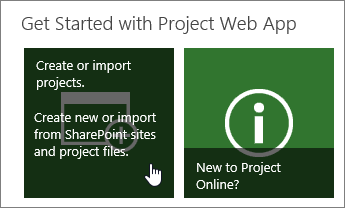
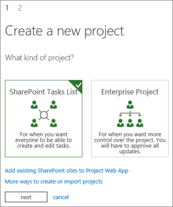
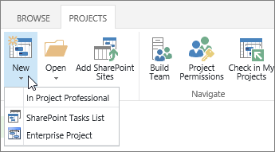

# Create a project in Project Web App

The easiest way to create a new project in Project Web App is to click **Create or import projects**, under **Get Started with Project Web App** on the main Project Web App home page.
  
    
    

  
    
    

  
    
    

  
    
    

  
    
    

Next, choose which type of project you want to create.
  
    
    

  
    
    

  
    
    

  
    
    

  
    
    

## Enterprise projects

Enterprise projects offer sophisticated scheduling, including enterprise resource management and timesheets. If you choose to create an enterprise project, you will  [Create a new task](99b036ba-8207-4702-a3fc-14c49f913683.md) in Project Web App.
  
    
    

## SharePoint tasks lists

SharePoint tasks lists are created as a project site with a tasks list. Tasks can be assigned to people and added to a timeline for a quick look at the overall plan. As you build your tasks list on the project site, those tasks will be viewable from the Project Center in Project Web App.
  
    
    
When you create a SharePoint Tasks List project in Project Web App, it starts as a  [Get started with a project site](http://technet.microsoft.com/library/8b68274b-622d-4a99-9245-1d205897cd43%28Office.14%29.aspx). You can  [Add tasks to your project](http://technet.microsoft.com/library/207fa4b6-8bea-4066-a805-9a46f65a6546%28Office.14%29.aspx),  [Add tasks to the timeline](http://technet.microsoft.com/library/5fecb585-cee4-4e1b-bbba-63d734579dc8%28Office.14%29.aspx), or  [Upload files to a library](http://technet.microsoft.com/library/da549fb1-1fcb-4167-87d0-4693e93cb7a0%28Office.14%29.aspx) on the project site.
  
    
    
You can also add a  [Overview: View a SharePoint task list in Project Web App](720757ef-545c-4635-98f9-c231d662561b.md), which lets you see workloads for everyone across SharePoint and Project Web App.
  
    
    

## Project Professional

Another option is to create a new project using Project Professional.
  
    
    
In the **Project Center**, choose **Projects** > **New**.
  
    
    

  
    
    

  
    
    

  
    
    

  
    
    

  
    
    
When you create a project this way, it is saved to Project Web App as an enterprise project.
  
    
    
You can also  [Create a new project](http://technet.microsoft.com/library/e9432a19-1081-4b47-ab6b-4d91fc036360%28Office.14%29.aspx) in Project Professional, and then [Save and publish a project to Project Web App](http://technet.microsoft.com/library/97f63e43-4599-46fc-9869-4ac51bca8da0%28Office.14%29.aspx) to Project Web App when you're ready.
  
    
    
