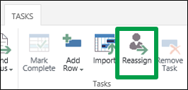
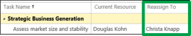
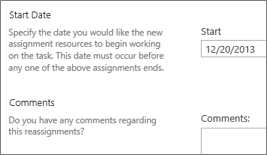

# Hand off work to someone else

There are a lot of reasons why you might reassign one of your tasks to someone else, for example:
  
    
    

- Maybe you're pulled into another, higher-priority project, and you need someone else to take on part of your existing workload.
    
  
- Maybe another person on the team has more experience than you do with a certain aspect of the project, and your project manager asks you to transition your work to that person.
    
  
- Or…maybe you're just really good at delegating.
    
  
To assign a task to someone else:
1. Click **Tasks** on the Quick Launch.
    
    
  
    
    

  
    
    

  
    
    

  
    
    

    
  
2. Click **Tasks** > **Reassign**.
    
    
  
    
    

  
    
    

  
    
    

  
    
    

    
  
3. Find the task that you want to reassign in the **Select New Resources** grid, and choose a new team member in the **Reassign To** column.
    
    
  
    
    

  
    
    

  
    
    

  
    
    

    
  
4. Set a **Start Date** for the transition, and add **Comments** if you'd like.
    
    
  
    
    

  
    
    

  
    
    

  
    
    

    
  
5. Click **Submit** to send the new assignment to the project manager.
    
    
  
    
    

  
    
    

  
    
    

  
    
    

    
  
