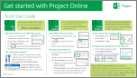
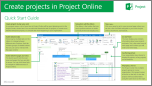
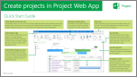
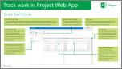

# Quick Start Guides for Project Online and Project Server 2013

 * [Project help](afac1e38-1219-4a88-bd22-81534778d528.md)* 
  
    
    

These downloadable PDFs are designed to help you get started with Project Online and Project Server 2013.
To download a guide, right-click the title or image, and then choose ** Save target as…**
  
    
    

## Project Online Quick Start Guides

||||
|:-----|:-----|:-----|
| [Get started with Project Online](https://download.microsoft.com/download/5/c/7/5c74ab79-e6f3-49d2-9c06-b9eefae7e593/AF104158520_en-us_quick_start_guide_get_started_with_project_online.pdf)    [          ](https://download.microsoft.com/download/5/c/7/5c74ab79-e6f3-49d2-9c06-b9eefae7e593/AF104158520_en-us_quick_start_guide_get_started_with_project_online.pdf)          (343 KB, PDF)    | [Create projects in Project Online](https://download.microsoft.com/download/d/4/6/d462f923-9e20-422d-8667-418e1219a68c/AF104152530_en-us_quick_start_guide_create_projects_in_project_online.pdf)    [          ](https://download.microsoft.com/download/d/4/6/d462f923-9e20-422d-8667-418e1219a68c/AF104152530_en-us_quick_start_guide_create_projects_in_project_online.pdf)          (449 KB, PDF)    | [Track work in Project Online](https://download.microsoft.com/download/b/6/3/b63f2790-b590-475d-8a4f-a10d67a7ea91/AF104152505_en-us_quick_start_guide_track_work_in_project_online.pdf)    [          ](https://download.microsoft.com/download/b/6/3/b63f2790-b590-475d-8a4f-a10d67a7ea91/AF104152505_en-us_quick_start_guide_track_work_in_project_online.pdf)          (384 KB, PDF)    |
   

## Project Server 2013 Quick Start Guides

|||
|:-----|:-----|
| [Create projects in Project Web App](https://download.microsoft.com/download/9/c/f/9cf6f358-e420-4726-8163-442f2f5883f4/AF104167751_en-us_quick_start_guide_create_projects_in_project_web_app.pdf)    [          ](https://download.microsoft.com/download/9/c/f/9cf6f358-e420-4726-8163-442f2f5883f4/AF104167751_en-us_quick_start_guide_create_projects_in_project_web_app.pdf)          (448 KB, PDF)    | [Track work in Project Web App](https://download.microsoft.com/download/1/9/b/19b2ce73-953c-41e3-89ed-8b70503e8a36/AF104167755_en-us_quick_start_guide_track_work_in_project_web_app.pdf)    [          ](https://download.microsoft.com/download/1/9/b/19b2ce73-953c-41e3-89ed-8b70503e8a36/AF104167755_en-us_quick_start_guide_track_work_in_project_web_app.pdf)          (334 KB, PDF)    |
   

## Need help?

There are several ways to get help with Project Online and Project Server 2013. The Office.com and TechNet Web sites are great resources for information. A great place to start is the  [Project help](afac1e38-1219-4a88-bd22-81534778d528.md).
  
    
    

|||
|:-----|:-----|
| [          ](e3e5f64f-ada5-4f9d-a578-130b2d4e5f11.md)   |If you are getting started with Project Online,  [Get started with Project Online](e3e5f64f-ada5-4f9d-a578-130b2d4e5f11.md) walks you through the process of getting set up.   |
   

|||
|:-----|:-----|
|You may also find it helpful to post your questions and issues on a discussion forum. The discussion forums tend to be very active, which make them a great resource for finding others who may have worked through similar issues, or encountered the same situation.    | [          ](https://social.technet.microsoft.com/forums/en-us/category/project)   |
   