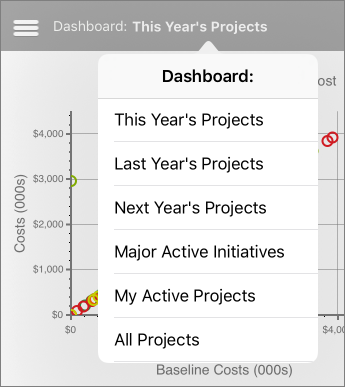
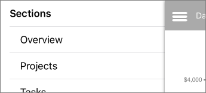
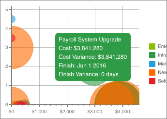
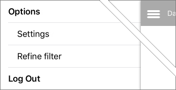
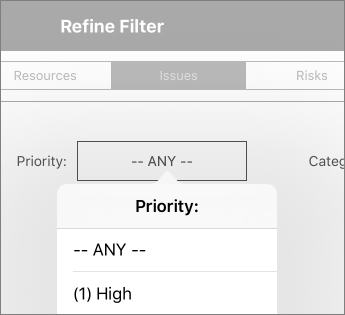

# Office 365 Project Portfolio Dashboard for iPad

> [!IMPORTANT]
> Get  [Office 365 Project Portfolio Dashboard](https://itunes.apple.com/us/app/office-365-project-portfolio/id1094852954) for iPad in the Apple App Store!
  
    
    

Office 365 Project Portfolio Dashboard is an app that you can use in conjunction with Project Online to quickly view and drill down into charts that illustrate things like progress, cost, schedule, and resources. **First, connect Office 365 Project Portfolio Dashboard to Project Online.** When you first launch the app, you'll be asked to enter your Project Online URL, your user name, and your password.Six dashboards are included by default:
- This Year's Projects
    
  
- Last Year's Projects
    
  
- Next Year's Projects
    
  
- Major Active Initiatives
    
  
- My Active Projects
    
  
- All Projects
    
  

> [!TIP]
> If your administrator has  [Add an app to a site](http://technet.microsoft.com/library/ef9c0dbd-7fe1-4715-a1b0-fe3bc81317cb%28Office.14%29.aspx), you can  [Create a portfolio dashboard](eb09494b-f2e5-451d-8b88-3257d055c6d4.md) on the web, which are then available for viewing in Office 365 Project Portfolio Dashboard for iPad.
  
    
    

## How do I switch between dashboards?

Tap the current dashboard name to see a list of available dashboards, and then choose another one from the list.
  
    
    

  
    
    

  
    
    

  
    
    

  
    
    

  
    
    

## Each dashboard has different sections

Tap the menu button (three lines) at the top left to switch between sections.
  
    
    

  
    
    

  
    
    

  
    
    

  
    
    

  
    
    

## Drill down for more detail

In some places, more information is displayed right on the chart. In other spots, another page is shown to drill into greater detail. To drill down, try selecting an area or row of a chart or table.
  
    
    

  
    
    

  
    
    

  
    
    

  
    
    

  
    
    

## Use filters to refine what you're seeing

Tap the menu button (three lines) at the top left, and then choose **Refine filter**.
  
    
    

  
    
    

  
    
    

  
    
    

  
    
    

  
    
    
Tap the filter category across the top, and then use the lists to choose which filters to apply. Tap **Save** at the top right when you're done.
  
    
    

  
    
    

  
    
    

  
    
    

  
    
    

  
    
    

> [!TIP]
> You can also filter information in some charts by tapping different items in the legend. 
  
    
    

