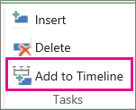

# Add tasks to a project timeline
The **Schedule** page lists all of a project's tasks when the project is opened for viewing or editing. The timeline on the **Schedule** page is a good tool for illustrating tasks at the individual project level.
> [!TIP]
> You can also  [Add projects and tasks to the Project Center timeline](ba5be725-dd1b-4bc8-8ef0-3cd680e8b532.md) in the Project Center to show work happening across your organization.
  
    
    

1.  [Open a project for editing](8f9ce971-7913-4357-9a9e-4805e0e876aa.md)
    
  
2. Click anywhere on the timeline, then on the **Tasks** tab, in the **Tasks** group, click **Add to Timeline**.
    
    
  
    
    

  
    
    

  
    
    

  
    
    

    
    > [!TIP]
      > You can  [Change the appearance of a timeline in Project Web App](a6541385-33db-4262-9b58-54b0f2330574.md) to use different colors, fonts, dates, and callouts.
3. To add another timeline, click the current timeline, and then click **Add** in the **Timeline Bar** group on the **Timeline** tab.
    
    > [!NOTE]
      > Multiple timelines are available in Project Online and Project Server 2016. 

    
  
    
    

  
    
    

  
    
    

  
    
    

    
  
4. To move tasks between timelines, click the task, and then click **Move Up** or **Move Down** in the **Current Selection** group on the **Timeline** tab.
    
    
  
    
    

  
    
    

  
    
    

  
    
    

    
  
