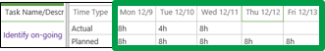
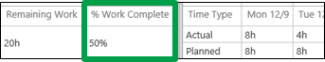

# Report the percent of work you've completed

 **This topic is for organizations that track time and task progress using one view.** [Report your task progress](4e338fec-6e78-4b0e-b059-11422057df31.md)
  
    
    

When your organization uses one view to track time and task progress, the hours that you fill out on your timesheet are used to calculate percent complete.
1. Click **Timesheet** on the Quick Launch.
    
    
  
    
    

  
    
    

  
    
    

  
    
    

    
  
2. Use the right side of the view to enter the hours you worked on the task.
    
    
  
    
    

  
    
    

  
    
    

  
    
    

    
  
3. Send your updates to the project managers for your tasks.
    
  - **If you're ready to send all of your updates,** click **Timesheet** > **Send** > **Send Progress for All Tasks**.
  
    
    

  
    
    

  
    
    

  
    
    

  
    
    

    
  
  - **If you only want to submit some of your updates,** select the check box for each task, and then click **Timesheet** > **Send** > **Send Progress for Selected Tasks**.
  
    
    

  
    
    

  
    
    

  
    
    

  
    
    

    
  
4. After you've sent your updates, the task will be updated on your timesheet, with the new percent complete in the **% Work Complete** column.
    
    
  
    
    

  
    
    

  
    
    

  
    
    

    
  

## But the percentage doesn't look accurate…what do I do?

Remember how percent complete is calculated?
  
    
    
 **20 hours completed / 40 hours scheduled = 50% complete**
  
    
    
You know how much you worked, and you have an idea about what percentage of the total work that represents, so what you'll need to adjust is the number of hours that are scheduled for the task.
  
    
    
For example, let's say you've worked 20 hours, but you really only feel about 25% complete on the task. That means that you really think the task will take 80 hours, not 40, because 20 hours is 25% of 80 hours. Here's what the math looks like: 
  
    
    
 **20 hours completed / 80 hours scheduled = 25% complete**
  
    
    
However, you're a team member, not the project manager, so you can't just go in and change the project plan to get your numbers to work out. You need to communicate this part of your task progress to your manager. You do this by submitting **remaining work** on the task.
  
    
    
In this example, you're saying that you think the whole thing will take 80 hours, and you've already completed 20 of those hours. That means you have 60 hours of remaining work.
  
    
    
 ** [Update how much work you have left to do](3c9edaed-20e7-4b54-9d83-db905fa5c504.md)** Once you submit remaining work, the percent complete should look accurate.
  
    
    
