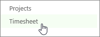
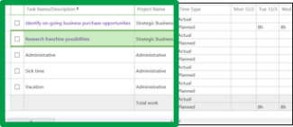
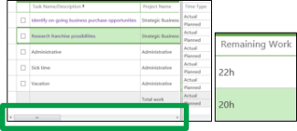
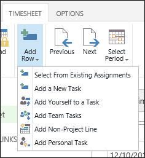
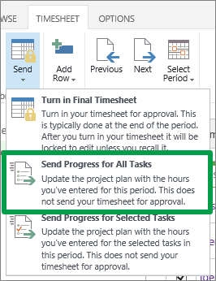
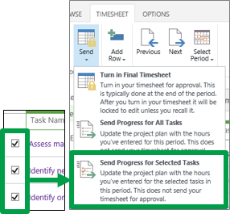

# Update how much work you have left to do

 **This topic is for organizations that track time and task progress using one view.** [Report your task progress](4e338fec-6e78-4b0e-b059-11422057df31.md)
  
    
    

Sometimes the number of hours that the schedule has left for a task doesn't match up with the amount of time you think you'll be spending to finish that task. For example, after completing 20 of the 40 scheduled hours for a task, you may feel like you have more than 20 hours of work left to do before the task is finished. By submitting your estimated remaining work to your project manager, you are communicating **task progress**.
1. Click **Timesheet** on the Quick Launch.
    
    
  
    
    

  
    
    

  
    
    

  
    
    

    
  
2. Find the task that you want to update on the left side of the view.
    
    
  
    
    

  
    
    

  
    
    

  
    
    

    
  
3. Use the scroll bar at the bottom of the grid to scroll right, to the **Remaining Work** column. Add the hours that you think are still required to get the task done.
    
    
  
    
    

  
    
    

  
    
    

  
    
    

    
    If you don't see the task that you want to update, click **Timesheet** > **Add Row**.
    
    
  
    
    

  
    
    

  
    
    

  
    
    

    
  
4. Send your updates to the project managers for your tasks.
    
    If you're ready to send all of your updates, click **Timesheet** > **Send** > **Send Progress for All Tasks**.
    
    
  
    
    

  
    
    

  
    
    

  
    
    

    
    If you only want to submit some of your updates, select the check box for each task, and then click **Timesheet** > **Send** > **Send Progress for Selected Tasks**.
    
    
  
    
    

  
    
    

  
    
    

  
    
    

    
  
