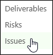
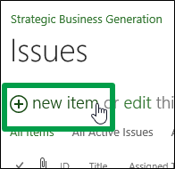
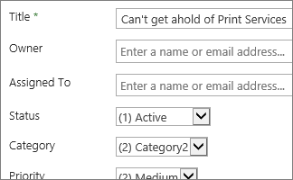
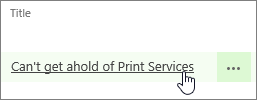

# Add an issue to a project

As you work on a project, issues may come up along the way that have an impact on the project schedule. Maybe someone you need to talk to is unexpectedly out of the office for a while, or a tool you need to get the work done isn't available. By recording the issues that come up as the project progresses, project managers are better able to manage the project schedule.
  
    
    

## Want to add an issue to a project?

If the issue isn't specific to any one task, simply add it to the project site.
  
    
    

1. Click **Projects** on the Quick Launch.
    
    
  
    
    

  
    
    

  
    
    

  
    
    

    
    
    
  
2. Click the name of a project in the list.
    
    
  
    
    

  
    
    

  
    
    

  
    
    

    
    
    
  
3. Click **Project Site** on the Quick Launch.
    
    
  
    
    

  
    
    

  
    
    

  
    
    

    
    
    
  
4. Click **Issues** on the Quick Launch.
    
    
  
    
    

  
    
    

  
    
    

  
    
    

    
    
    
  
5. Click **New Item**.
    
    
  
    
    

  
    
    

  
    
    

  
    
    

    
    
    
  
6. Add information about the issue, including as many details as you can.
    
    
  
    
    

  
    
    

  
    
    

  
    
    

    
    
    
  
7. When you're done, click **Edit** > **Save**.
    
    
  
    
    

  
    
    

  
    
    

  
    
    

    
    
    
  

## Want to link this issue to a specific task?

After you've initially saved the issue, you can go back in and assign it to a specific task.
  
    
    

1. Click the name of the issue in the list.
    
    
  
    
    

  
    
    

  
    
    

  
    
    

    
    
    
  
2. In the lower-right portion of the page, click **Add Related Item**.
    
    
  
    
    

  
    
    

  
    
    

  
    
    

    
    
    
  
3. On the left side of the box, under the name of your project, click **Tasks**.
    
    
  
    
    

  
    
    

  
    
    

  
    
    

    
    
    
  
4. On the right side of the box, click the row for the specific task you want to link the issue to.
    
    
  
    
    

  
    
    

  
    
    

  
    
    

    
    
    
  
5. Click **Insert** to link the issue to the task.
    
    
  
    
    

  
    
    

  
    
    

  
    
    

    
    
    
  

## Need more help?

If you're still not finding the answers you need, try searching for content on  [support.office.com](https://support.office.com), or browsing through the list of topics on the  [Project help](afac1e38-1219-4a88-bd22-81534778d528.md).
  
    
    
You may also find it helpful to post your questions and issues on a discussion forum. The  [Project discussion forums](https://social.technet.microsoft.com/forums/en-us/category/project) tend to be very active, which make them a great resource for finding others who may have worked through similar issues, or encountered the same situation.
  
    
    
 [
  
    
    
](https://social.technet.microsoft.com/forums/en-us/category/project)
  
    
    
