# Link risks, issues, files, or deliverables to tasks

As you work on a project, you may find it useful to  [Add a risk to a project](7aa1acc9-50cf-4f15-ac3b-fedf41b31c83.md),  [Add an issue to a project](3e1a59e5-43b3-4281-9cfb-503c646f49b9.md),  [Upload files to a library](http://technet.microsoft.com/library/da549fb1-1fcb-4167-87d0-4693e93cb7a0%28Office.14%29.aspx), and list deliverables on the project site. Sometimes, these risks, issues, files, and deliverables are tied to specific tasks within the project. By linking these items to their related tasks, you give yourself a reminder of where you need to keep an eye on things, or where you have files that you might need to refer to or keep updated.
  
    
    

You can link things together by  [starting with the risk, issue, file, or deliverable](3ef3059a-5041-4f6e-9cc8-0341fd6b1aea.md#BKMK_StartFromItem), or by  [starting with the task](3ef3059a-5041-4f6e-9cc8-0341fd6b1aea.md#BKMK_StartFromTask).
## Starting from the risk, issue, file, or deliverable you've already added

1. Click the name of the issue, risk, file, or deliverable, to view it.
    
     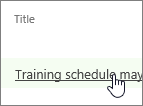
  

  

  
2. Click **Add Related Item**.
    
     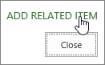
  

  

  
3. On the left side of the box, under the name of your project, click **Tasks**.
    
     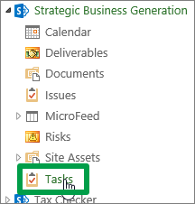
  

  

  
4. On the right side of the box, click the row for the specific task (or tasks) you want to link the issue, risk, file, or deliverable to.
    
     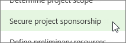
  

  

  
5. Click **Insert** to link the item to the task.
    
     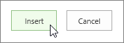
  

  

  

## Starting from your tasks

1. Add your project's  [Add a risk to a project](7aa1acc9-50cf-4f15-ac3b-fedf41b31c83.md),  [Add an issue to a project](3e1a59e5-43b3-4281-9cfb-503c646f49b9.md),  [Upload files to a library](http://technet.microsoft.com/library/da549fb1-1fcb-4167-87d0-4693e93cb7a0%28Office.14%29.aspx), or deliverables to the project site.
    
  
2. In Project Web App, click **Projects** on the Quick Launch.
    
    
  
    
    
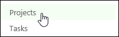
  
    
    

  
    
    

  
    
    

    
    
    
  
3. Click the name of a project in the list.
    
    
  
    
    
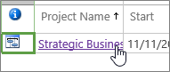
  
    
    

  
    
    

  
    
    

    
    
    
  
4. Click **Project Site** on the Quick Launch.
    
    
  
    
    
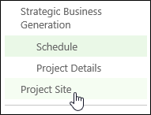
  
    
    

  
    
    

  
    
    

    
    
    
  
5. Click **Tasks** on the Quick Launch.
    
    
  
    
    
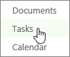
  
    
    

  
    
    

  
    
    

    
    
    
  
6. Click the name of a task in the list.
    
    
  
    
    
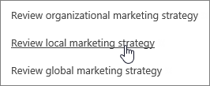
  
    
    

  
    
    

  
    
    

    
    
    
  
7. Click **Show More**.
    
    
  
    
    
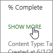
  
    
    

  
    
    

  
    
    

    
    
    
  
8. Click **Add Related Item**.
    
    
  
    
    

  
    
    

  
    
    

  
    
    

    
    
    
  
9. On the left side of the box, under the name of your project, click **Risks**, **Issues**, **Documents**, or **Deliverables**.
    
    
  
    
    
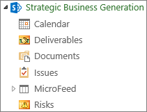
  
    
    

  
    
    

  
    
    

    
    
    
  
10. On the right side of the box, click the row for the specific item you want to link the task to.
    
    
  
    
    
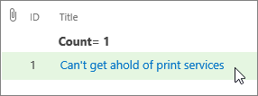
  
    
    

  
    
    

  
    
    

    
    
    
  
11. Click **Insert** to link the issue to the task.
    
    
  
    
    

  
    
    

  
    
    

  
    
    

    
  

## Still stuck?

If you're still not finding the answers you need, try searching for content on  [support.office.com](https://support.office.com), or browsing through the list of topics on the  [Project help](afac1e38-1219-4a88-bd22-81534778d528.md).
  
    
    
You may also find it helpful to post your questions and issues on a discussion forum. The  [Project discussion forums](https://social.technet.microsoft.com/forums/en-us/category/project) tend to be very active, which make them a great resource for finding others who may have worked through similar issues, or encountered the same situation.
  
    
    
 [
  
    
    
](https://social.technet.microsoft.com/forums/en-us/category/project)
  
    
    
