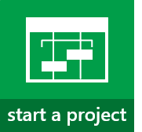

# Step 3: Set up shop in Project Online

|||
|:-----|:-----|
|
  
    
    

  
    
    

  
    
    

  
    
    
   | [
  
    
    
](3fda2b6f-3145-46fa-af02-e39a00450ec1.md)
  
    
    
 [
  
    
    
](e65c6c3b-68af-4d13-9504-5626b73e54ce.md)
  
    
    

  
    
    

  
    
    

  
    
    

  
    
    
   |
   
 **At this point, if you really want to, you can dive right in and  [Create a project in Project Web App](072e676d-d798-457d-a4d1-66baaaf6c552.md)!** Everything is there for you to just jump in and run. But...there are a few things that you can set up now, to make Project Online more useful for your organization.
## Set your time zone

|||
|:-----|:-----|
|
  
    
    

  
    
    

  
    
    

  
    
    
   |**Got users in different time zones?** Project Online stores times and dates in UTC (Coordinated Universal Time) format, and then converts times to the local time zone of your Project Web App site when you view a page. If you have users in time zones outside [the time zone for your Project Web App site](http://technet.microsoft.com/library/e9e189c7-16e3-45d3-a090-770be6e83c1a%28Office.14%29.aspx), you should have them  [change their personal time zone settings to match their location](http://technet.microsoft.com/library/CAA1FCCC-BCDB-42F3-9E5B-45957647FFD7%28Office.14%29.aspx) to ensure that they're seeing times and dates properly in Project Online.   |
   

## Set up timesheets

|||
|:-----|:-----|
|
  
    
    

  
    
    

  
    
    

  
    
    
   |**Want your team members to turn in timesheets for the work they're doing?** Before your team members can start filling out timesheets, you need to [Set up timesheets](3e20822d-de27-494e-8821-c25b1174586e.md).    
|||
|:-----|:-----|
|**Basic**    [Set up timesheets](3e20822d-de27-494e-8821-c25b1174586e.md)           [Set up your fiscal year](f3955791-d452-4e1f-a5c4-efa1ddb88ecf.md)           [Set up categories for timesheet rows](7e70ec99-927c-4fe0-a94d-c66f6451e497.md)           [Set up vacation and sick leave time](67bdd3e9-9887-45ee-948d-7f3c02a1e5eb.md)   |**Advanced**    [Set up how time and task progress are captured](55825b21-1a20-4d40-9f26-0ec91bf920d3.md)           [Customize timesheets and task progress for your organization](f787d680-223b-4aa7-92e0-5fc32ed3c962.md)           [Set up time and task progress approval](ac06db07-b8c3-4f58-be63-af68fa974a27.md)   |
   
|
   

## Set up a streamlined way to manage users and resources

|||
|:-----|:-----|
|
  
    
    

  
    
    

  
    
    

  
    
    
   |**Want to use groups to manage who's doing what in Project Online?** You can set up Project Online to use the same Active Directory groups you might already have set up in SharePoint Online. This can make it a little easier to keep track of who's doing what across the different tools in your organization.   If you want to go this route:    
Change permission management in Project Online . Plan SharePoint groups in Project Online . Configure the Resource Center . |
   

## And there's more...

|||
|:-----|:-----|
|
  
    
    

  
    
    

  
    
    

  
    
    
   |**There are lots of ways to map Project Online to the way you run your business.** Here are a handful of other things you can start looking through, when you're ready to dive deeper. Some of these resources are written with Project Server in mind, but the steps are relatively similar.   
||
|:-----|
|**This is complicated stuff.** If you're not ready for complicated, ignore this section and move on to [Create a project in Project Web App](072e676d-d798-457d-a4d1-66baaaf6c552.md). You don't need to know this advanced level of setup to be able to use Project Online. (It's okay if you let out a sigh of relief now!)    |
   
 **If you're ready for complicated, here are some places to start:**    [Enterprise custom fields and lookup tables in Project Web App](https://technet.microsoft.com/library/gg709725.aspx)    [Using workflow for demand management in Project Online](06066a32-7e24-4d0a-b629-dd75d9facf02.md)    [Portfolio analysis overview](https://technet.microsoft.com/library/dn641991.aspx)   **If you get overwhelmed or confused,** the [discussion forums on TechNet](https://social.technet.microsoft.com/forums/en-us/category/project) are a great place to get your questions answered.   |
   

## Ready to move past setup?

|||
|:-----|:-----|
| [          ](072e676d-d798-457d-a4d1-66baaaf6c552.md)|**Next up,  [Create a project in Project Web App](072e676d-d798-457d-a4d1-66baaaf6c552.md)!**   **Stuck?** Try the [Project discussion forums](https://social.technet.microsoft.com/forums/en-us/category/project) on TechNet!    [          ](https://social.technet.microsoft.com/forums/en-us/category/project)   |
   