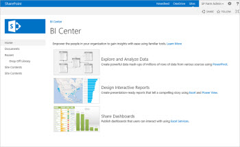

# Where did the BI Center site go in Project Online?

 * [Project help](afac1e38-1219-4a88-bd22-81534778d528.md)* 
  
    
    

Improvements to Project Online include easier access to your sample reports and data connections. The Business Intelligence (BI) Center site will no longer be created automatically for new Project Online sites, and new lists/libraries are used for your reporting content. Read this article to learn more about these changes, including what to do if you want to continue using your old BI Center site.
## What's changing?

Up until recently, when a Project Online site was created, a BI Center site was created automatically. The BI Center site resembles the following image:
  
    
    

  
    
    

  
    
    
With the recent changes, the BI Center site is no longer created by default. The following table summarizes what these changes mean for your environment.
  
    
    

||**Before...**|**Now...**|
|:-----|:-----|:-----|
|Using a BI Center site    |When you created a Project Online site, a BI Center site was created automatically. The BI Center site includes reporting content, such as sample reports and data connections, and it's where you'd go to view and use your Project Online reports.    |When you create a new Project Online site, no BI Center site is created automatically. Instead, a Reports library and a Data Connections list are created automatically. Project Online includes links to those locations so you have easy access to your content.    Any Project Online sites that you're already using will be updated to use the new Reports library and Data Connections list instead of the BI Center site. Your existing BI Center site is not deleted (until you delete it yourself), and your existing content is still available. Links in your Project Online sites are updated automatically to point to your new Reports library and Data Connections list.    |
|Navigating to reports    |When you clicked the **Reports** tile in your Project Online site, you were taken to your BI Center site. There, you'd click **Reports** to view your Project reports.   |In your Project Online site, when you click **Reports**, you go straight to the Reports library where your reports are stored.    |
|Finding data connections    |When you clicked the **Reports** tile in your Project Online site, you were taken to your BI Center site. There, you'd click **Data Connections** to view your available data connections to use for reports.   |In your Project Online site, choose **Site Contents**, and then choose **Data Connections**.    |
   

## The good news is, you have options! What do you want to do?

With these changes, you can choose whether to use your new Reports library, or continue using your old BI Center site. 
  
    
    
See the following sections for more details for each option.
  
    
    

-  [Use the new Reports library](4b71a920-d603-4ffd-b2ab-654e398c73d5.md#usenewlists)
    
  
-  [Continue using your existing BI Center site](4b71a920-d603-4ffd-b2ab-654e398c73d5.md#existingbicenter)
    
  

### Use the new Reports library

If you're planning to use the new Reports library, and you don't have any content to move, you're all set. Your sample reports and data connections are already set up and ready to use.
  
    
    
If you have existing content in a BI Center site that you've been using, you'll want to move your content to the new lists/libraries. 
  
    
    

> [!TIP]
> Don't move the sample reports or default OData data connections that you get automatically in Project Online. The new Reports library and Data Connections list will already contain those files. Only move the files that your group has created or modified and that you want to keep using. > If you have a lot of files to move, try this: In the ribbon, on the **Library** tab, select the **Open with Explorer** button. Then, drag-and-drop your files by using File Explorer.
  
    
    

 **To move your content from your old BI Center site to the new libraries**
  
    
    

1. In your Project Online site, choose **Settings** > **Site Contents**. Scroll down to the **Subsites** list, and then click **Business Intelligence Center** to open your BI Center site.
    
  
2. Choose **Data Connections**, and then download any data connection files that your group has created to a folder on your computer. (Don't move the default OData data connections.)
    
  
3. In the BI Center site, choose **Reports**, and then download any reports that your group has created or modified to a folder on your computer. (Don't move the default sample reports.) 
    
  
4. Go to your Project Online site, choose **Site Contents**, and then choose **Data Connections**. 
    
    Upload your data connection files to the new Data Connections library.
    
  
5. In your Project Online site, choose **Reports**, and then upload your reports to the new Reports library.
    
  
After you've moved your Project reporting content, we recommend that you open each report, refresh the data, and then save and close the report to make sure everything is working correctly.
  
    
    
To avoid having duplicate sets of data connections and reports, consider deleting your old BI Center site after you've moved your content.
  
    
    

### Continue using your existing BI Center site

If you'd rather continue using your existing BI Center site, you can do that. Edit a link in your Project Online site to point to the correct location for your content. Here's how to do that.
  
    
    
 **To update a link in your Project Online site**
  
    
    

1. In your Project Online site, choose **Settings** > **Site Contents**. 
    
    Scroll down to the **Subsites** list, and then click **Business Intelligence Center**.
    
  
2. Copy the website address (URL) of your BI Center site. 
    
  
3. Go to your Project Online site, and then choose **Edit Links** in the Quick Launch.
    
  
4. In the **Reports** row, in the **Custom URL** column, paste the website address that you copied in step 3.
    
  
5. Click **Save and Close**.
    
  
That's it! You can continue using your old BI Center site until you're ready to transition to the new Reports library and Data Connections list.
  
    
    
