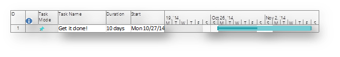

# Track or Treat: white paper

This white paper is part of our "From the trenches" collection. It describes the advantages to tracking project work, discusses tracking methods, and explains the difference between tracking time and tracking progress.
  
    
    

To see more white papers, see  ["From the Trenches" white papers](faec6b1a-c217-4c79-b8c4-0514f402106b.md).
## Track or treat

It's the Halloween season here in North America so I thought we'd talk about something scary: tracking our projects. What? That's not scary you say? Information from the field would beg to differ.
  
    
    

### Planning not Managing is still so common

In many industries and organizations, it is stunningly common that even when formal project management schedules are created, they are left in a planning mode only and never tracked. The exercise of plan and if you must, plan again. Nowhere is this more prevalent than in software development. For all the progress we've made in project management in the software industry, the numbers of projects that are only planned vs. those which are planned and then tracked is enormous. If you are one of those who only plans, the good news is, you're not alone. The bad news is, you're not alone!
  
    
    
There are many reasons why tracking projects in some industries is not popular. In some industries, for example, it is quite common to have personnel who specialize in creating bids or in project pricing or in project contracting or in estimating to make the original plan for the project. This is true in many different environments but we see it almost always in construction, heavy engineering, aerospace/defence and large engineering/procurement/construction (EPC) projects. Once the bid is won, a completely new team takes on the tracking and delivery of the project. On large projects, the people who created the original bid have often moved on long ago to make other bids as the time between creating the estimate and closing the contract may be extensive. The project that is just now starting up may be old news to them. So those who do the project management aren't able to track against the original plan because the people who created it and the structure of the plan itself are not available.
  
    
    
The most common reason given for not doing project tracking however is that the project is so fluid that tracking the work is too challenging. Some projects are changed so quickly that just keeping up with the plan is an enormous undertaking. If you are spending all your time updating the plan, there is precious little time left to track what you have been planning.
  
    
    
This can have an interesting effect which is not necessarily a good one. In environments where the project manager updates the plan over and over and over again based on changing conditions, the project is never really late; never really over budget; never really off track. How could it be? After all, we just updated the plan 20 minutes ago and we're right on track with where we planned.
  
    
    
If you're in the software development industry and you're thinking, that sounds a little like Agile, you'd be exactly right. The idea of Agile project management was to build as we design and have the delivery of what we're creating happen iteratively. Our plans would adjust accordingly and we could, at any time, say "The client reports that it's good enough. We can stop here for now."
  
    
    
That's completely appropriate for certain kinds of development but for others, it's the stuff of dreams. Most software development environments live with the same project management constraints as every other industry. We have deadlines to meet, budgets to respect and a fixed list of scope to deliver. Let's call that traditional project management. Even in primarily Agile environments, my experience has been that Agile management happens within an umbrella of traditional project management.
  
    
    
Whatever the incentive to just plan, tracking your project carries the potential for enormous benefits. Let's take a look at the whole tracking concept.
  
    
    

### What does tracking mean?

You might think that project tracking has a very distinct definition and you'd be incorrect. How to track a project depends vastly on what the objectives are. Here are a couple of more common tracking methods:
  
    
    

#### Guess at a percentage

"We're about half way there," the team leader says and we know that's about 50 percent of what we'd planned. While this is tracking and this is much better than not tracking at all, the quality of this data is quite weak. If I had a plan to complete a task in 10 days and I report that we're about 50 percent complete, project management tools like Microsoft Project and Project Server will make some assumptions for me. They'll figure that based on the limited data they have, you must have spent 5 days of effort so far and have 5 days of effort remaining. Perhaps that's true but it would mask a situation where you are about 50 percent complete but it's taken you 20 days of effort to get there and therefore probably have 20 days of work remaining.
  
    
    

#### Measure how much is left

Years ago a dark comedy movie called "The Money Pit" featuring Tom Hanks featured a crew of home contractors who never seemed to be done. The running gag through throughout the movie was the answer to "When will you be done?" "Three more weeks" all the contractors would say.
  
    
    
But, tracking remaining duration is a much better quality of data than just guessing at a percentage. Remaining duration gives us a sharp focus on what is left to get this piece done and when can the next piece that is dependant on this one get started. There are two ways to think of remaining duration based on how you've set up your tasks. The first is to think of the total task's remaining duration. This would be appropriate if we are not focused on the effort required to complete it. The second is to think of the remaining duration or effort required for each assignment. This would be more appropriate if the tasks are resource driven. But either is a big step up from just guessing at a percentage.
  
    
    

#### Measure how much we've spent

"I've spent 10 days so far," is one way to look at progress. Sometimes referred to as LOE or "Level or Effort." Level of Effort is a great way to look at our actual burn rate but it carries a blind side. On the good side of this method, we have a great understanding of how much we've spent on this task so far. On the bad side, we might not have a great understanding of what's left to do. Being in the timesheet business, we deal often with organizations trying to implement this method. At one time our staff thought of this method as only appropriate if coupled with other more sophisticated project tracking techniques but we've been shown that it is often very strong just on its own. "If we could just determine where our time is going," I was told by a client, "that would put us so far ahead of what we've been doing, we could become almost instantly more effective." He was right too. We did implement a timesheet which allowed time to be tracked against planned tasks and that alone made the organizations tremendously more effective. They were later able to add additional methods of tracking to improve their performance yet further.
  
    
    

#### We're going to use the earned value method

The earned-value method was developed about 30 years ago as a way of controlling extremely complex projects but the fundamental concept is quite simple. If we make a budget for a task, then no matter how much time we spend, we can't earn more than 100% of the budget. Earned value focuses on tracking the "physical" percent complete and that lends itself well to some types of projects and not so much to others. If we're building a road, for example, and we have 100 miles of road to build, then when we're at mile-marker 50, we're half done. If you've spent 75% of the money getting that far, you've got big troubles and the earned value method will make that obvious. That would indicate that you're probably going to go 50% over budget by the time you're done.
  
    
    
If you're doing research for a new drug or writing software, then measuring the physical percent complete may be much more elusive. The earned value folks have a whole toolbox of possible ways to get at this kind of progress and of them all, "weighted milestones" would be my favorite. In a weighted milestone project management environment, we set up key milestones of the work and as we arrive at that milestone, we earn the percentage we'd agreed upon before starting that milestone would represent. What's great about this method is there's little debate. Did you complete the milestone? Yes or No? If not, you've earned nothing. If so, you've earned that percentage.
  
    
    

### The Ivory Snow Project

Even if you are using one of these methods, one of the things you should watch out for is what I call the "Ivory Snow" project. These projects advance almost instantly to 99.97% complete and then stay stuck there for the rest of time.
  
    
    

### How will all these things appear?

Regardless of what project management tool you're using, showing progress is often a fairly common element of the display. Here we've got an image from Microsoft Project showing one bar with 50% progress:
  
    
    

  
    
    

  
    
    
If that's all we're tracking, we've at least got some notion of where we're headed but modern tools like Project and Project Server can offer so much more. If we set a baseline on the project, we'll be able to compare not only how the task is progressing but how it compares against our original plan.
  
    
    

  
    
    

  
    
    
Here we can see that the task was expected to be 50% complete and it is, but it started a week late. On the right side of the bar, we can see that we've spent 50% of the time and (taking weekends into account) we've filled 50% of the bar. If we had entered resource work, we might have had 80 hours of work to day and used 40 hours. That's right on track for this task if we think of it in isolation but even though the task may progress at the pace and burn rate we expected, it is still having a negative impact on any tasks that are downstream.
  
    
    

### Okay, I'm tracking, now what?

Okay, so we've covered some of the basics. You're already in the top 20% of skilled project management managers. Seriously. This is already better than 80% of those out there. Now for something fundamental but potentially very impactful.
  
    
    

### If x, then y

What I mean by that is that effective tracking needs a consequence formula: If x happens, then take y action.
  
    
    
It's a basic formula but one of the toughest to train people in. Many years ago, I had the privilege of working with a team of nationally certified lifeguards. These were skilled professionals but one thing could be practiced but never really experienced until it actually happened: How would the lifeguard react in an actual emergency. Those in the armed forces will explain a similar challenge. You can train and train and train but you don't really know for sure how someone will react when there is an actual weapon fired in anger towards them.
  
    
    
Project management is fortunately not usually a matter of life or death but we have a similar problem with those who track projects. Does the project manager know what they should do when the project isn't tracking exactly as planned? This is something you can think about long in advance. Do you have a contingency budget of time and/or money? Do you have a chain of command for them to get authority to take action? Do you have a communications plan for them to reach the right people when the project is running late or not? And, what results constitute taking action? Is a one day delay worth escalating? How about one week? How about an increase in risk or scope? Setting some standards for this in advance can avoid upset later.
  
    
    

### Trick or Track

Setting your organization or your project to implement tracking isn't difficult. Virtually ever project management product in the industry has some ability to store project progress but there is one corporate cultural aspect of tracking that must still be taken into account to have a good chance of success and that is to not shoot the messenger. Many project managers who I have spoken to over time express concerns that their management find only good news to be acceptable when receiving project reports.
  
    
    
A number of years ago I was in a large boardroom of a large multi national firm. We were discussing the impact of the project management tool receiving information from the timesheet we publish.
  
    
    
"I don't understand," a senior vice president said, "why, when we get the timesheet hours, that the tasks aren't updating the progress."
  
    
    
"If I had a 40 hour task and I put 40 hours of effort from the timesheet into that task, what would you expect the result to be?" I asked.
  
    
    
The VP looked at confused at the question.
  
    
    
"I'd expect it to be complete," he said.
  
    
    
"But what if it's not?" I answered.
  
    
    
"I don't understand," said the now upset VP. "If it's a 40 hour task and you did 40 hours of work, then it must be over."
  
    
    
I wasn't sure what to answer to that but fortunately I was saved by the head of the project group who asked to speak to the VP outside for a moment and presumably explained that life doesn't always follow the plan.
  
    
    
Getting management to understand that they can make the biggest impact when the project doesn't go as planned is something that can deliver huge benefits just as much as management's insistence that all project must report progress as planned can be crippling.
  
    
    
Tracking your project can be a treat not only for those who manage it but also for the entire organization.
  
    
    

## About the Author

Chris Vandersluis is the president and founder of Montreal, Canada-based HMS Software, a Microsoft Certified Partner. He has an economics degree from McGill University and over 30 years experience in the automation of project control systems. He is a long-standing member of the Project Management Institute (PMI) and helped found the Montreal, Toronto, and Quebec chapters of the Microsoft Project Users Group (MPUG). Publications for which Chris has written include Fortune, Heavy Construction News, Computing Canada magazine, and PMI's PMNetwork, and he is a regular columnist for Project Times. He teaches Advanced Project Management at McGill University and often speaks at project management association functions across North America and around the world. HMS Software is the publisher of the TimeControl project-oriented timekeeping system and has been a Microsoft Project Solution Partner since 1995. 
  
    
    
Chris Vandersluis can be contacted by e-mail at: chris.vandersluis@hms.ca
  
    
    
If you would like to read more EPM-related articles by Chris Vandersluis, see HMS's EPM Guidance site (http://www.epmguidance.com/?page_id=39).
  
    
    
