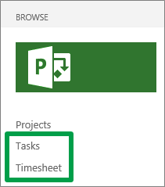

# Report your task progress

There are two ways that your administrator may have set things up for entering task progress. The steps you take to report your task progress are different, based on which way your organization is set up. 
  
    
    

## How do I know which way my organization is set up?

You could ask your administrator about whether your organization is using single entry mode, but an easier way to figure it out on your own is to look at the Quick Launch.
  
    
    
If your organization is tracking time and task progress separately, you'll most likely see both the **Tasks** and **Timesheet** views listed on the Quick Launch.
  
    
    

  
    
    

  
    
    

  
    
    

  
    
    

  
    
    

## I see both Tasks and Timesheet on the Quick Launch

This means that your organization is most likely tracking time and task progress separately.
  
    
    
You will:
  
    
    

-  [Enter hours on your timesheet](a44e4d20-a5f0-4f36-94c0-d0abeca8366f.md)
    
  
-  [Report the percent of work you've completed](760fe754-5aac-4697-aa0b-eb4fb30db97a.md)
    
  
-  [Update how much work you have left to do](fe646892-a8fa-4eac-8129-8c7121610c68.md)
    
  

## I only see Timesheet on the Quick Launch

This means that your organization is most likely tracking time and task progress in the same view.
  
    
    
You will:
  
    
    

-  [Enter hours on your timesheet](a44e4d20-a5f0-4f36-94c0-d0abeca8366f.md)
    
  
-  [Report the percent of work you've completed](2f34261c-2fa6-41c2-a3fe-a386150327f1.md)
    
  
-  [Update how much work you have left to do](3c9edaed-20e7-4b54-9d83-db905fa5c504.md)
    
  

## Still not sure?

If you're still not sure, ask your coworkers! They've probably already been submitting time and task progress, so they should know where you should be entering your hours.
  
    
    
