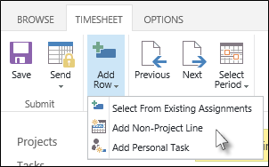

# Add a task to your timesheet

Tasks assigned to you that are scheduled for the dates in the current timesheet period will be automatically included on your timesheet. Sometimes, however, you might start work on a task early, for example, and need to add a task to your timesheet that isn't automatically included. You can add a task to your timesheet, and your time will be accounted for in the project.
  
    
    

1. Click the **Timesheet** tab on the ribbon.
    
    
  
    
    

  
    
    

  
    
    

  
    
    

    
  
2. Click **Add Row**, and then choose the kind of task you want to add.
    
    
  
    
    

  
    
    

  
    
    

  
    
    

    
  

After adding the task, you can  [Enter hours on your timesheet](a44e4d20-a5f0-4f36-94c0-d0abeca8366f.md).
  
    
    

