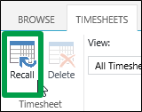
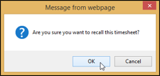

# Take back a timesheet that you sent for approval

Maybe you were working from home and your four-year-old accidentally submitted your timesheet, or your cat walked across your keyboard and entered some extra hours for you. Or, more likely, you forgot to add some task work to your timesheet before sending it to your project manager. Whatever the reason, sometimes, you just didn't mean to submit things yet.
  
    
    

If you realize, after you've sent your timesheet for approval, that you need to make changes, you can recall your timesheet.
1. Click **Settings**
  
    
    

  
    
    
 > **PWA Settings**.
    
    
  
    
    

  
    
    

  
    
    

  
    
    

    
  
2. Under **Time and Task Management**, click **Manage Timesheets**.
    
    
  
    
    

  
    
    

  
    
    

  
    
    

    
  
3. Click the row for the timesheet you want to recall.
    
    
  
    
    

  
    
    

  
    
    

  
    
    

    
  
4. Click **Timesheets** > **Recall**.
    
    
  
    
    

  
    
    

  
    
    

  
    
    

    
  
5. Click **OK** to confirm the recall.
    
    
  
    
    

  
    
    

  
    
    

  
    
    

    
  
