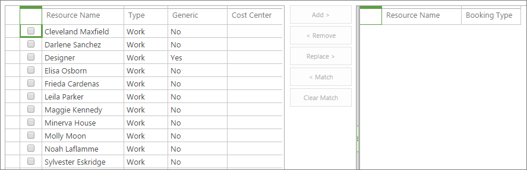
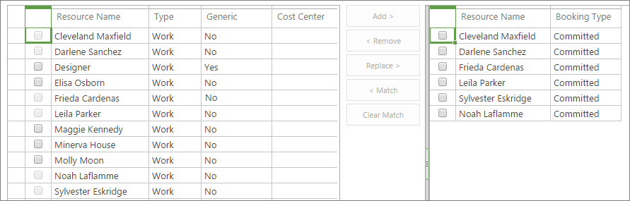
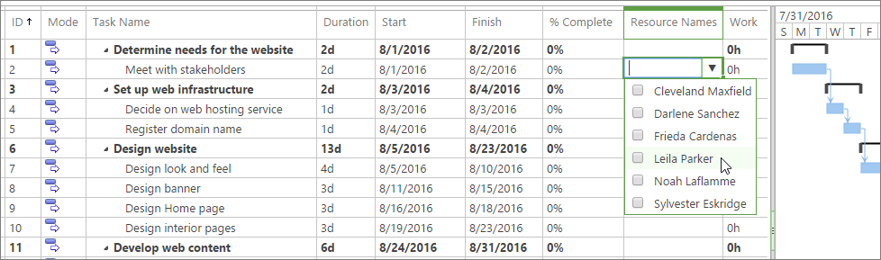
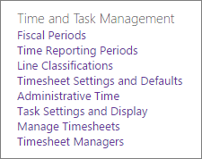

# Use team resources in Project Online

Team resources are the human assets assigned to a project and they are responsible for completing specific tasks. The resource manager first adds everyone in the organization who's available for project work to the Project Online Resource Center. Project managers then build their project teams by choosing from this resource pool. With the project team in place, the project manager assigns resources to tasks. Team resources complete their tasks, and can use Project Online to submit timesheets and progress updates.
  
    
    

## In this topic

-  [Add team resources as Project Online users](55c86326-9f88-47df-9030-0746f1cccb21.md#_Add)
    
  
-  [Set up resources in the Project Online Resource Center](55c86326-9f88-47df-9030-0746f1cccb21.md#_Setup)
    
  
-  [Build a project team](55c86326-9f88-47df-9030-0746f1cccb21.md#_Build)
    
  
-  [Assign resources to tasks](55c86326-9f88-47df-9030-0746f1cccb21.md#_Assign)
    
  
-  [Set up time and progress reporting for team resources](55c86326-9f88-47df-9030-0746f1cccb21.md#_Setup_time)
    
  

## Add team resources as Project Online users

Most team resources need access to Project Online (along with a license) to see their assigned tasks, submit timesheets, and enter progress. Therefore, the first step required to set up team resources is to add them as Project Online users. You can add internal permanent employees as well as external contractors or temporary staff.
  
    
    

> [!TIP]
> The following procedure describes how to add users to Project Online one at a time. If your organization uses Active Directory or Exchange, you might be able to automatically import most or all of your users, along with their contact information. Talk with your Project Online administrator for details. 
  
    
    

1. Go to the Office 365 admin center. If Project Online or any of your Office 365 apps are open in your browser, choose the app launcher in the upper-left corner of the page, and then choose **Admin**. If you want to open the admin center in a separate tab in your browser, hold down Ctrl and choose **Admin**.
    
    > [!TIP]
      > If Project Online or another Office 365 app is not open, in your browser's address bar, type  [http://portal.office.com](https://portal.office.com/) and press Enter. After you sign in, the Office Online Home page opens and the app launcher is available in the upper-left corner.
2. In the left pane, choose **Users**, and then choose **Active Users**.
    
  
3. On the **Active Users** page, choose **Add a user**.
    
  
4. Complete the fields in the **New User** dialog box, including name, contact information, account password information, Project Online role, and Project Online license information. Choose **Save**.
    
  
5. In the **User was added** dialog box, make sure that the **Send password in email** check box is selected. Enter the email address(es) in the text box, and then choose **Send email and close**. If you'd rather not send the password in email, clear the check box and choose **Close**.
    
    > [!TIP]
      > If you choose to send the password email, the new user receives an email from the Microsoft Online Services Team with a subject of "New or modified user account information." Or, you can have the password email sent to you to then give to the new user. 
6. Repeat this process for all users you want to add to Project Online.
    
  
 [Team resources are the human assets assigned to a project and they are responsible for completing specific tasks. The resource manager first adds everyone in the organization who's available for project work to the Project Online Resource Center. Project managers then build their project teams by choosing from this resource pool. With the project team in place, the project manager assigns resources to tasks. Team resources complete their tasks, and can use Project Online to submit timesheets and progress updates.](55c86326-9f88-47df-9030-0746f1cccb21.md#_Top)
  
    
    

## Set up resources in the Project Online Resource Center

When the users have been added, return to Project Online and identify them as resources in the organization's project resource pool. Identifying them as resources enables them to be added to project teams and have tasks assigned to them.
  
    
    

> [!TIP]
>  If your organization uses Active Directory, you can automatically identify your users as resources through Active Directory synchronization. For more information, see [Configure the Resource Center](c2cb242a-adc2-44e3-ac4c-b95f833b3ac3.md). Without Active Directory synchronization, however, you need to set up your resources one at a time. 
  
    
    

1. Choose the app launcher in the upper-left corner of the page, and then choose **Project**.
    
  
2. In Project Online, on the Quick Launch, choose **Resources**.
    
  
3. On the **Resources** tab, choose **New**.
    
  
4. In the **Identification Information** section, select the **Associate resource with a user account** check box.
    
  
5. In the **User Authentication** section, in the **User logon account** box, type the user's name or email address as you entered it in the admin center.
    
  
6. Enter any other information you have about the resource. Choose **Save**. The resource is added to the Resource Center.
    
  
7. Repeat this process for all users you want to identify as resources.
    
  
You might not have all the information about a resource to start with, but you can always return and add or refine information later. Of particular importance for team resources and their project managers is information about skill sets, availability, cost, department, and job codes. Use this procedure to edit a resource that's already listed in the Resource Center.
  
    
    

1. In Project Online, on the Quick Launch, choose **Resources**. The Resource Center page opens. The Resource Center lists all resources in your organization's resource pool who are set up in Project Web App.
    
  
2. Select the check box next to the name of the resource whose information you want to update.
    
  
3. On the **Resources** tab, in the **Resources** group, choose **Edit**. The **Edit Resource** page opens, showing details about the selected resource.
    
  
4. Add information to fields throughout the page. When finished, choose **Save**.
    
    > [!TIP]
      > Team resources are considered work resources by Project Online, as are equipment resources. Other types of resources include material resources and cost resources. Refer to  [Add a resource to Project Web App](71c6aa5c-2a97-4cbb-9814-26289c62c471.md) to learn more about the different types of resources.
 [Team resources are the human assets assigned to a project and they are responsible for completing specific tasks. The resource manager first adds everyone in the organization who's available for project work to the Project Online Resource Center. Project managers then build their project teams by choosing from this resource pool. With the project team in place, the project manager assigns resources to tasks. Team resources complete their tasks, and can use Project Online to submit timesheets and progress updates.](55c86326-9f88-47df-9030-0746f1cccb21.md#_Top)
  
    
    

## Build a project team

After Project Online users are added to the Resource Center, they are identified as resources and project managers can now add them to their specific projects as team resources.
  
    
    

1. In Project Online, on the Quick Launch, choose **Projects**.
    
  
2. In the **Project Center**, choose the name of the project for which you want to build your team.
    
  
3. On the **Project** tab, in the **Navigate** group, choose **Build Team**. The left side of the **Build Team** page lists the entire Project Online resource pool. The right side is blank, but will soon list the team resources selected for the current project.
    
    
  
    
    

  
    
    

  
    
    

  
    
    

    
    > [!TIP]
      > You can specify that the list show resources that meet specific characteristics. For example, to show only work resources (and no material or cost resources), on the Team tab, in the **Data** group, choose the **View** box labeled **All Resources**, and then choose **Work Resources**. Likewise, to filter by a characteristic, on the **Team** tab, in the **Data** group, choose the **Filter** box, and then specify your filter. Finally, to group the resources by a characteristic, on the **Team** tab, in the **Data** group, choose the **Group by** box, and then choose a grouping like **Earliest Available** or **Booking Type**. 
4. In the table on the left, select the check boxes next to the names of the resources you want to add to your team.
    
    > [!TIP]
      > The Build Team table shows certain fields that can help you decide who to add to your team. Examples include **Type**, **Cost Center**, and **Earliest Available**. For more information about a resource, especially their skill sets and costs, go to the Resource Center. On the Quick Launch, choose **Resources**. Select the check box next to the name of the resource. On the **Resources** tab, in the **Resources** group, choose **Edit**. The **Edit Resource** page opens, showing details about the selected resource.
5. Between the two tables, choose **Add**.
    
  
6. On the **Team** tab, in the **Team** group, choose **Save &amp; Close**. The resources you selected are now added as your project's team resources on the right side of the page. These resources are now ready to have tasks assigned.
    
    
  
    
    

  
    
    

  
    
    

  
    
    

    
  
 [Team resources are the human assets assigned to a project and they are responsible for completing specific tasks. The resource manager first adds everyone in the organization who's available for project work to the Project Online Resource Center. Project managers then build their project teams by choosing from this resource pool. With the project team in place, the project manager assigns resources to tasks. Team resources complete their tasks, and can use Project Online to submit timesheets and progress updates.](55c86326-9f88-47df-9030-0746f1cccb21.md#_Top)
  
    
    

## Assign resources to tasks

With your team built, you can now start orienting the team members to the project and hold your kickoff meeting. In Project Online, you can assign the resources to tasks.
  
    
    

1. In Project Online, on the Quick Launch, choose **Projects**.
    
  
2. In the **Project Center**, choose the name of the project in which you want to assign resources to tasks.
    
  
3. Arrange the Gantt chart so that you can easily work with the **Resource Name** column. You can drag the split bar far to the right so you can see the task name and resource name at the same time. Or, position the mouse over the **Resource Name** column until the pointer becomes a four-headed arrow, and then drag the column to the left, closer to the **Task Name** column.
    
  
4. To start to assign a resource to a task, click in the task's **Resource Name** field. Click it a second time to open the drop-down menu listing all the team resources.
    
    
  
    
    

  
    
    

  
    
    

  
    
    

    
  
5. Select the check boxes next to the names of the resource(s) you want to assign to the current task. Press Enter.
    
  
6. Repeat this process for all the tasks needing to be assigned. Note that you can assign resources only to the lowest level of subtasks in the task outline—and not to any level of summary tasks above them.  [Indent or outdent tasks in your project](9fe939b4-52ca-4ae5-8521-530000315738.md).
    
  
7. On the **Task** tab, in the **Project** group, choose **Save**.
    
  
8. On the **Task** tab, in the **Project** group, choose **Publish**. As soon as you publish the project, team resources have access to their assigned tasks. After signing in to Project Online, they can choose **Tasks** on the Quick Launch to see their assignments.
    
    
  
    
    

  
    
    

  
    
    

  
    
    

    
  
 [Team resources are the human assets assigned to a project and they are responsible for completing specific tasks. The resource manager first adds everyone in the organization who's available for project work to the Project Online Resource Center. Project managers then build their project teams by choosing from this resource pool. With the project team in place, the project manager assigns resources to tasks. Team resources complete their tasks, and can use Project Online to submit timesheets and progress updates.](55c86326-9f88-47df-9030-0746f1cccb21.md#_Top)
  
    
    

## Set up time and progress reporting for team resources

You can set up Project Online to have your team resources report task updates in one of three ways:
  
    
    

- In a timesheet, with actual hours worked on each assigned task
    
  
- In task progress, with percentage complete on each assigned task
    
  
- In a single-entry timesheet that includes both actual hours and percentage complete on each assigned task
    
  
You can also set up whether team resources can update the project schedule with their actual hours or percentage complete, and whether you need to approve their updates.
  
    
    

1. In Project Online, choose **Settings**, and then choose **PWA Settings**.
    
  
2. Under **Time and Task Management**, select links like **Fiscal Periods** or **Time Reporting Periods** to set the time-based parameters for reporting.
    
    
  
    
    

  
    
    

  
    
    

  
    
    

    
  
3. Choose **Timesheet Settings and Defaults** and **Task Settings and Displays** to specify how you want the timesheets to appear, the information that team resources should report on, and whether they need to submit the reports for approval.
    
  
4. At the bottom of each page, choose **Save** to implement your changes.
    
  
 [Team resources are the human assets assigned to a project and they are responsible for completing specific tasks. The resource manager first adds everyone in the organization who's available for project work to the Project Online Resource Center. Project managers then build their project teams by choosing from this resource pool. With the project team in place, the project manager assigns resources to tasks. Team resources complete their tasks, and can use Project Online to submit timesheets and progress updates.](55c86326-9f88-47df-9030-0746f1cccb21.md#_Top)
  
    
    

## See also

#### Other Resources

  
    
    
 [Configure the Resource Center](c2cb242a-adc2-44e3-ac4c-b95f833b3ac3.md)
  
    
    
 [Add a resource to Project Web App](71c6aa5c-2a97-4cbb-9814-26289c62c471.md)
  
    
    
 [Indent or outdent tasks in your project](9fe939b4-52ca-4ae5-8521-530000315738.md)
  
    
    
 [Set up timesheets](3e20822d-de27-494e-8821-c25b1174586e.md)
  
    
    
 [What can team members do in Project Online?](e10f3d44-0428-4591-ac33-c888386442c4.md)