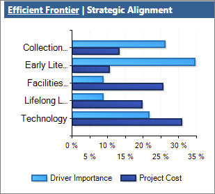
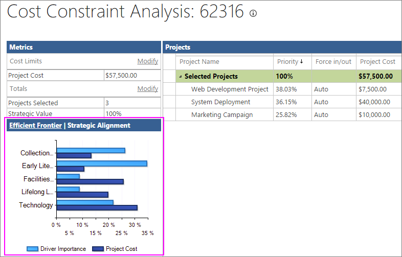

# Use the strategic alignment chart

Ideally, every dollar spent on projects should have some positive effect on your organization's strategic business goals. By examining the strategic alignment chart that's part of the Project Online portfolio analysis tools, you can see how closely your project portfolio budget supports strategic initiatives. This insight can help you decide which new projects are most beneficial to undertake. It can also help you adjust in-progress project portfolios so that the strategic alignment improves.
  
    
    

In this article
-  [What is strategic alignment?](65e216d7-39a9-4772-ac19-7855fec7cb62.md#_what)
    
  
-  [Set up business drivers and projects for portfolio analysis](65e216d7-39a9-4772-ac19-7855fec7cb62.md#_set)
    
  
-  [Interpret your strategic alignment chart in Project Online](65e216d7-39a9-4772-ac19-7855fec7cb62.md#_interpret)
    
  
-  [How the strategic alignment chart is calculated](65e216d7-39a9-4772-ac19-7855fec7cb62.md#_how)
    
  

## What is strategic alignment?

Strategic alignment is a way for you to analyze, in terms of dollars spent, the extent to which your project spending supports the achievement of your organization's business goals. When you run a portfolio analysis in Project Web App for Project Online, you get the strategic alignment chart from a  [How the strategic alignment chart is calculated](65e216d7-39a9-4772-ac19-7855fec7cb62.md#_how) based on information you enter, including:
  
    
    

- Your business drivers and their priorities
    
  
- The project plans for each portfolio project, including the overall project cost
    
  
- The strategic impact of each business driver on each project (none, low, moderate, strong, extreme)
    
  
In the strategic alignment chart, Project Online draws a bar graph with the percentage score for each driver across all projects (Driver Importance) compared with the percentage score of the total portfolio budget invested in each driver (Total Cost). 
  
    
    

  
    
    

  
    
    

  
    
    

  
    
    

  
    
    
If the two bars for each driver are about the same length, this tells you that project spending is well-aligned with your strategic business goals. If any pair of bars on a driver are far apart, this tells you there's more work to be done. It might indicate that the wrong types of projects are being chosen, the spending on projects is out of proportion with business goals, or the business goals themselves might need updating.
  
    
    

> [!NOTE]
> Users identified as Portfolio Managers or Administrators for Project Web App have the permissions necessary to create portfolio analyses in Project Online. Users identified as Portfolio Viewers can review the portfolio dashboard and analyses. If you're the Project Online administrator, to work with user permissions, on the **Settings** menu, choose **Site Settings**. Under Users and **Permissions**, choose **People and groups** or **Site permissions**. 
  
    
    

 [Ideally, every dollar spent on projects should have some positive effect on your organization's strategic business goals. By examining the strategic alignment chart that's part of the Project Online portfolio analysis tools, you can see how closely your project portfolio budget supports strategic initiatives. This insight can help you decide which new projects are most beneficial to undertake. It can also help you adjust in-progress project portfolios so that the strategic alignment improves.In this articleWhat is strategic alignment?Set up business drivers and projects for portfolio analysisInterpret your strategic alignment chart in Project OnlineHow the strategic alignment chart is calculated](65e216d7-39a9-4772-ac19-7855fec7cb62.md#_top)
  
    
    

## Set up business drivers and projects for portfolio analysis

To run portfolio analyses, including cost analyses that generate the strategic alignment chart, you need to set up your project portfolio in a specific way. 
  
    
    
To get started, be sure that you can access the portfolio analysis links on the Quick Launch. If you don't see a Strategy section on the Quick Launch, ask your Project Online administrator to add it.
  
    
    

1. On the **Settings** menu, choose **PWA Settings**.
    
  
2. Under **Look and Feel**, choose **Quick Launch**.
    
  
3. In the **Modify Quick Launch Items** table, select the check boxes next to **Strategy**, **Driver Library**, **Driver Prioritization**, and **Portfolio Analyses**.
    
  
4. On the **Quick Launch** tab, in the **Commit** group, choose **Save &amp; Close**.
    
    The **Strategy** section appears on the Quick Launch.
    
    
  
    
    

  
    
    

  
    
    

  
    
    

    
  
Now that you have the links you need, the portfolio analysis setup process includes the following five steps in Project Web App:
  
    
    

1. Add your organization's strategic business drivers.
    
  
2. Prioritize the business drivers.
    
  
3. Develop each project plan or proposed project along with cost information.
    
  
4. Rate how well each proposed project aligns with those business drivers.
    
  
5. Analyze your portfolio.
    
  
See below for more details on these steps.
  
    
    

### Add strategic business drivers

A business driver is a strategic goal that your organization has decided that it wants to accomplish, for example, increase product quality, expand its reach into the market, or diversify its service offerings. Business drivers should be specific and measurable, so you can readily determine whether and how much your various projects fulfill them. Organizations typically define their business goals during periodic strategic planning sessions.
  
    
    
In portfolio analysis, Project Web App uses business drivers to help rank the value of various projects so you can more objectively decide which projects will help your organization meet its strategic goals.
  
    
    

1. On the Quick Launch, choose **Driver Library**.
    
  
2. On the **Driver** tab, in the **Driver** group, choose **New**.
    
  
3. Complete the page that appears with your organization's business drivers. Get more details about  [business drivers for your Project Online portfolio analysis](https://technet.microsoft.com/en-us/library/dn641989.aspx).
    
  
4. On the **Driver** tab, in the **Driver** group, choose **Save**.
    
  

### Prioritize the business drivers

After you've defined your business drivers, you need to prioritize them.
  
    
    

1. On the Quick Launch, choose **Driver Prioritization**.
    
  
2. On the **Prioritizations** tab, in the **Prioritizations** group, choose **New**.
    
  
3. Complete the page that appears and work through the succeeding pages and the business driver prioritization process. Learn more about  [business driver prioritization](https://technet.microsoft.com/en-us/library/dn641992.aspx).
    
  
4. On the **Prioritization** tab, in the **Prioritization** group, choose **Save**.
    
  

> [!TIP]
> You can create multiple sets of business drivers and driver prioritizations. 
  
    
    

### Create the projects

If you haven't yet created the projects for a proposed portfolio, now's the time to do it. Be sure that each project includes project costs and resource information. 
  
    
    

### Rate each project's strategic impact

With the projects in place, rate the strategic impact for each one.
  
    
    

1. On the Quick Launch, choose **Projects**.
    
  
2. On the **Project Center,** choose the project for which you want to rate strategic impact and include in the portfolio analysis.
    
  
3. On the Quick Launch, choose **Strategic Impact**.
    
    This link appears with your Quick Launch project links after you create and save the business drivers.
    
  
4. Rate the impact of the project against each of the business drivers. 
    
  
5. On the **Project** tab, in the **Project** group, choose **Save**.
    
  

### Analyze your portfolio

After you've rated all projects you want to include in the portfolio analysis against the business drivers, you're ready to create the portfolio analysis. 
  
    
    

1. On the Quick Launch, choose **Portfolio Analyses**.
    
  
2. On the **Analyses** tab, in the **Analysis** group, choose **New**. 
    
  
3. Work through the pages that appear and define the analysis. This includes the driver prioritization you set, choosing and prioritizing the projects to be included in the analysis, reviewing the priorities, and analyzing costs. Learn more about  [creating your portfolio analysis](https://technet.microsoft.com/en-us/library/dn641990.aspx).
    
  
4. On the **Analysis** tab, in the **Analysis** group, choose **Save**.
    
  
 [Ideally, every dollar spent on projects should have some positive effect on your organization's strategic business goals. By examining the strategic alignment chart that's part of the Project Online portfolio analysis tools, you can see how closely your project portfolio budget supports strategic initiatives. This insight can help you decide which new projects are most beneficial to undertake. It can also help you adjust in-progress project portfolios so that the strategic alignment improves.In this articleWhat is strategic alignment?Set up business drivers and projects for portfolio analysisInterpret your strategic alignment chart in Project OnlineHow the strategic alignment chart is calculated](65e216d7-39a9-4772-ac19-7855fec7cb62.md#_top)
  
    
    

## Interpret your strategic alignment chart in Project Online

The portfolio analysis includes the strategic alignment chart, which is part of the cost constraint analysis. The strategic alignment chart can help you determine if new projects and their budgets are supporting your business goals. The strategic alignment chart can also help you analyze your existing portfolio of in-process projects and determine whether any adjustments should be made to move the portfolio closer to strategic alignment and therefore gain more value for your organization.
  
    
    

1. On the Quick Launch, choose **Portfolio Analyses**.
    
  
2. In the table that appears, choose the analysis you want to review.
    
  
3. If the cost analysis page is not already open, on the **Analysis** tab, in the **Portfolio Selection** group, click in the **Scenario** box, and select the scenario you want to analyze, for example, **Baseline**.
    
  
4. On the ** Analysis** tab, in the **Navigate** group, choose **Analyze Cost**.
    
    The portfolio cost analysis page opens, listing the projects selected for this analysis, associated cost metrics, and the **Efficient Frontier** chart in the lower-right corner.
    
  
5. In the title bar of the **Efficient Frontier** chart, choose **Strategic Alignment**. The chart switches from Efficient Frontier to Strategic Alignment. 
    
    
  
    
    

  
    
    

  
    
    

  
    
    

    
  
6. Review the chart to determine how well project portfolio spending supports the business drivers. The vertical axis lists each business driver. The dark horizontal bars show the percentage of spending on each driver across all projects. These bars are based on the project costs as well as the strategic impact scores you assigned in each project. The lighter horizontal bars show the percentage of importance for each driver that you identified when you prioritized the drivers. Each driver, then, is associated with this pair of bars.
    
  
When a pair of driver bars are about the same length, this means that your project spending in this portfolio are doing a good job of living up to the values and goals represented in that driver.
  
    
    
On the other hand, when a pair of bars have quite different lengths, it means that your project spending is out of line with your business goals. If the driver importance bar is long, for example, and the project cost is short, this means that your organization might want to consider dedicating additional funding to this project. Likewise, if the driver importance bar is short and the project cost is long, it means that a lower-priority driver is getting higher project dollars devoted to it. 
  
    
    
There might be good reasons for the two bars to be out of alignment, but examining the chart brings it to light and as the portfolio manager, you can do what you can to be sure that your portfolio project mix and the associated spending is intentional rather than accidental.
  
    
    
If you decide you want to bring any two bars into closer alignment, especially for a portfolio of in-progress projects, you have the following options:
  
    
    

- Examine the spending on projects. Is it too high or too low in relation to the priority of the business driver?
    
  
- Examine the choice of projects. Do the projects have much to do with the business drivers? If not, why not? Should any projects be put on hold or canceled? Should new projects be added to bring the portfolio into better alignment?
    
  
- Examine the business goals themselves. Are their priorities set appropriately? Are they up-to-date? Do they really reflect where the organization is now? Is it time for a new strategic planning session?
    
  
If you're analyzing a portfolio of proposed projects to determine which projects should be approved and which should be denied, use the strategic alignment chart to help you decide and also to set the appropriate budgets. You can adjust the project mix and the project costs. You can also adjust the project activities themselves to more effectively support the business goals. After these adjustments, recalculate the portfolio analysis and see if the strategic alignment has improved.
  
    
    
 [Ideally, every dollar spent on projects should have some positive effect on your organization's strategic business goals. By examining the strategic alignment chart that's part of the Project Online portfolio analysis tools, you can see how closely your project portfolio budget supports strategic initiatives. This insight can help you decide which new projects are most beneficial to undertake. It can also help you adjust in-progress project portfolios so that the strategic alignment improves.In this articleWhat is strategic alignment?Set up business drivers and projects for portfolio analysisInterpret your strategic alignment chart in Project OnlineHow the strategic alignment chart is calculated](65e216d7-39a9-4772-ac19-7855fec7cb62.md#_top)
  
    
    

## How the strategic alignment chart is calculated

This summarizes the series of calculations that results in the strategic alignment chart:
  
    
    

1. Based on your business drivers and their strategic impact on each portfolio project, Project Online calculates a driver score for each project.
    
  
2. Based on this driver score and the project budget, Project Online calculates the percentage of each project budget that's allocated to each driver.
    
  
3. Project Online then multiples the overall cost of each project by the percentage of project budget allocated to each driver. This provides the amount of each project budget that's allocated to specific drivers.
    
  
4. The cost allocated to each business driver is then added, providing the total investment per driver across all projects in the portfolio.
    
  
5. The sum of the investment for each driver is divided into the total cost of the portfolio to find the percent invested in each driver.
    
  
6. Project Online draws a bar graph with the percentage score for each driver across all projects compared with the percentage score of the total portfolio budget invested in each driver. This shows Driver Importance compared with Total Cost for each driver.
    
  
 [Ideally, every dollar spent on projects should have some positive effect on your organization's strategic business goals. By examining the strategic alignment chart that's part of the Project Online portfolio analysis tools, you can see how closely your project portfolio budget supports strategic initiatives. This insight can help you decide which new projects are most beneficial to undertake. It can also help you adjust in-progress project portfolios so that the strategic alignment improves.In this articleWhat is strategic alignment?Set up business drivers and projects for portfolio analysisInterpret your strategic alignment chart in Project OnlineHow the strategic alignment chart is calculated](65e216d7-39a9-4772-ac19-7855fec7cb62.md#_top)
  
    
    

## See also

#### Other Resources

  
    
    
 [Portfolio analysis business drivers](https://technet.microsoft.com/en-us/library/dn641989.aspx)
  
    
    
 [Portfolio analysis driver prioritization](https://technet.microsoft.com/en-us/library/dn641992.aspx)
  
    
    
 [Analyzing portfolios](https://technet.microsoft.com/en-us/library/dn641990.aspx)
  
    
    
 [Project Server 2013 - Strategy and Project Portfolio](https://social.technet.microsoft.com/wiki/contents/articles/17089.project-server-2013-strategy-and-project-portfolio.aspx)
  
    
    
 [Portfolio Analysis with Microsoft Server 2010](https://technet.microsoft.com/en-us/library/gg715564%28v=office.14%29.aspx)