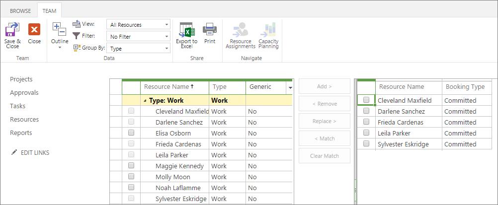
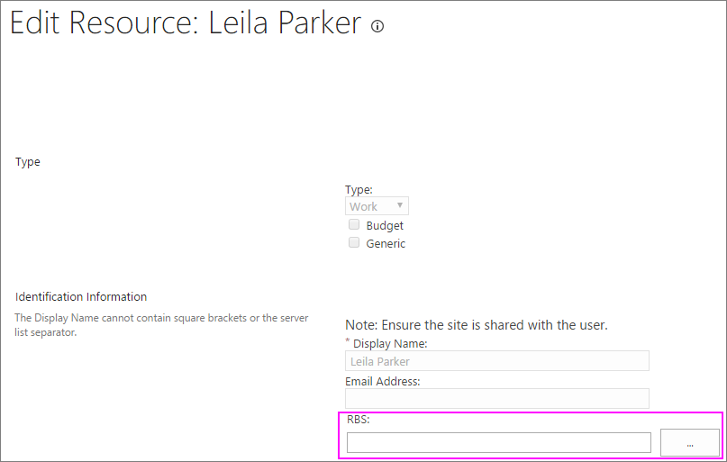
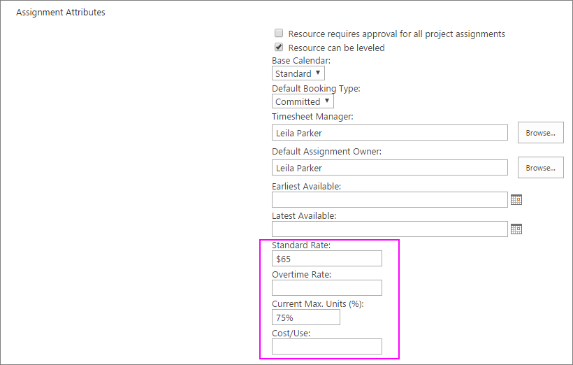
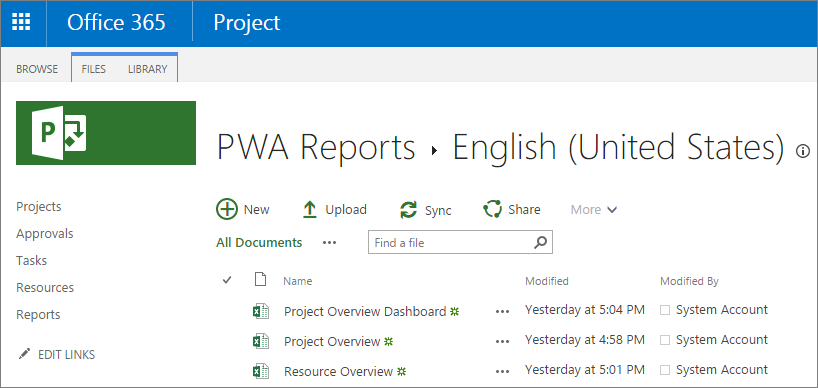
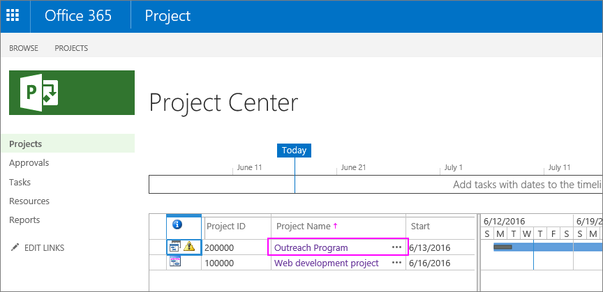
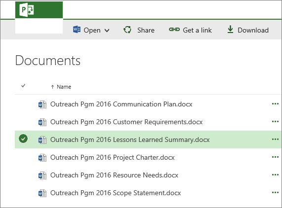
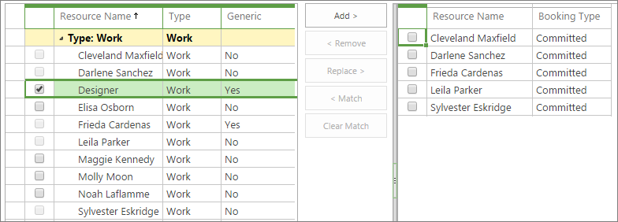

# Use data to forecast resource demand in Project Online

As a resource manager, you know that engaging the right resources for the right projects for the right amount of time is always a challenge, especially because you need to predict the future somehow. The good news is that you can use Project Web App for Project Online to analyze historical resource usage data captured in similar past projects. With this data you can more confidently forecast resource needs for future projects and even for your entire organization. You can then create models in upcoming projects to more accurately define the who, how, and when of resource engagement. 
  
    
    

In this topic
-  [See the types of resources used in past projects](6ce59d2e-aff1-49f0-ac61-8952b438e444.md#_see1)
    
  
-  [See how much a resource was used in past projects](6ce59d2e-aff1-49f0-ac61-8952b438e444.md#_see2)
    
  
-  [Find more sources of historical resource data](6ce59d2e-aff1-49f0-ac61-8952b438e444.md#_find)
    
  
-  [Develop resource forecasts for upcoming projects by creating generic resources](6ce59d2e-aff1-49f0-ac61-8952b438e444.md#_develop)
    
  
-  [Set the stage for future resource forecasting](6ce59d2e-aff1-49f0-ac61-8952b438e444.md#_set)
    
  

## See the types of resources used in past projects

If your organization has been using Project Web App for Project Online for at least one or two completed projects, you can use the historical data captured in those projects to help forecast resource needs for upcoming similar projects. For example, you might be able to use information from a system deployment project implemented two years ago to collect resource information for a similar deployment planned for next year. With historical project and resource data, you can analyze the types of resources used and their skill sets. 
  
    
    

### Review resources on the Build Team page

The first place to look for the types of resources used in a completed similar project is on the Build Team page. Here you can see the names of all resources assigned to a selected project.
  
    
    

1. In the Quick Launch, choose **Projects**.
    
  
2. In the **Project Center**, choose the name of the completed similar project you want to review.
    
  
3. To open the **Build Team** page, on the **Project** tab, in the **Navigate** group, choose **Build Team**.
    
    
  
    
    

  
    
    

  
    
    

  
    
    

    
  
4. Make a note of the resources listed on the right side of the view. These are the team members for the selected project whose information you'll be researching for your forecast.
    
    > [!TIP]
      > It might be easier to print or add a screen capture of the page to your notes. 

### Review a resource's details on the Edit Resource page

Now that you have the names of the resources who worked on the project, you can look at the resources individually on the **Edit Resource** page, and gather information about their functional skill sets, work units, and costs.
  
    
    

1. In the Quick Launch, choose **Resources**. 
    
    The Resource Center page opens. The Resource Center lists all resources in your organization's resource pool who are set up in Project Web App. The team members of the project you chose are among this list.
    
  
2. Select the check box next to the name of the first resource you want to research. 
    
  
3. On the **Resources** tab, in the **Resources** group, choose **Edit**. 
    
    The **Edit Resource** page opens, showing details about your selected resource.
    
  
4. For information about the type of resource, look at the **RBS**, **Resource Departments**, and **Code** fields. The **Code** field is sometimes used for job titles or job codes.
    
    
  
    
    

  
    
    

  
    
    

  
    
    

    
    > [!TIP]
      > If a code is present in the RBS field, you can press the Select Value button (the ellipses button) to see the full resource breakdown structure. An RBS is a hierarchical outline of functions which is often used to define resources from a functional or role-based point of view in a project. This contrasts with the department name or human resources job title in a company. If your organization has set up an RBS to detail functional skill sets and it's been set up in Project Online, this is an excellent place to help determine the types of resources to recruit for upcoming similar projects. 
5. For information about how much of this type of resource was assigned to this project, look at the **Current Max. Units (%)** field.
    
  
6. For information about the resource's costs, look at the **Standard Rate**, **Overtime Rate**, and **Cost/Use** fields. Note any information that's useful to you. Again, print or capture the page if that's easier.
    
    
  
    
    

  
    
    

  
    
    

  
    
    

    
  
7. When finished, choose **Cancel**.
    
  
8. In the Resource Center, select the check box next to the name of the next resource you want to research and repeat this process.
    
  

> [!NOTE]
> While people assigned to project tasks are considered work resources and are the most common project resources, equipment is another type of work resource. There are also material resources and cost resources. Refer to  [Add a resource to Project Web App](71c6aa5c-2a97-4cbb-9814-26289c62c471.md) to learn more about the different types of resources.
  
    
    

 [As a resource manager, you know that engaging the right resources for the right projects for the right amount of time is always a challenge, especially because you need to predict the future somehow. The good news is that you can use Project Web App for Project Online to analyze historical resource usage data captured in similar past projects. With this data you can more confidently forecast resource needs for future projects and even for your entire organization. You can then create models in upcoming projects to more accurately define the who, how, and when of resource engagement. In this topicSee the types of resources used in past projectsSee how much a resource was used in past projectsFind more sources of historical resource dataDevelop resource forecasts for upcoming projects by creating generic resourcesSet the stage for future resource forecasting](6ce59d2e-aff1-49f0-ac61-8952b438e444.md#_top)
  
    
    

## See how much a resource was used in past projects

Gain insight into when and how many resources were used throughout the project lifecycle by analyzing the actual time that resources spent working on their task assignments. The Resource Assignments view provides time-based information useful for future planning, for example, when a resource was added to the team and when their tasks ended, and also when their peak times were during the project. In addition to seeing actual hours spent on individual tasks per time period, you can see rolled-up totals for phases or for the entire project.
  
    
    
This information about actual hours worked would have ideally been reported by resources through their submitted timesheets, although project managers might have entered them as well. 
  
    
    

1. In the Quick Launch, choose **Resources**. 
    
  
2. Select the check box next to the names of the resources whose actual time you want to research. 
    
  
3. On the **Resources** tab, in the **Navigate** group, choose **Resource Assignments**.
    
    The Gantt Chart view appears for the project assignments of each of the selected resources.
    
  
4. On the **Assignments** tab, in the **Display** group, choose **Timephased Data**.
    
    The view changes to show **Planned, Actual**, and **Overtime** hours for each task in the project, grouped by the different resources selected. The timephased portion of the view shows the number of hours per time period.
    
  
5. To review summary information per time period, in the timephased portion of the view next to the project name, see the values in the rolled-up **Actual** and **Overtime** fields. To get the total actual and overtime hours for the resource on the entire project, click in the timephased portion of the view, and then press the End key to navigate to the **Total** field.
    
  
 [As a resource manager, you know that engaging the right resources for the right projects for the right amount of time is always a challenge, especially because you need to predict the future somehow. The good news is that you can use Project Web App for Project Online to analyze historical resource usage data captured in similar past projects. With this data you can more confidently forecast resource needs for future projects and even for your entire organization. You can then create models in upcoming projects to more accurately define the who, how, and when of resource engagement. In this topicSee the types of resources used in past projectsSee how much a resource was used in past projectsFind more sources of historical resource dataDevelop resource forecasts for upcoming projects by creating generic resourcesSet the stage for future resource forecasting](6ce59d2e-aff1-49f0-ac61-8952b438e444.md#_top)
  
    
    

## Find more sources of historical resource data

You can review resource reports and lessons learned summaries from a previous similar project.
  
    
    

### Review reports

1. To see the Resource Overview report for the completed project, on the Quick Launch, choose **Reports**.
    
  
2. In the **PWA Reports** page which appears, choose your language. The three sample reports are listed.
    
    
  
    
    

  
    
    

  
    
    

  
    
    

    
  
3. To open the report in Excel Online, choose **Resource Overview**. 
    
    To download it to your filing system, click the bubble to the left of the report name, and then, on the menu bar, choose **Download**. Navigate through your file system to find the location where you want to save the report, and then choose **Save**.
    
  

### Review lessons learned

If the completed project went through a lessons learned exercise, find the summary document and see what information it has about resource types, skill sets, cost, and usage. It might be stored in the document library for the project.
  
    
    

1. In the Quick Launch, choose **Projects**.
    
  
2. In the **Project Center**, choose the name of the project whose lessons learned document you want to open.
    
    
  
    
    

  
    
    

  
    
    

  
    
    

    
  
3. In the Quick Launch, choose **Documents.** The **Documents** page for the project opens.
    
  
4. Find the lessons learned document and select it by clicking the bubble to the left of the filename. (If you select the filename itself, it might open the file.)
    
    
  
    
    

  
    
    

  
    
    

  
    
    

    
  
5. On the menu bar, choose **Download**.
    
  
6. Navigate through your file system to find the location where you want to save the document, and then choose **Save**. 
    
  

> [!TIP]
> If you don't find a lessons learned file in the project's document library, contact the project manager and the resource manager if applicable. Interview them to learn what you can about their experiences with resource demand. 
  
    
    

 [As a resource manager, you know that engaging the right resources for the right projects for the right amount of time is always a challenge, especially because you need to predict the future somehow. The good news is that you can use Project Web App for Project Online to analyze historical resource usage data captured in similar past projects. With this data you can more confidently forecast resource needs for future projects and even for your entire organization. You can then create models in upcoming projects to more accurately define the who, how, and when of resource engagement. In this topicSee the types of resources used in past projectsSee how much a resource was used in past projectsFind more sources of historical resource dataDevelop resource forecasts for upcoming projects by creating generic resourcesSet the stage for future resource forecasting](6ce59d2e-aff1-49f0-ac61-8952b438e444.md#_top)
  
    
    

## Develop resource forecasts for upcoming projects by creating generic resources

When you've analyzed previous similar projects for useful resource information, you can develop your forecasts for future projects and possibly for the portfolio of projects throughout your organization. From your analysis, create a list of resource types and their skill sets, ideally with the help of an RBS. 
  
    
    
Then, in Project Web App for Project Online, add a new generic resource for each resource type or job title you might need in future projects. A generic resource is a resource you can add to the Project Web App resource pool that represents the job title, skill set, cost per hour or per use, and availability levels. 
  
    
    

### Add a generic resource

You add a generic resource to a team and assign it to tasks the same way you do an actual resource. The difference is that the resource is flagged as "generic," and instead of having a name like "Darlene Sanchez," the resource name is something like "Network Engineer."
  
    
    

1. In the Quick Launch, choose **Resources**.
    
  
2. On the **Resources** tab, in the **Resources** group, choose **New**.
    
  
3. On the **New Resources** page, in the **Type** section, select the **Generic** check box.
    
  
4. In the **Display Name** box, type the generic functional name of the resource. For example, instead of a person's name, type a title or function like **Designer**, **Writer**, or **Developer**.
    
  
5. Complete any other fields that might be useful for modeling resource requirements along with their associated scheduling and costs. For example, enter any information you might have for the **Base Calendar**, **Standard Rate, Overtime Rate**, **Current Max. Units (%)**, or **Cost/Use** fields.
    
  
6. Choose **Save**.
    
    The new generic resource is added to the Resource Center and is now available to be added to project teams.
    
  

> [!NOTE]
> Generic resources often apply to people, but you can also identify generic resources for equipment and material resources. 
  
    
    

### Model an upcoming project by using generic resources

In upcoming projects, you can work with the project manager to build the team by using the set of generic resources. In this way, when modeling an upcoming project, you can forecast resource requirements and costs without artificially committing actual resources to a project that doesn't yet exist. 
  
    
    

1. In the Quick Launch, choose **Projects**.
    
  
2. In the **Project Center**, choose the name of the project you're modeling.
    
  
3. On the **Project** tab, in the **Navigate** group, choose **Build Team**.
    
  
4. In the left table on the page, which lists your Project Online resource pool, select the check box next to the generic resource.
    
    
  
    
    

  
    
    

  
    
    

  
    
    

    
  
5. Between the two tables, choose **Add**. 
    
  
6. On the **Team** tab, in the **Team** group, choose **Save &amp; Close**.
    
    The generic resource is now added to the current project's team. You or the project manager can now assign tasks to this generic resource. 
    
  

### Replace generic resources with actual resources

When the project gets the go-ahead from the managing stakeholders, you can recruit actual resources that meet the criteria, and replace the generic resource placeholders.
  
    
    

1. In the Quick Launch, choose **Resources**.
    
  
2. Select the check box next to the name of the generic resource you want to replace. 
    
  
3. On the **Resources** tab, in the **Resources** group, choose **Edit**.
    
  
4. On the **Edit Resources** page, in the **Type** section, clear the **Generic** check box.
    
  
5. In the **Display Name** box, replace the generic functional name of the resource with the name of the person.
    
  
6. Complete any other fields for which you have information. Of particular interest for scheduling, usage, and cost are the **RBS**, **Base Calendar**, **Earliest Available**, **Latest Available**, **Standard Rate**, **Overtime Rate**, **Current Max. Units (%)**, or **Cost/Use** fields.
    
  
7. Choose **Save**.
    
    Throughout any projects, the generic resource is replaced with the name and information of the new, actual resource, both on the **Build Team** page as well as in project task assignments.
    
  
 [As a resource manager, you know that engaging the right resources for the right projects for the right amount of time is always a challenge, especially because you need to predict the future somehow. The good news is that you can use Project Web App for Project Online to analyze historical resource usage data captured in similar past projects. With this data you can more confidently forecast resource needs for future projects and even for your entire organization. You can then create models in upcoming projects to more accurately define the who, how, and when of resource engagement. In this topicSee the types of resources used in past projectsSee how much a resource was used in past projectsFind more sources of historical resource dataDevelop resource forecasts for upcoming projects by creating generic resourcesSet the stage for future resource forecasting](6ce59d2e-aff1-49f0-ac61-8952b438e444.md#_top)
  
    
    

## Set the stage for future resource forecasting

During your research of historical data, if you were dismayed to find that certain categories of resource-related data were not recorded in past projects, you can start to set that right. Do what you can to ensure the following in current and future projects:
  
    
    

- Job titles, costs, job codes, and departments are entered on the **Edit Resources** page for each resource.
    
  
- An RBS is created and periodically updated for all skill sets and associated with all resources in the Resource Center, which is the Project Web App resource pool.
    
  
- Team members update the project schedule with their actual hours from their periodic timesheets.
    
  
- Every project team goes through a lessons learned exercise and uploads the summary document to the Project Web App document library for the project.
    
  
If your company has a project management organization or portfolio manager, these practices can be instituted as a standard for all projects. You can also ask your Project Online administrator to make resource fields that you identify required rather than optional.
  
    
    

## See also

#### Other Resources

  
    
    
 [Learn more about resource units](http://technet.microsoft.com/library/505FE97B-9265-43E4-9B23-8800FD716C58%28Office.14%29.aspx)
  
    
    
 [Add a resource to Project Web App](71c6aa5c-2a97-4cbb-9814-26289c62c471.md)
  
    
    
 [Sample reports in Project Online](ceab4edc-13f4-4b64-81e1-a0f3a5c607bc.md)
  
    
    
 [What reporting tools can I use with project data?](002eaac1-35ef-4bab-b977-a02b39715ec3.md)