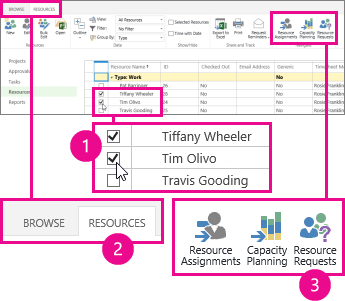
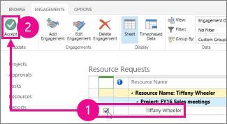
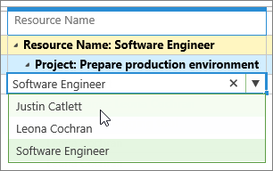

# Accept or reject an engagement request

After a project manager  [Request a resource's time](http://technet.microsoft.com/library/18a1dc67-d3ca-47cb-b032-9cc6289e3f93%28Office.14%29.aspx), the resource manager needs to review the request in Project Online or Project Server 2016, and then decide the right course of action.
  
    
    

In the **Resource Center**, select the resources you manage, and then click **Resources** > **Resource Requests** to review what project managers have submitted.
  
    
    

  
    
    

  
    
    

  
    
    
Look for requests marked as **Proposed**, and then:
- **Accept the request as-is if it looks okay.** Select the check box for the request, and then click **Engagements** > **Accept**. This marks the request as **Committed**, and the project manager has approval to assign the resource to tasks that match the request.
    
    
  
    
    

  
    
    

  
    
    

  
    
    

    
  
- **Make some changes and then accept the request.** You can change any of the request details, including swapping out the requested resource for a different resource. If a project manager has requested a generic resource, like a Software Engineer, you can swap it out for a specific one, like a person in that role who is available to do the work.
    
    
  
    
    

  
    
    

  
    
    

  
    
    

    
    On the **Resource Requests** page, you can change the **Resource Name**, **Committed Units**, **Committed Start**, or **Committed Finish**. After making your changes, click **Engagements** > **Accept**. This sends your changes to the project manager, who can choose to run with your suggestion, or resubmit the request with additional changes.
    
  
- **Reject the request.** If the request isn't acceptable, and suggesting changes to the project manager isn't an option, you can simply reject it. Select the check box for the request, and then click **Engagements** > **Reject**. The project manager will see that the request is **Rejected**, and can make changes and resubmit the request. If you need to reject a request, consider adding some comments or discussing your reasoning with the project manager so the resource need can be resolved appropriately.
    
  

## What should I be looking for?

If you're not sure whether an engagement is acceptable, you can  [Evaluate resource capacity](9da06433-281c-49d3-bcf9-e1dc5d67ead4.md) to learn more about availability, work, assignments, and engagements.
  
    
    
