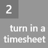
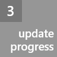
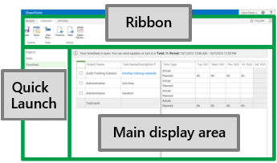
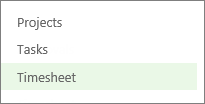
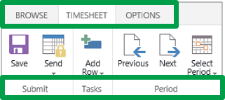
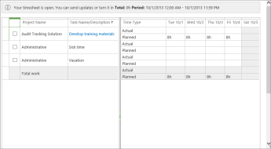
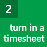

# Step 1: Get your bearings

  
    
    

  
    
    
 [
  
    
    
](f49a8e4a-29d2-4601-ac5a-437c232c31f1.md) [
  
    
    
](ca5c3826-85bf-4a31-9351-3b83fd7c8fe0.md)
  
    
    

 **Ready to dive in and start using Project Web App?** First, let's take a look at what you see when you sign in, so you know which areas do what.
The Project Web App window is made up of three main areas: the  [Quick Launch](71708a8a-dcb1-4b18-b9eb-cbbd23321db3.md#BKMK_QuickLaunch), the  [ribbon](71708a8a-dcb1-4b18-b9eb-cbbd23321db3.md#BKMK_Ribbon), and the  [main display area](71708a8a-dcb1-4b18-b9eb-cbbd23321db3.md#BKMK_MainDisplayArea).
  
    
    

  
    
    

  
    
    

  
    
    

  
    
    

||
|:-----|
||
   

## Quick Launch

The Quick Launch lists the main views and pages that you are able to access. You can click these links to go to different areas of Project Web App. 
  
    
    

  
    
    

  
    
    

  
    
    

  
    
    

  
    
    
Some pages in Project Web App do not include the Quick Launch. For example, when you fill out a form, you need to complete and save the form, or cancel out of it, in order to see the Quick Launch.
  
    
    

||
|:-----|
||
   

## Ribbon

The ribbon is the toolbar that you use to perform actions on what's currently in the main display area.
  
    
    
There may be multiple tabs on the ribbon, like **Browse**, to move between different sets of actions.
  
    
    

  
    
    

  
    
    

  
    
    

  
    
    

  
    
    
Each tab contains groups of related buttons like **Submit** that you can use to work with the page content.
  
    
    

||
|:-----|
||
   

## Main display area

The main display area contains information about your projects and tasks. This is the main focus of each page, and is where you will enter and review data.
  
    
    

  
    
    

  
    
    

  
    
    

  
    
    

  
    
    
This screenshot shows a timesheet in the main display area. Other pages, like the Project Center or the Tasks view, appear here too.
  
    
    

||
|:-----|
||
   

## That's it!

You've got the basics of how to get around in Project Web App.
  
    
    
 ** [View a list of projects](71716c1f-c2e8-4fea-be9e-3c0b657252a4.md)**
  
    
    

||
|:-----|
||
   

## NEXT STEP...

Next, learn about  [Step 2: Turn in a timesheet](f49a8e4a-29d2-4601-ac5a-437c232c31f1.md).
  
    
    

  
    
    

  
    
    
 [
  
    
    
](f49a8e4a-29d2-4601-ac5a-437c232c31f1.md) [
  
    
    
](ca5c3826-85bf-4a31-9351-3b83fd7c8fe0.md)
  
    
    
