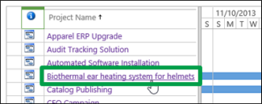
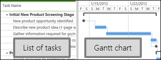
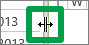

# View a list of projects

Occasionally, you might want to look at a list of all the projects you're working on, or all the projects you have access to in your organization. The Project Center shows a list of projects.
  
    
    

1. Click **Projects** on the Quick Launch.
    
    
  
    
    

  
    
    

  
    
    

  
    
    

    
  
2. Click the name of a project in the list to view that project's tasks and schedule.
    
    
  
    
    

  
    
    

  
    
    

  
    
    

    
  
3. Click through the links below the project name on the Quick Launch to view information about the project.
    
    
  
    
    

  
    
    

  
    
    

  
    
    

    
  
4. Scroll through the list of tasks, and view them on the Gantt chart on the right, to see the work planned for this project.
    
    
  
    
    

  
    
    

  
    
    

  
    
    

    
|||
|:-----|:-----|
|
> [!TIP]
>  Slide the splitter in the middle over to see more of either side of the view.
  
    
    

 **Also, what's a Gantt chart?** A Gantt chart is a fancy timeline. It shows time going across the top, with bars for each row. Progress is shown within each bar, and arrows show how one task or project relates to another.   |
  
    
    

  
    
    

  
    
    

  
    
    
   |
   
