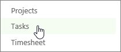
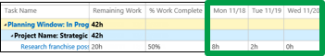
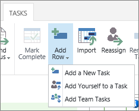
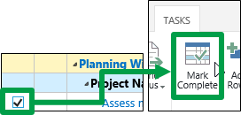
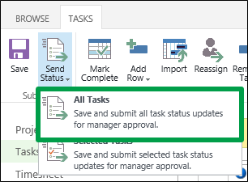
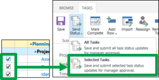

# Report the percent of work you've completed

 * [Project help](afac1e38-1219-4a88-bd22-81534778d528.md)* 
  
    
    

 **This topic is for organizations that track time and task progress using separate views.** [Report your task progress](4e338fec-6e78-4b0e-b059-11422057df31.md)
Sometimes the hours you've spent on a task don't match up with the percent of work you feel like you've completed on the task. For example, you may have completed 20 of 40 hours on a task, but you may not feel that you are 50% complete. You may think you are farther along, say 75% complete, or a bit behind, maybe 25% complete.
  
    
    

When you communicate your estimated percent complete, this is your **task progress**.
1. Click **Tasks** on the Quick Launch.
    
    
  
    
    

  
    
    

  
    
    

  
    
    

    
  
2. Fill out your hours on the right side of the grid.
    
    
  
    
    

  
    
    

  
    
    

  
    
    

    
    The **% Work Complete** column, on the left side of the grid, will be automatically updated with the percent complete, using this math:
    
    **Actual Work / [Actual Work + Remaining Work] = % Work Complete**
    
    If you don't see the task that you want to update, click **Tasks** > **Add Row**.
    
    
  
    
    

  
    
    

  
    
    

  
    
    

    
    If you're completely done with a task, select the check box for the task, and then click **Tasks** > **Mark Complete**. Percent complete is updated to 100%.
    
    
  
    
    

  
    
    

  
    
    

  
    
    

    
  
3. Send your updates to the project managers for your tasks.
    
  - **If you're ready to send all of your updates,** click **Tasks** > **Send Status** > **All Tasks**.
  
    
    

  
    
    

  
    
    

  
    
    

  
    
    

    
  
  - **If you only want to submit some of your updates,** select the check box for each task, and then click **Tasks** > **Send Status** > **Selected Tasks**.
  
    
    

  
    
    

  
    
    

  
    
    

  
    
    

    
  

## But the percentage doesn't look accurate…what do I do?

Remember how percent complete is calculated?
  
    
    
 **20 hours completed / 40 hours scheduled = 50% complete**
  
    
    
You know how much you worked, and you have an idea about what percentage of the total work that represents, so what you'll need to adjust is the number of hours that are scheduled for the task.
  
    
    
For example, let's say you've worked 20 hours, but you really only feel about 25% complete on the task. That means that you really think the task will take 80 hours, not 40, because 20 hours is 25% of 80 hours. Here's what the math looks like: 
  
    
    
 **20 hours completed / 80 hours scheduled = 25% complete**
  
    
    
To adjust the hours scheduled, you can either change the hours in the **Work** column, to reflect the 80 total hours, or you can change the hours in the **Remaining Work** column, to reflect the additional work left to do.
  
    
    
In this example, you're saying that you think the whole thing will take 80 hours, and you've already completed 20 of those hours. That means you have 60 hours of remaining work. When you enter 60 in the **Remaining Work** column, the **% Work Complete** column is updated to reflect the percentage that you feel is more accurate.
  
    
    
 ** [Update how much work you have left to do](fe646892-a8fa-4eac-8129-8c7121610c68.md)**
  
    
    
