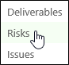
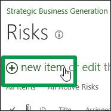
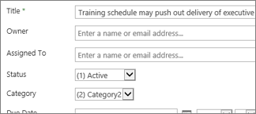
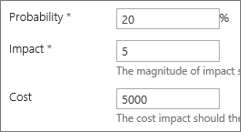
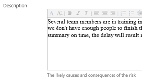
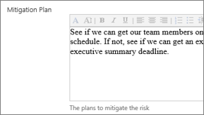
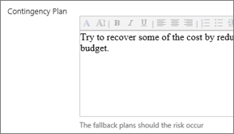
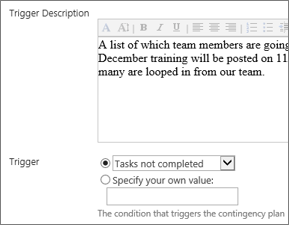
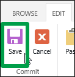

# Add a risk to a project

Risks are things that can impact a project's schedule, and that you're aware of when the project is planned. These may be things like an upcoming personnel change, or a tight turnaround time on a particular deliverable. By planning for a project's risks ahead of time, project managers are better able to manage the project schedule. 
  
    
    

## Want to add a risk to a project?

If the risk isn't specific to any one task, simply add it to the project site.
  
    
    

1. Click **Projects** on the Quick Launch.
    
    
  
    
    

  
    
    

  
    
    

  
    
    

    
    
    
  
2. Click the name of a project in the list.
    
    
  
    
    

  
    
    

  
    
    

  
    
    

    
    
    
  
3. Click **Project Site** on the Quick Launch.
    
    
  
    
    

  
    
    

  
    
    

  
    
    

    
    
    
  
4. Click **Risks** on the Quick Launch.
    
    
  
    
    

  
    
    

  
    
    

  
    
    

    
    
    
  
5. Click **New Item**.
    
    
  
    
    

  
    
    

  
    
    

  
    
    

    
    
    
  
6. Add information about the risk, including as many details as you can.
    
    
  
    
    

  
    
    

  
    
    

  
    
    

    
    
    
    The **Probability**, **Impact** (which is a general score, in comparison with other risks), and **Cost** of the risk help the project manager understand the risk, at a glance.
    
    
  
    
    

  
    
    

  
    
    

  
    
    

    
    
    
    The **Description** should cover why the risk is a possibility, and what will happen if it occurs.
    
    
  
    
    

  
    
    

  
    
    

  
    
    

    
    
    
    The **Mitigation Plan** is what you need to do to try to avoid the risk occurring.
    
    
  
    
    

  
    
    

  
    
    

  
    
    

    
    
    
    The **Contingency Plan** is what you're going to do if the risk actually does occur.
    
    
  
    
    

  
    
    

  
    
    

  
    
    

    
    
    
    The **Trigger Description** and **Trigger** are the things that will happen that will indicate when the risk is occurring, and when you need to put the contingency plan into action.
    
    
  
    
    

  
    
    

  
    
    

  
    
    

    
    
    
  
7. When you're done, click **Edit** > **Save**.
    
    
  
    
    

  
    
    

  
    
    

  
    
    

    
    
    
  

## Want to link this risk to a specific task?

After you've initially saved the risk, you can go back in and link it to a specific task, or to multiple tasks. The risk may be related to specific tasks in the project, and by linking the risk to these tasks, you give yourself a reminder of where you need to keep an eye on things.
  
    
    

1. Click the name of the risk in the list, to view it.
    
    
  
    
    

  
    
    

  
    
    

  
    
    

    
    
    
  
2. In the lower-right portion of the page, click **Add Related Item**.
    
    
  
    
    

  
    
    

  
    
    

  
    
    

    
    
    
  
3. On the left side of the box, under the name of your project, click **Tasks**.
    
    
  
    
    

  
    
    

  
    
    

  
    
    

    
    
    
  
4. On the right side of the box, click the row for the specific task you want to link the risk to.
    
    
  
    
    

  
    
    

  
    
    

  
    
    

    
    
    
  
5. Click **Insert** to link the risk to the task.
    
    
  
    
    

  
    
    

  
    
    

  
    
    

    
    
    
  

## Need more help?

If you're still not finding the answers you need, try searching for content on  [support.office.com](https://support.office.com), or browsing through the list of topics on the  [Project help](afac1e38-1219-4a88-bd22-81534778d528.md).
  
    
    
You may also find it helpful to post your questions and issues on a discussion forum. The  [Project discussion forums](https://social.technet.microsoft.com/forums/en-us/category/project) tend to be very active, which make them a great resource for finding others who may have worked through similar issues, or encountered the same situation.
  
    
    
 [
  
    
    
](https://social.technet.microsoft.com/forums/en-us/category/project)
  
    
    
