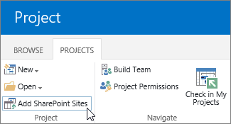

# More ways to create or import projects

 * [Project help](afac1e38-1219-4a88-bd22-81534778d528.md)* 
  
    
    

Got existing projects you want to add, or looking for other ways to create new projects? Project Web App has a few different options.
## Import an .mpp file from Project Professional

To import a project from Project Professional:
  
    
    

1. First, you'll need to  [Log on to Project Web App](http://technet.microsoft.com/library/7e7bbf48-60dc-4a39-8f65-24f154a97028%28Office.14%29.aspx).
    
  
2. Once that connection is established and you are logged on to Project Web App, the next step is to  [Save and publish a project to Project Web App](http://technet.microsoft.com/library/97f63e43-4599-46fc-9869-4ac51bca8da0%28Office.14%29.aspx).
    
  
Another way you might import a project from Project Professional is by  [Sync with a SharePoint tasks list](http://technet.microsoft.com/library/fb956d2c-723d-4d5a-b7e5-710ef82aa27a%28Office.14%29.aspx), and then  [Add an existing SharePoint task list to Project Web App](6f7b8294-2284-43ed-be4b-a8480f472674.md).
  
    
    

## Import a SharePoint task list

Here's one way to add an existing SharePoint task list to Project Web App:
  
    
    

1. In the **Project Center**, click the **Projects** tab, and then click **Add SharePoint Sites**.
    
    
  
    
    

  
    
    

  
    
    

  
    
    

    
  
2. Select the check box next to the site with the task list you're importing, change the **Project Name** if you'd like, choose the **Tasks List** you want to import, and then choose **Add**.
    
    > [!NOTE]
      > Only those sites you can access are listed. If the list you want to add is on a site you can't access, you'll need to request permissions to access that site before you can import the task list to Project Web App. 
 **Looking for other options?** You can also import a SharePoint task list by [Add an existing SharePoint task list to Project Web App](6f7b8294-2284-43ed-be4b-a8480f472674.md) to a page on the SharePoint site, and then linking the task list to Project Web App.
  
    
    
 **Start simple, expand later.** Once your project is through initial planning, you may want to take advantage of the more robust project planning, tracking, and reporting features in Project Web App. You can easily [Change a SharePoint task list into an enterprise project](d1387254-9478-4d9d-90d7-a4aee16b1f3c.md).
  
    
    

## Create a new project in the Project Center

In the **Project Center**, choose **Projects** > **New**.
  
    
    

  
    
    

  
    
    

  
    
    

  
    
    

  
    
    
When you create a project this way, you can create it as an enterprise project, which is managed within Project Web App, or you can create it as a SharePoint task list. You can also choose to create a new project in Project Professional.
  
    
    
