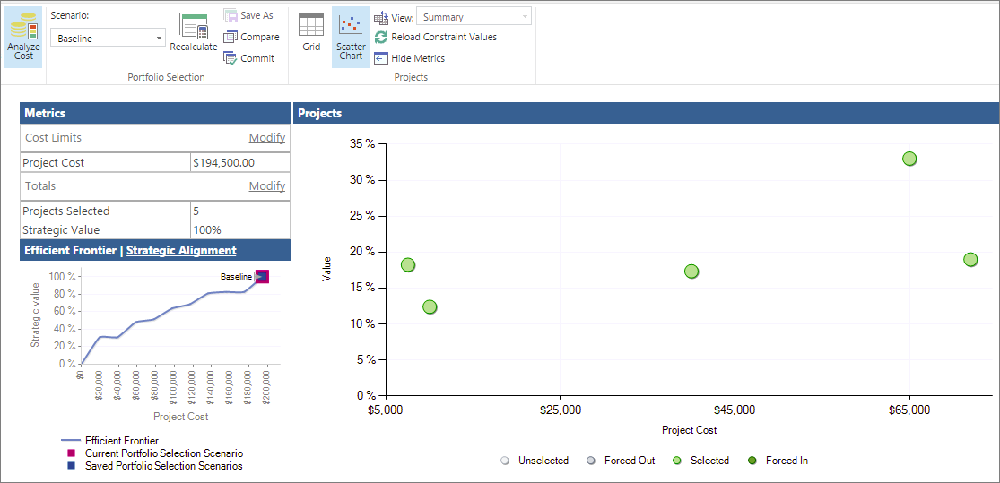
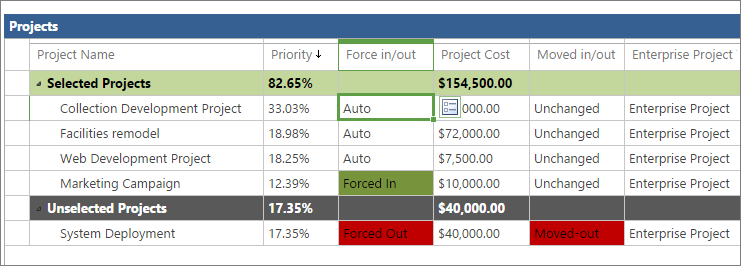
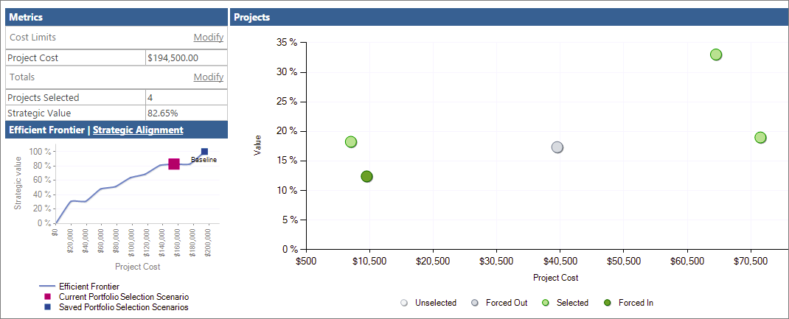
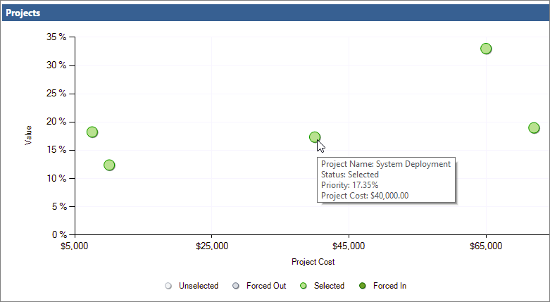
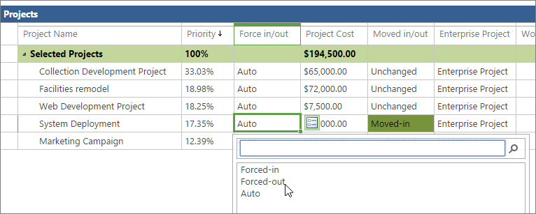
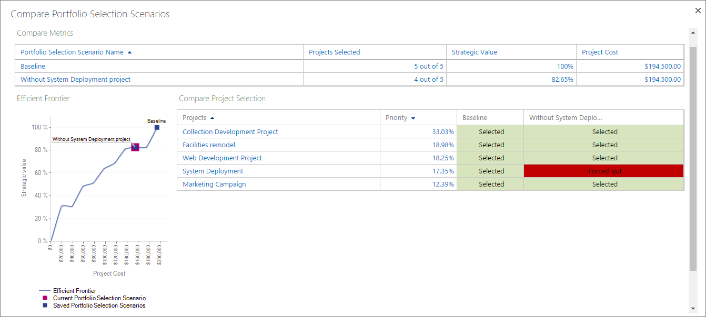

# Use the portfolio analysis scatter chart

Use the portfolio analysis scatter chart, along with the project grid, to work with and see the effects of adding and removing projects in a portfolio. You can save different portfolio selection scenarios, compare them with each other, and even commit to one when you've made your decision. 
  
    
    

## In this topic

-  [What is portfolio analysis scatter chart?](7e5503e2-79ac-425d-b91c-a49c1548d384.md#_What_is_portfolio)
    
  
-  [Set up business drivers and projects for portfolio analysis](7e5503e2-79ac-425d-b91c-a49c1548d384.md#_Setup_business)
    
  
-  [Create and save portfolio scenarios in Project Online](7e5503e2-79ac-425d-b91c-a49c1548d384.md#_Create_save_portfolio)
    
  

## What is portfolio analysis scatter chart?

The portfolio analysis scatter chart, available on the Cost Constraint Analysis page of the Project Online portfolio analysis area, plots the projects in your portfolio by cost versus value.
  
    
    

  
    
    

  
    
    

  
    
    

  
    
    

  
    
    
Color-coded plot points on the scatter chart each represent a project's selection state within the portfolio. There are four possible selection states: 
  
    
    

- **Selected.** The project is automatically selected by Project Web App to be part of the portfolio based on the strength of the project's business driver and prioritization settings as well as the project's ability to add value to the portfolio. This is an Auto setting.
    
  
- **Unselected.** The project is automatically unselected by Project Web App to be excluded from the portfolio based on the weakness of the project's business driver and prioritization settings as well as the project's likelihood of not adding value to the portfolio. This is an Auto setting.
    
  
- **Forced in.** The project is manually selected by the portfolio manager to be included in the portfolio, in spite of the fact that Project Web App had unselected it. Forcing in a project is often done to fulfill a mandate like regulatory compliance. Forcing in a project might cause other projects to be automatically unselected.
    
  
- **Forced out.** The project is manually unselected by the portfolio manager to be excluded from the portfolio, in spite of the fact that Project Web App had selected it for inclusion.
    
  
You can see projects' selection status in the project grid on the Cost Constraint Analysis page. Projects are listed under the **Selected Projects** or **Unselected Projects** headings. The **Force in/out** column specifies **Auto** if Project Web App automatically did the selecting or unselecting. The column specifies **Forced-in** or **Forced-out** if you made a change.
  
    
    

  
    
    

  
    
    

  
    
    

  
    
    

  
    
    
The scatter chart provides insight into the projects that are slated to be implemented as well as the ones that are not. You can change the selection state of projects in the portfolio to see how forcing different projects in or out affect the portfolio's strategic value, the efficient frontier, and strategic alignment. 
  
    
    

  
    
    

  
    
    

  
    
    

  
    
    

  
    
    
You can save these what-if scenarios for future reference and comparison. 
  
    
    

> [!NOTE]
> Users identified as Portfolio Managers or Administrators for Project Web App have the permissions necessary to run portfolio analyses and create scenarios in Project Online. Users identified as Portfolio Viewers can review saved portfolio analyses and scenarios. If you're the Project Online administrator, to work with user permissions, on the **Settings** menu, choose **Site Settings.** Under **Users and Permissions**, choose **People and groups** or **Site permissions**. 
  
    
    

 [Top of page](7e5503e2-79ac-425d-b91c-a49c1548d384.md#_Top)
  
    
    

## Set up business drivers and projects for portfolio analysis

To run portfolio analyses, you need to set up your project portfolio in a specific way.
  
    
    
To get started, be sure that you can access the portfolio analysis links on the Quick Launch. If you don't see a **Strategy** section on the Quick Launch, ask your Project Online administrator to add it.
  
    
    

1. On the **Settings** menu, choose **PWA Settings**.
    
  
2. Under **Look and Feel**, choose **Quick Launch**.
    
  
3. In the **Modify Quick Launch Items** table, select the check boxes next to **Strategy**, **Driver Library**, **Driver Prioritization**, and **Portfolio Analyses**.
    
  
4. On the **Quick Launch** tab, in the Commit group, choose **Save &amp; Close**. The **Strategy** section appears on the Quick Launch.
    
  

  
    
    

  
    
    

  
    
    

  
    
    

  
    
    
Now that you have the links you need, the portfolio analysis setup process includes the following five steps in Project Web App:
  
    
    

1. Add your organization's strategic business drivers.
    
  
2. Prioritize the business drivers.
    
  
3. Develop each project plan or proposed project along with cost information.
    
  
4. Rate how well each proposed project aligns with those business drivers.
    
  
5. Analyze your portfolio.
    
  
See below for more details on these steps.
  
    
    

### Add strategic business drivers

A business driver is a strategic goal that your organization has decided that it wants to accomplish, for example, increase product quality, expand its reach into the market, or diversify its service offerings. Business drivers should be specific and measurable, so you can readily determine whether and how much your various projects fulfill them. Organizations typically define their business goals during periodic strategic planning sessions.
  
    
    
In portfolio analysis, Project Web App uses business drivers to help rank the value of various projects so you can more objectively decide which projects will help your organization meet its strategic goals.
  
    
    

1. On the Quick Launch, choose **Driver Library**.
    
  
2. On the **Driver** tab, in the **Driver** group, choose **New**.
    
  
3. Complete the page that appears with your organization's business drivers. Get more details about  [business drivers for your Project Online portfolio analysis](https://technet.microsoft.com/en-us/library/dn641989.aspx).
    
  
4. On the **Driver** tab, in the **Driver** group, choose **Save**.
    
  

### Prioritize the business drivers

After you've defined your business drivers, you need to prioritize them.
  
    
    

1. On the Quick Launch, choose **Driver Prioritization**.
    
  
2. On the **Prioritizations** tab, in the **Prioritizations** group, choose **New**.
    
  
3. Complete the page that appears and work through the succeeding pages and the business driver prioritization process. Learn more about  [business driver prioritization](https://technet.microsoft.com/en-us/library/dn641992.aspx).
    
  
4. On the **Prioritization** tab, in the Prioritization group, choose **Save**.
    
  

> [!TIP]
> You can create multiple sets of business drivers and driver prioritizations. 
  
    
    

### Create the projects

If you haven't yet created the projects for a proposed portfolio, now's the time to do it. Be sure that each project includes project costs and resource information. 
  
    
    

### Rate each project's strategic impact

With the projects in place, rate the strategic impact for each one.
  
    
    

1. On the Quick Launch, choose **Projects**.
    
  
2. On the **Project Center**, choose the project for which you want to rate strategic impact and include in the portfolio analysis.
    
  
3. On the Quick Launch, choose **Strategic Impact**. This link appears with your Quick Launch project links after you create and save the business drivers.
    
  
4. Rate the impact of the project against each of the business drivers.
    
  
5. On the **Project** tab, in the **Project** group, choose **Save**.
    
  

### Analyze your portfolio

After you've rated all projects you want to include in the portfolio analysis against the business drivers, you're ready to create the portfolio analysis.
  
    
    

1. On the Quick Launch, choose **Portfolio Analyses**.
    
  
2. On the **Analysis** tab, in the **Analysis** group, choose **New**.
    
  
3. Work through the pages that appear and define the analysis. This includes the driver prioritization you set, choosing and prioritizing the projects to be included in the analysis, reviewing the priorities, and analyzing costs. Learn more about  [creating your portfolio analysis](https://technet.microsoft.com/en-us/library/dn641990.aspx).
    
  
4. On the **Analysis** tab, in the **Analysis** group, choose **Save**.
    
  
 [Top of page](7e5503e2-79ac-425d-b91c-a49c1548d384.md#_Top)
  
    
    

## Create and save portfolio scenarios in Project Online

In the portfolio analysis, you can review the scatter chart which shows project value against cost and also see the results of different project mix scenarios.
  
    
    

### Review the scatter chart

The scatter chart also represents all projects, whether they're automatically selected or unselected, and whether you've forced them in or out of the portfolio.
  
    
    

1. On the Quick Launch, choose **Portfolio Analyses**.
    
  
2. In the table that appears, choose the analysis you want to review.
    
  
3. If the cost analysis page is not already open, on the **Analysis** tab, in the **Portfolio Selection** group, click in the **Scenario** box, and select the scenario you want to analyze, for example, **Baseline**.
    
  
4. On the **Analysis** tab, in the **Navigate** group, choose **Analyze Cost**. The portfolio **Cost Constraint Analysis** page opens, which lists the projects selected for this analysis, associated cost metrics, and the Efficient Frontier chart in the lower-right corner.
    
  
5. On the **Analysis** tab, in the **Projects** group, choose **Scatter Chart**. The project grid switches to the scatter chart. Notice that the scatter chart shows a plot for all projects, whether or not they're selected for inclusion in the portfolio. They're color-coded, with the legend below the chart.
    
  
6. To see information about individual projects in the scatter chart, rest the mouse pointer over any plot point. The project name, selection state, value percentage, and project cost appear.
    
  

  
    
    

  
    
    

  
    
    

  
    
    

  
    
    

### Force projects in and out and review the portfolio analysis changes

Use the scatter chart and project grid to try scenarios with different project combinations. When you move projects in or out in these different scenarios, you'll see project costs and strategic values change, and therefore you'll also see different results in the efficient frontier chart and the strategic alignment chart. This can help you find the best combination of projects in your portfolio.
  
    
    

1. To experiment with different selection states on projects, for example, from selected to forced-out, return to the project grid. On the **Analysis** tab, in the **Projects** group, choose **Grid.**
    
  
2. In the project grid, click in the **Force in/out** field for the project you want to change. Click the icon that appears next to the field. On the drop-down menu, choose **Forced-in**, **Forced-out**, or **Auto**.
    
    
  
    
    

  
    
    

  
    
    

  
    
    

    
  
3. On the **Analysis** tab, in the **Portfolio Selection** group, choose **Recalculate**. The new portfolio analysis is recalculated based on your changes. Notice any changes to the **Metrics** table in the upper left, which includes total project portfolio cost and the strategic value percentage for the number of project selected for the portfolio. Also notice any changes to the **Efficient Frontier** chart in the lower-left corner of the page. Choose **Strategic Alignment** to see changes in that chart as well.
    
  
4. On the **Analysis** tab, in the **Projects** group, choose **Scatter Chart**. Notice the different colors and positions of the plotted projects that you forced out or in.
    
  

### Save project portfolio scenarios

You can save scenarios for later reference. 
  
    
    

1. To save a scenario, on the **Analysis** tab, in the **Portfolio Selection** group, choose **Save As**.
    
  
2. Type a name for the portfolio selection scenario and then choose **OK**. Saved scenarios are listed in the **Scenario** box, along with the **Baseline** scenario that you started with.
    
  

### Compare saved scenarios

You can compare saved scenarios to help you decide which projects belong in a portfolio.
  
    
    

1. To compare scenarios, on the **Analysis** tab, in the **Portfolio Selection** group, choose **Compare**. Any saved scenarios are presented in the **Compare Portfolio Selection Scenarios** page.
    
    
  
    
    

  
    
    

  
    
    

  
    
    

    
  
2. Compare the scenarios to see the effects of projects in or out of the portfolio, along with the number of projects, strategic value, project cost, and efficient frontier chart.
    
  
3. Click the **Close** button.
    
  

### Commit to a saved portfolio selection scenario

You can commit to a saved portfolio selection scenario, including the baseline scenario. When you commit to a scenario, the project selection decisions are written to fields in the projects and project views.
  
    
    

1. On the **Analysis** tab, in the **Portfolio Selection** group, click in the **Scenario** box, and choose the name of the scenario you want to commit to.
    
  
2. On the **Analysis** tab, in the **Portfolio Selection** group, choose **Commit**. A message states that this portfolio selection will be committed to the Project Web App database and might trigger workflow actions for an individual project.
    
  
3. Choose **OK**. Your portfolio selection is committed and ready for project implementation.
    
  
 [Top of page](7e5503e2-79ac-425d-b91c-a49c1548d384.md#_Top)
  
    
    

## See also

#### Other Resources

  
    
    
 [Portfolio analysis business drivers](https://technet.microsoft.com/en-us/library/dn641989.aspx)
  
    
    
 [Portfolio analysis driver prioritization](https://technet.microsoft.com/en-us/library/dn641992.aspx)
  
    
    
 [Analyzing portfolios](https://technet.microsoft.com/en-us/library/dn641990.aspx)
  
    
    
 [Project Server 2013 - Strategy and Project Portfolio](https://social.technet.microsoft.com/wiki/contents/articles/17089.project-server-2013-strategy-and-project-portfolio.aspx)
  
    
    
 [Portfolio Analysis with Microsoft Server 2010](https://technet.microsoft.com/en-us/library/gg715564%28v=office.14%29.aspx)