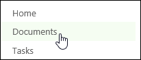
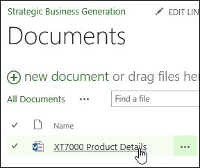

# View a project document

Projects sometimes come equipped with a lot of documents, from proposals and planning documents, to research and presentations. These documents are stored on a separate site for each project.
  
    
    

1. Click **Projects** on the Quick Launch.
    
    
  
    
    

  
    
    

  
    
    

  
    
    

    
  
2. Click the name of a project in the list.
    
    
  
    
    

  
    
    

  
    
    

  
    
    

    
  
3. Click **Project Site** on the Quick Launch.
    
    
  
    
    

  
    
    

  
    
    

  
    
    

    
  
4. Click **Documents** on the Quick Launch.
    
    
  
    
    

  
    
    

  
    
    

  
    
    

    
  
5. Click the name of the document in the list, to open it.
    
    
  
    
    

  
    
    

  
    
    

  
    
    

    
  
