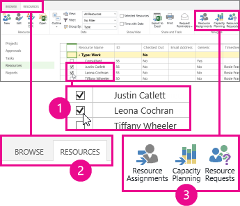
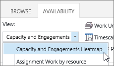
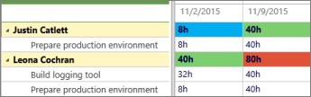
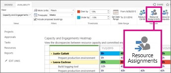

# Evaluate resource capacity

When you need to know if resources are overbooked, you can use the **Capacity Planning** view, in the **Resource Center**, to compare how many hours a resource is able to put in versus how many hours they're needed on projects.
  
    
    

In the **Resource Center**, select the check box for each resource you want to review, and then click **Resources** > **Capacity Planning**.
  
    
    

  
    
    

  
    
    

  
    
    
Choose **Availability** > **View** > **Capacity and Engagements Heatmap**.
  
    
    

  
    
    

  
    
    

  
    
    
In this view:
- **Green means things are good.** The resource's engaged time is roughly the same as the resource's overall capacity.
    
  
- **Blue shows where a resource is underused.** The resource's engaged time is significantly lower than the resource's overall capacity, and should be given more work.
    
  
- **Red shows where a resource is overextended.** The resource's engaged time is significantly higher than the resource's overall capacity, and should have some work either reassigned to someone else, or moved to a less-busy timeframe.
    
  
In the following example, we see two resources: Justin and Leona. Justin is underused during the week of 11/2, because he's only engaged for 8 hours of work, and Leona is overextended during the week of 11/9, because she's engaged for a total of 80 hours of work across two projects.
  
    
    

  
    
    

  
    
    

  
    
    
Justin should be added to more work to get him closer to his 40-hour capacity, and Leona should have some of her work reassigned or pushed out so that she has a reasonable workload for her 40-hour capacity.For more detail about what work each resource is doing, click **Availability** > **Resource Assignments**.
  
    
    

  
    
    

  
    
    

  
    
    
The **Resource Assignments** view shows task assignments, dates, actual work, and remaining work. With this level of detail, you have the right information to make suggestions on how the resources could be used more effectively.
## Want to change the view?

There are several things you can change in this view.
  
    
    

|**Change this...**|**By doing this...**|
|:-----|:-----|
|Which boxes are highlighted with red or blue    |Adjust the percentages in **Availability** > **Thresholds**.    |
|Which way columns are shown in the grid    |Adjust the **Timescale** in **Availability** > **Filters**.    |
|Which way work is shown in the grid    |Adjust the **Work Units** in **Availability** > **Filters**.    |
|Which dates are shown in the grid    |Click **Set Date Range** in **Availability** > **Date Range**.    |
|Whether to show engagements that aren't accepted yet    |Select the **Include proposed bookings** check box in **Availability** > **Filters**.    |
   
