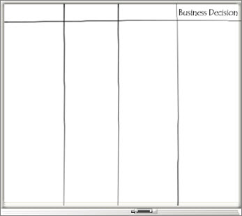
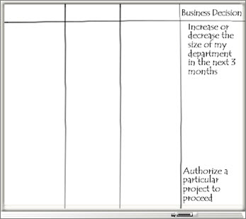

# Being a solutions buyer: white paper

This white paper is part of our "From the trenches" collection. It describes how prospective software purchasers can make interactions with software vendors more effective by applying easily understood business analysis methods. It walks you through an exercise that can help create software evaluation criteria by effectively determining what problems need to be addressed by the software solution. 
  
    
    

To see more white papers, see  ["From the Trenches" white papers](faec6b1a-c217-4c79-b8c4-0514f402106b.md).
## Being a Solutions Buyer

All too often, a software purchase is based on a list of features, an advertising campaign, or a friend's recommendation. This article describes how prospective software purchasers can make interactions with software vendors more effective by applying easily understood business analysis methods. 
  
    
    
It's sure not like it used to be. Getting software working in an enterprise setting isn't even referred to as installation any more. Nowadays, the terms implementation or deployment better describe what is needed to get a new package up and running. 
  
    
    
More and more software vendors are speaking about what they sell as solutions, and it's no wonder. When we think about deploying an enterprise system like Microsoft Project Server or Microsoft CRM, we have to first think about the different layers of technology that will be involved, and—before we even get to that—we have to think about the impact on our overall business.
  
    
    
With solutions to sell comes, of course, solutions sales. If you've followed this at all, you know that almost every high tech organization on the planet that targets mid to large organizations is working to re-create itself as a solutions sales deliverer. Microsoft is certainly among these organizations. Microsoft has worked extensively over the last few years to establish solutions selling as a guiding principle in its field sales and implementation forces.
  
    
    
So what is a solutions salesperson? It's true they're still a salesperson. However, solutions salespeople aim not just to move a box of software, but to build something that helps the client improve their situation. 
  
    
    
Sounds great so far; a Nirvana of salespeople all looking to improve your lot in life. But this does come with a challenge, and addressing that challenge is something in which you—the prospective client—can participate. 
  
    
    

### Focusing on the problem

The challenge that most solutions salespeople face when they arrive to the market is our preconception about what a solution should look like. We're so used to focusing on functions and features of software, when we speak to a software salesperson the conversation almost inevitably leads directly to, "Can your software do this? Can your software do that?" Experienced software salespeople—and those are the types who are moved into solutions selling positions—are so used to selling functions and features that they often forget to ask the most basic question of all: "What is the problem?"
  
    
    
 Now this may sound silly, but if you think about your last few conversations with software salespeople, you might be surprised at how rarely this question comes up. Vendors like Microsoft and its partners receive many Requests for Proposals each year. I've seen hundreds of them over the years, and one thing that is almost always present is a long grid of functions that the vendor is expected to fill in. This large spreadsheet often is the core of the reply to the client.
  
    
    
What is rarely present is a description of the business needs that will be addressed by each of these functions. It's so easy to get caught up in a feature we're familiar with from a previous product or that we've seen promoted somewhere that it takes real discipline to focus on what got us interested in this new product in first place. This can be especially so in an enterprise setting where there is a lot of input into what type of solution is being sought. It's much easier to send out a request asking for people to list all the functions that they'd like in a new software system than it is to talk about their particular business needs. 
  
    
    
If you're starting to think that perhaps you've been missing something obvious, you're not alone. This condition is so prevalent in the software industry at the moment that a new category of consultant called Business Analyst has sprung up. These people are trained to make the connection from business need to software functionality. Let's take a few minutes to see how you can apply the basic concepts—in the way that a Business Analyst would apply them—in your evaluations of enterprise level software.
  
    
    

### Identifying the business need

The first thing to think about is what business need brought you to look for a new software system in the first place. Our own organization often consults companies on implementing enterprise project management software. When I arrive in an organization as a consultant, long before we talk about whether to buy software, I ask how the organization is doing project management right now. 
  
    
    
When they finish their answer, I always ask this follow-up question: "Is that method working for you?" Surprisingly, the client often answers that it is. For me the implementation conversation has to stop there. "If there's no problem," I explain, "there's no way for me to craft a solution!" Often this answer makes people pause. "Why were we called in?" I'll ask. The answers can vary widely, and it's not uncommon for people to look around the room realizing that there are several agendas under way which must be reconciled—and our conversation is less than five minutes old!
  
    
    
So, asking "What is our business need?" is a great place to start. There is almost always an overall goal which answers this question—a goal that jump-started the initiative in the first place.
  
    
    

### Conducting a vision exercise

Next you'll need to look a little deeper into what this means in terms of software functionality. When we implement enterprise project management software like Microsoft Project Server into an organization, we always start with a vision exercise which involves the key personnel—those who are evaluating the software—and the senior management—those who are sponsoring the exercise. It's not enough to do this exercise with just technical personnel, because the objective of this exercise is to connect business goals to technical functions.
  
    
    
Here's an effective way to do this: Put the key personnel into a room with a big whiteboard. Divide the whiteboard into 4 columns: Start with a heading in only the far right column. Call it "Business Decision." 
  
    
    

  
    
    

  
    
    
In the right column you are going to list business decisions you hope to make by using the new system you are considering. When we do this with a client, the first thing people want to do is to list a lot of features, so you'll have to insist that the answers which are important are business decisions. For example, a participant may immediately say, "I need a list of all resources and their workload." That may be true, of course, but what you need to find out is what business decision they will make with that list. 
  
    
    
Some examples of business decisions might be: 
  
    
    

- Hiring or firing in a particular department
    
  
- Making a go or no-go decision on a project
    
  

  
    
    

  
    
    
Once you've got a decent list of business decisions, pause. Now is a good time to review the business decision list and identify the top priority decisions. You might want to ask yourselves this question: If you could only get answers for one of these business decisions, which would deliver the most value to the organization? Picking the top three decisions is always easiest at this point in the process. 
  
    
    
If you have gotten this far, you've already accomplished more than most organizations that seek out enterprise project management software. Being able to provide a prioritized list of the most significant business decisions to systems vendors is a huge step forward for the entire process. When you can tell system vendors what business decisions you need to make, they are empowered to move beyond talking about simple functionality to talking about how to make the organization more effective.
  
    
    
Next, look at each decision and ask, "In order to make that business decision, what report would you require?" Virtually every decision is made after looking at one or more reports. Label the 3rd column "Report." For each of the top three decisions, list in that column the reports required for the corresponding decision.
  
    
    
For example, we might say that to determine whether to hire or fire personnel for a particular department, we need a report by department showing the resource capacity planning data. This includes a forward forecast of expected workload, expected resource availability, and schedule. If you are a mid-sized business, the cash flow might also be a concern. You might, for example, have a need for additional personnel but not be able to find the cash to hire them. The cash flow report would include estimated incomes and outflows of money with a running balance.
  
    
    

  
    
    

  
    
    
If we fill in the Report column for each of the decisions we've identified as our priorities, the shape of what we'll require is already starting to become clear. Once you're done, you've got a list of physical output that you require from your prospective system.
  
    
    
Pause again here to find out if there are already reports of the type you've identified already in use in the organization. Chances are that such reports exist, but in numerous formats and possibly with either incomplete data or with excessive effort required to generate them. If you find formats of reports that have worked in the organization, you can add these to your list of systems requirements. Now you can provide even more information to the system vendors.
  
    
    
With the key reports now identified, we can move to the elements of a system required to generate those reports. Add the heading "Analysis" to the 2nd column of the chart. For each report, identify the analyses or algorithms that are required to generate the report. For example, for a resource capacity planning report, we might require a critical path schedule from the project management system and a resource leveling analysis.
  
    
    

  
    
    

  
    
    
These analyses will often be marketed by vendors on the basis of the myriad of features that each includes. (Yes, feature-by-feature selling is still alive and well!) What you need to be able to determine is the minimal functionality that will deliver the reports you require with which you can then make or improve the business decision that you have identified. You may be surprised at how basic is the functionality that you require in order to fulfill your actual business requirements. For some reports, no analysis or calculations will be required at all; the reports need only to be simple aggregates that can be generated right out of the new system's data.
  
    
    
Finally, we come to the first column in our chart. Once you've identified the analyses required, you can move to determining what elements of data are required to feed the analyses.
  
    
    
Add the heading "Input" to the 1st column of your chart. 
  
    
    
In the example we've been using, we might require a complete list of tasks for each project implicated in the department's work. This might very well be every project in the organization. We'll also need a complete profile of the availability of each resource along with the workload defined on each task such that when the task moves in the schedule analysis, the workload moves in the resource leveling analysis. Also, remember how we started with the decision of hiring or firing in a particular department? We'll also need to be able to identify the resources by department. 
  
    
    

  
    
    

  
    
    
We can move like this from the outputs on the right to the inputs on the left until we have identified everything we'll need in our new enterprise system. 
  
    
    

### Assessing risks

Once this exercise is complete, it's worthwhile to go back to each of the inputs and determine how available these elements of data are. You might find—as we often do—that some of these items don't even exist. For example, some organizations don't maintain a complete list of resource availability. You might also find that not every project has a resource-loaded schedule showing the resource load generated by that project. In many organizations, certain types of projects aren't put into a system of any kind. Emergency work, technical support work, or regular maintenance work are some common examples. 
  
    
    
If you don't have access to the fundamental data you'll require to deliver the business value, you've got to look at that element of the system as high-risk. For example, if we find that we can identify resource-loaded schedules for 80% of the organization's projects, can we reasonably expect to improve our business decision to increase or decrease staff? The answer is likely, "No." Why? Because perhaps the 20% of projects that are not in the system might represent 80% of the work load for a particular department. If you don't have all the data, you'll never know whether the final report is accurate.
  
    
    
There are ways around these kinds of problems, of course. One method is to isolate all the business processes of those aspects of the organization where you can't get access to the data elements. A division whose projects might not be in the system wouldn't have their resources listed either. This can't be done so simply in every case; you'll have to look item-by-item to figure out how much risk those business process and business decisions are to your implementation. It's not uncommon at this point in the process to re-prioritize the final business decisions you hope to improve. You might have a decision that is very desirable but turns out to be very high risk and therefore not worth pursuing in the early phases of your deployment. 
  
    
    

### Documenting what you've done

When you conduct this kind of meeting, assign a scribe—someone whose job it will be to record notes and comments throughout the process. The reasons why a particular business decision was ranked as a high or low priority or why something was considered high risk will be quickly forgotten if you don't have good notes to refer back to.
  
    
    
It is very important to record:
  
    
    

- What you have written on the whiteboard
    
  
- Who participated in the process
    
  
- Who owns each final business decision
    
  
If you're feeling overwhelmed at this point, don't fear. This entire exercise can be accomplished very quickly, even in the largest organizations. It is not uncommon to be able to complete the entire process in a day or perhaps two. The key to being successful is getting the right level of management into the room. Moreover, this type of meeting is best facilitated by someone from outside the organization who is not predisposed to do things the way they have always been done.
  
    
    

### Knowledge is power

If you're looking at enterprise project management systems—indeed, at enterprise systems of any kind—completing this exercise gives you a tremendous amount of power when you interact with software systems vendors. You can immediately distinguish between those elements of a system that are important to you and those that are not. Software vendors can be provided with the list of reports and decisions that you want to make. 
  
    
    
You might be surprised at some of the responses that come back to you from the vendors. Freed up to respond in a way other than on a feature-by-feature basis—that is, trying to fit a square function into a round requirement—the better vendors will be able to show you how you can answer your business challenges by using their systems to their best advantage.
  
    
    
Here is the biggest benefit of conducting this exercise: You have created ready-made evaluation criteria. Now, during the proof-of-concept phase, you can immediately focus on whether the system delivers the information you need to improve the business decisions you must make. 
  
    
    

## About the Author

Chris Vandersluis is the president and founder of Montreal, Canada-based HMS Software, a Microsoft Certified Partner. He has an economics degree from McGill University and over 30 years experience in the automation of project control systems. He is a long-standing member of the Project Management Institute (PMI) and helped found the Montreal, Toronto, and Quebec chapters of the Microsoft Project Users Group (MPUG). Publications for which Chris has written include Fortune, Heavy Construction News, Computing Canada magazine, and PMI's PMNetwork, and he is a regular columnist for Project Times. He teaches Advanced Project Management at McGill University and often speaks at project management association functions across North America and around the world. HMS Software is the publisher of the TimeControl project-oriented timekeeping system and has been a Microsoft Project Solution Partner since 1995. 
  
    
    
Chris Vandersluis can be contacted by e-mail at: chris.vandersluis@hms.ca
  
    
    
If you would like to read more EPM-related articles by Chris Vandersluis, see HMS's EPM Guidance site (http://www.epmguidance.com/?page_id=39).
  
    
    
