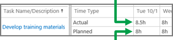
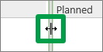

# Enter hours on your timesheet

The time you spend on tasks and other non-project work is captured on your timesheet.
  
    
    

1. On the Quick Launch, click **Timesheet**.
    
    
  
    
    

  
    
    

  
    
    

  
    
    

    
  
2. Find the task that you worked on in the list on the left side, and then follow the row across to the right side of the view.
    
    
  
    
    

  
    
    

  
    
    

  
    
    

    
  
3. Fill in your hours across the top row of the grid, next to **Actual**.
    
    
  
    
    

  
    
    

  
    
    

  
    
    

    
    The bottom row of the grid shows the **Planned** hours, from when the task was initially scheduled in the project.
    
|||
|:-----|:-----|
|
> [!TIP]
>  Slide the splitter in the middle over to see more of either side of the view.
  
    
    

|
  
    
    

  
    
    

  
    
    

  
    
    
   |
   
