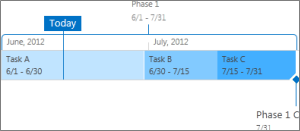
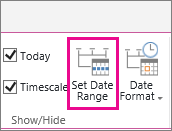
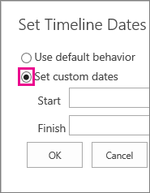

# Change the appearance of a timeline in Project Web App

The timeline can be customized in several ways. This article describes how to customize the timeline in the following ways:
  
    
    

-  [Change the fonts and colors ](a6541385-33db-4262-9b58-54b0f2330574.md#__change_fonts_colors)
    
  
-  [Change how dates are displayed](a6541385-33db-4262-9b58-54b0f2330574.md#__change_dates_displayed)
    
  
-  [Change how tasks appear](a6541385-33db-4262-9b58-54b0f2330574.md#__change_tasks_appear)
    
  
-  [Lock the timeline width](a6541385-33db-4262-9b58-54b0f2330574.md#__lock_timeline_width)
    
  
-  [Set timeline date ranges](a6541385-33db-4262-9b58-54b0f2330574.md#__set_timeline_range)
    
  

  
    
    

## Change the fonts and colors

You can change the font face, size, format, and color for the text used on the timeline. You can also change the fill colors used for the timeline bars, diamonds, and background.
  
    
    
To change the fonts and colors used on the timeline:
  
    
    

1. Click once on the timeline to select it.
    
  
2. To change the font used on a timeline bar or diamond, click the bar or diamond, and then, on the **Timeline** tab, in the **Font** group, change the font face, size, format, and color.
    
    > [!TIP]
      > When you click a bar or diamond on the timeline, a box appears with information about that task. If this box is in the way when you're ready to format a different bar or diamond, simply click the X in the top right corner of the box to close it. 
3. To change the color used to fill in a bar or diamond, click the bar or diamond, and then, on the **Timeline** tab, in the **Font** group, click **Highlight Color**, and choose a color.
    
    > [!NOTE]
      > The color used to fill a diamond is also used for the line drawn between the diamond and the task name. 
4. To change the color used to fill in the background of the timeline, click in a space in the timeline that isn't filled by a bar or diamond, and then, on the **Timeline** tab, in the **Font** group, click **Highlight Color**, and choose a color.
    
  

## Change how dates are displayed

By default, the timeline includes task dates, a marker indicating the current date, and dates across the top to mark the timescale. However, you can also include the overall project start and finish dates, or choose to hide any of the default date indicators. You can also choose the format for task start dates and due dates. To choose how you want to include dates on the timeline:
  
    
    

1. Click once on the timeline to select it.
    
  
2. On the **Timeline** tab, in the **Show/Hide** group, select the check box next to each type of date that you want to include on the timeline:
    
  - **Task Dates** Select the **Task Dates** check box to display the start date and due date for each task within the task's bar or next to the task's diamond.
    
  
  - **Today** Select the **Today** check box to display an indicator on the timeline for the current date.
    
  
  - **Start &amp; Finish** Select the **Start &amp; Finish** check box to display a start date at the beginning of the timeline and a finish date at the end of the timeline. These dates are taken from the earliest task start date, and the latest task due date.
    
  
  - **Timescale** Select the **Timescale** check box to display markers across the top of the timeline at dated intervals.
    
  
3. To choose the format to use for dates within task bars or next to task diamonds, on the **Timeline** tab, in the **Show/Hide** group, click **Date Format**, and select the format you want to use.
    
  

## Change how tasks appear

Tasks without a start date, or tasks that have a start date but no due date, always appear as diamonds on the timeline. A task with a start date and a due date, however, can appear as a bar on the timeline, or you can choose to display it as a callout above the timeline. This can be particularly useful if you have chosen to indent tasks in your task list as a way to communicate different phases of a project, or larger tasks that have several subtasks. For example, let's say you have a task list like this:
  
    
    

- Phase 1
    
  - Task A
    
  
  - Task B
    
  
  - Task C
    
  
- Phase 2
    
  - Task D
    
  
  - Task E
    
  
You might choose to display phases as callouts on the timeline, and tasks as bars on the timeline.
  
    
    

  
    
    

  
    
    

  
    
    

  
    
    

  
    
    
To display a task as a callout on the timeline, click once on the task bar, and then, on the **Timeline** tab, in the **Current Selection** group, click **Display as Callout**. If you decide you would rather return the callout to the timeline as a bar, click once on the callout text, and then, on the **Timeline** tab, in the **Current Selection** group, click **Display as Bar**. You can also remove tasks from the timeline entirely, without removing them from the task list. This can be helpful if you need to simplify the timeline, or if you would prefer that some tasks didn't show up in the Project Summary web part. There are two ways to remove a task from the timeline:
  
    
    

- Click once on the bar, diamond, or callout text, and then, on the box that appears, click **Remove from Timeline**.
    
  
- Click once on the bar, diamond, or callout text, and then, on the **Timeline** tab, in the **Current Selection** group, click **Remove from Timeline**.
    
  

## Lock the timeline width

After you have added tasks to the timeline and arranged them in a way that you feel accurately represents the project, you can lock the timeline width so that others who view the timeline see the timeline for your project in the way you have intended. If you do not lock the timeline width, the width will vary based on the size of the window being used to view the timeline. To lock the timeline width, arrange the timeline to accurately represent your project, and then, on the **Timeline** tab, in the **Actions** group, click **Lock Timeline Width**. Now, when someone else views your timeline, it will remain at the width that you have set, regardless of the viewer's window size.
  
    
    

## Set timeline date ranges

Depending on the size or complexity of a project, you might find it helpful to adjust the date range by increasing or decreasing the range of dates that the timeline displays. You can accomplish this in Project Online or Project Server 2016 by customizing the date range of the timeline.
  
    
    

1. On the Quick Launch, click **Projects**.
    
    
  
    
    

  
    
    

  
    
    

  
    
    

    
  
2. Click anywhere on the timeline to open the **Timeline** tab, then in the **Show/Hide** group click **Set Date Range**.
    
    
  
    
    

  
    
    

  
    
    

  
    
    

    
  
3. On the **Set Timeline Dates** box, select **Set custom dates**, fill in your desired start and finish dates, and then click **OK**.
    
    
  
    
    

  
    
    

  
    
    

  
    
    

    
  
