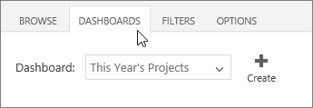
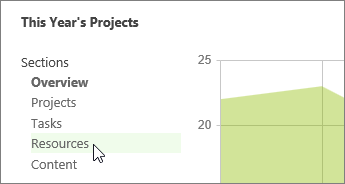
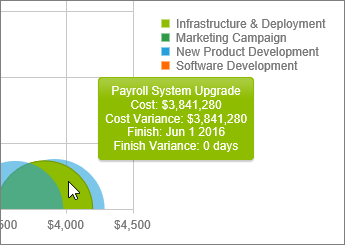
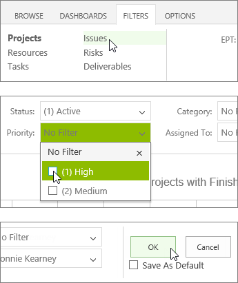
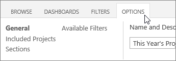

# What can I do with a portfolio dashboard?

Office 365 Project Portfolio Dashboard is an app that you can use in conjunction with Project Online to quickly view and drill down into charts that illustrate things like progress, cost, schedule, and resources. You can add the app to Project Online to view and create dashboards on the web, or you can  [Office 365 Project Portfolio Dashboard for iPad](2727ac0f-8276-4700-a5e3-bace8c042e02.md) by downloading the Office 365 Project Portfolio Dashboard app and connecting it to Project Online.
  
    
    

> [!NOTE]
> Don't see Office 365 Project Portfolio Dashboard? You may need to ask your administrator to  [Add an app to a site](http://technet.microsoft.com/library/ef9c0dbd-7fe1-4715-a1b0-fe3bc81317cb%28Office.14%29.aspx). 
  
    
    

Six dashboards are included by default:
- This Year's Projects
    
  
- Last Year's Projects
    
  
- Next Year's Projects
    
  
- Major Active Initiatives
    
  
- My Active Projects
    
  
- All Projects
    
  

> [!TIP]
> You can also  [Create a portfolio dashboard](eb09494b-f2e5-451d-8b88-3257d055c6d4.md), if these default dashboards aren't quite meeting your needs. 
  
    
    

 **To change dashboards,** choose **Dashboards**, and then choose another one from the list.
  
    
    

  
    
    

  
    
    

  
    
    

## Each dashboard has different sections

Use the links on the left side of the dashboard to switch between sections.
  
    
    

  
    
    

  
    
    

  
    
    

  
    
    

  
    
    

## Drill down for more detail

In some places, more information is displayed right on the chart. In other spots, another page is shown to drill into greater detail. To drill down, try selecting an area or row of a chart or table.
  
    
    

  
    
    

  
    
    

  
    
    

  
    
    

  
    
    

## Use filters to refine what you're seeing

Choose a filter category on the left, set the filters in the middle, and then choose **OK** on the right.
  
    
    

  
    
    

  
    
    

  
    
    

  
    
    

  
    
    

> [!TIP]
>  If you want the dashboard to always use the filters you've set, select the **Save As Default** checkbox, and then choose **OK**. >  You can also filter information in some charts by tapping different items in the legend.
  
    
    

## Change what's included on a dashboard

The **Options** tab includes all settings for the current dashboard, including the filters that define which projects are included, the charts displayed within each section, and the filters that are available when viewing the dashboard. These are the same options you have when you [Create a portfolio dashboard](eb09494b-f2e5-451d-8b88-3257d055c6d4.md).
  
    
    

> [!IMPORTANT]
> When you save a change to the options for a dashboard, you're changing the dashboard for everyone in your organization. 
  
    
    

  
    
    

  
    
    

  
    
    

  
    
    

  
    
    
