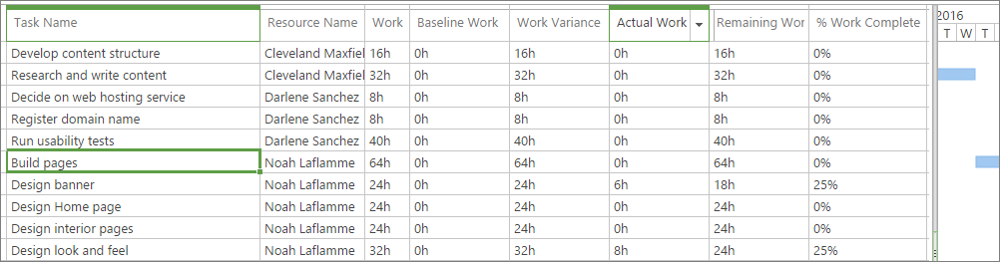
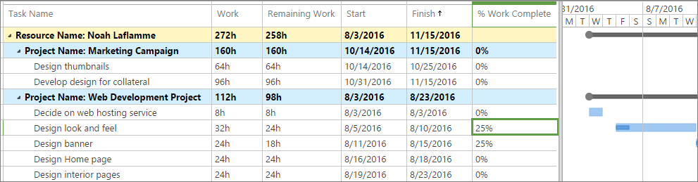
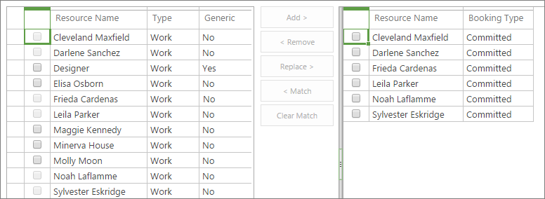
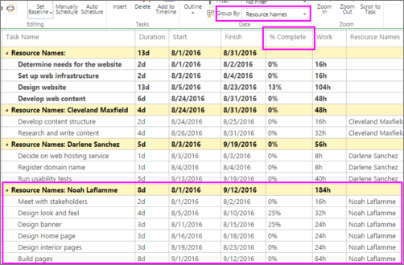
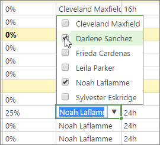
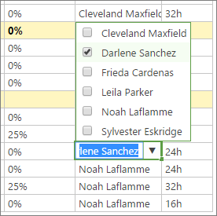
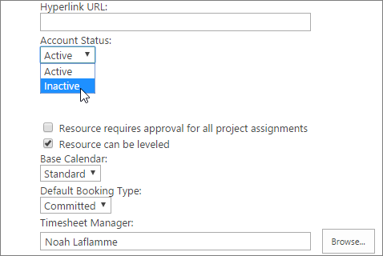

# Replace a resource in Project Online

When a team member leaves a project before all of their assigned work is completed, you need to quickly find an appropriate replacement who can jump in and take over the remaining tasks. In Project Online, you can review actual work done by the original resource and remaining work to be done by their replacement, which informs you of the skills and timeframe needed. You can then find a matching resource, replace the resource, and transfer all remaining work to that new person.
  
    
    

## In this topic

  
    
    

-  [View actual and remaining work](aab48bcd-d935-44b5-aab6-aa62fd5e519f.md#_View)
    
  
-  [Find potential resource replacements](aab48bcd-d935-44b5-aab6-aa62fd5e519f.md#_Find)
    
  
-  [Get more information about potential resource replacements](aab48bcd-d935-44b5-aab6-aa62fd5e519f.md#_GetMoreInfo)
    
  
-  [Replace an existing resource with a new one](aab48bcd-d935-44b5-aab6-aa62fd5e519f.md#_Replace)
    
  
-  [Deactivate the resource ](aab48bcd-d935-44b5-aab6-aa62fd5e519f.md#_Deactivate)
    
  

## View actual and remaining work

Before you start looking for an appropriate replacement for the team member, review the tasks remaining to be done and their scheduled dates. This will give you a better idea of the skills and availability to look for.
  
    
    

### Review assignments on the Assignments Work view

1. In Project Online, in the Quick Launch, choose **Projects**. 
    
  
2. In the **Project Center**, choose the name of the project in which you're replacing the departing team member.
    
  
3. On the **Task** tab, in the **Data** group, click in the **View** box, and then choose **Assignments Work**. The Assignments Work view shows all assignments by resource, whose names are sorted alphabetically.
    
    
  
    
    

  
    
    

  
    
    

  
    
    

    
    > [!TIP]
      > For a smaller project, or one with fewer resources, instead of grouping you can click the arrow in the **Resource Name** column heading and choose **Sort Ascending**. 
4. For the departing resource, review the **Task Name**, **Actual Work**, and **Remaining Work** columns.
    
    > [!TIP]
      > To return to the default view, on the **Task** tab, in the **Data** group, click in the **View** box, and then choose **Tasks Summary**. 

### Review assignments on the Resource Assignments page

Another way to see the resource's remaining tasks is on the Resource Assignments page. This is especially helpful if the resource is assigned to tasks in multiple projects.
  
    
    

1. On the Quick Launch, choose **Resources**.
    
  
2. In the **Resource Center**, select the check box next to the name of the departing resource.
    
  
3. On the **Resources** tab, in the **Navigate** group, choose **Resource Assignments**. The Resource Assignments page shows all tasks in all projects to which the selected resource is assigned, and includes remaining work, start and finish date, and percentage work complete for each task. One view for this page shows the task sheet with a Gantt Chart.
    
    
  
    
    

  
    
    

  
    
    

  
    
    

    
  
4. To show timephased data including planned, actual, and overtime hours, on the **Assignments** tab, in the **Display** group, choose **Timephased Data**.
    
  
 [When a team member leaves a project before all of their assigned work is completed, you need to quickly find an appropriate replacement who can jump in and take over the remaining tasks. In Project Online, you can review actual work done by the original resource and remaining work to be done by their replacement, which informs you of the skills and timeframe needed. You can then find a matching resource, replace the resource, and transfer all remaining work to that new person.](aab48bcd-d935-44b5-aab6-aa62fd5e519f.md#_Top)
  
    
    

## Find potential resource replacements

It can be tough to find the right person with the skills and availability you need, orient him or her to the project, and make the transition as smooth as possible. If your organization's resources are set up in Project Online with good information about skill sets and availability, your resource replacement search process can be more efficient.
  
    
    

### View, filter, or group resources to find a replacement

One method to narrow down possible resource replacements is to view, filter, or group resources on the **Build Team** page by certain characteristics, for example, by resource type or availability dates.
  
    
    

1. On the Quick Launch, choose **Projects**.
    
  
2. In the **Project Center**, choose the name of the project that needs the resource replacement.
    
  
3. On the **Project** tab, in the **Navigate** group, choose **Build Team**. The **Build Team** page opens, and shows the entire resource pool in the table on the left. The table on the right lists the current project team.
    
    
  
    
    

  
    
    

  
    
    

  
    
    

    
  
4. Use one or more of the following methods to reduce the list of available resources in the table on the left to just those who meet your criteria.
    
  - On the **Team** tab, in the **Data** group, click in the **View** box, and choose the resource type you're looking for, for example, **Work Resources**. (To see all resources again, click in the **View** box and choose **All Resources**.)
    
  
  - On the **Team** tab, in the **Data** group, click in the **Filter** box, and choose **Resources with In Progress Assignments** or **Overallocated Resources**. These might be resources to rule out because they might not have availability for your project. On the other hand, if tasks needing a replaced resource are scheduled later, these resources might become available again. (To see all resources again, click in the **Filter** box and choose **No Filter**.)
    
  
  - On the **Team** tab, in the **Data** group, click in the **Group by** box, and choose a grouping like **Earliest Available** or **Latest Available**. (To remove the grouping, click in the **Group by** box and choose **No Group**.)
    
  

### Match resources to find a replacement

Another method for targeting potential resource replacements is to use the Match feature on the Build Team page. This works if your organization has set up your resources with resource breakdown structure (RBS) codes.
  
    
    

1. On the Quick Launch, choose **Projects**.
    
  
2. In the **Project Center**, choose the name of the project that needs the resource replacement.
    
  
3. On the **Project** tab, in the **Navigate** group, choose **Build Team**. 
    
  
4. In the table on the right, select the check box next to the name of the departing resource.
    
  
5. Between the two resource tables, choose **Match**. The table on the left is filtered to show any resources that match the same RBS code as the resource selected in the table on the right.
    
  
6. Make a note of the resources you want to research further.
    
  
 [When a team member leaves a project before all of their assigned work is completed, you need to quickly find an appropriate replacement who can jump in and take over the remaining tasks. In Project Online, you can review actual work done by the original resource and remaining work to be done by their replacement, which informs you of the skills and timeframe needed. You can then find a matching resource, replace the resource, and transfer all remaining work to that new person.](aab48bcd-d935-44b5-aab6-aa62fd5e519f.md#_Top)
  
    
    

## Get more information about potential resource replacements

Now that you have names for possible resource replacements, you can gather more information in the Resource Center. Find information about skills and availability in the **Resource Assignments** and **Capacity Planning** pages and also by looking at the resource details for each candidate.
  
    
    

### Review the Resource Assignments page

See what possible resource replacements are working on now and into the near future by reviewing the **Resource Assignments** page.
  
    
    

1. On the Quick Launch, choose **Resources**. 
    
  
2. In the **Resource Center**, select the check box next to the names of any resources whose assignments you want to review. 
    
  
3. On the **Resources** tab, in the **Navigate** group, choose **Resource Assignments**. The **Resource Assignments** page shows all tasks in all projects to which the selected resource is assigned, including remaining work, start and finish date, and percentage work complete for each task. The default setting for this page shows time-phased data including planned, actual, and overtime hours.
    
  
4. To switch to the Gantt Chart, on the **Assignments** tab, in the **Display** group, choose **Gantt Chart**.
    
  

### Review the Capacity Planning page

Also review the **Capacity Planning** page for the selected resources to see how busy they are now and into the future.
  
    
    

1. In the **Resource Center**, be sure to select the check boxes next to the names of any resources whose capacity you want to review.
    
  
2. On the **Resources** tab, in the **Navigate** group, choose **Capacity Planning**. The top of the **Capacity Planning** page shows a graph of capacity over time for all selected resources.
    
  
3. Scroll down to see time-phased details for each selected resource. The availability and capacity for each resource is shown for each time period.
    
  
4. To get more capacity information, make one or more of the following changes.
    
  - To see other views of capacity information, on the **Availability** tab, in the **Views** group, click in the **View** box and select another view, for example, **Resource Utilization** or **Remaining Availability**.
    
  
  - To change the timescale, on the **Availability** tab, in the **Filters** group, click in the **Timescale** box, and select the time period you want, for example, **Weeks** or **Months**.
    
  
  - To see availability for a certain time period, on the **Availability** tab, in the **Date Range** group, choose **Set Date Range**. In the dialog box, select the start date in the **From** box and select the end date in the **To** box.
    
  
5. To leave the **Capacity Planning** page and return to the **Resource Center**, on the **Availability** tab, in the **Navigate** group, choose **Resource Center**.
    
  

### Review the Edit Resource page

Finally, review details in the Edit Resource page to help you make your final decision.
  
    
    

1. On the Quick Launch, choose **Resources**.
    
  
2. In the **Resource Center**, select the check boxes next to the names of the resources you want to research. 
    
  
3. On the **Resources** tab, in the **Resources** group, choose **Edit**. The ** Edit Resource** page appears for the first selected resource.
    
  
4. To find information that can help you decide on the best replacement candidate, do one or more of the following.
    
  - In the **Assignment Attributes** section, review the **Base Calendar**, **Earliest Available**, **Latest Available**, and **Current Max. Units (%)** fields.
    
  
  - Also in the **Assignment Attributes** section, review the cost fields: **Standard Rate**, **Overtime Rate**, and **Cost/Use** to make sure these work with your project budget.
    
  
  - Review the fields in the **Departments** and **Group Fields** sections, as these can give you indications of the resource's job title and associated skill set.
    
  
5. To review information for the next selected resource, choose **Continue without Saving**. The **Edit Resource** page appears for the second selected resource.
    
  
6. Repeat this process until you've reviewed the skill set, availability information, and costs for all selected resources.
    
  
 [When a team member leaves a project before all of their assigned work is completed, you need to quickly find an appropriate replacement who can jump in and take over the remaining tasks. In Project Online, you can review actual work done by the original resource and remaining work to be done by their replacement, which informs you of the skills and timeframe needed. You can then find a matching resource, replace the resource, and transfer all remaining work to that new person.](aab48bcd-d935-44b5-aab6-aa62fd5e519f.md#_Top)
  
    
    

## Replace an existing resource with a new one

Now you're ready to replace the resource. When you replace a resource, the information about any actual work done by the original resource remains as it was—assigned to the original resource. The replacing resource is assigned to any remaining work assigned to the original resource. 
  
    
    

### Replace a resource automatically by using the Build Team page

1. In Project Online, on the Quick Launch, choose **Projects**.
    
  
2. In the **Project Center**, choose the name of the project that needs the resource replacement.
    
  
3. On the **Project** tab, in the **Navigate** group, choose **Build Team**. 
    
  
4. In the table on the left, select the check box next to the name of the resource who is to replace the departing resource on the team.
    
  
5. In the table on the right, select the check box next to the name of the departing resource.
    
  
6. Between the two tables, choose **Replace**. The replacing resource is added to the team listed on the right. All of the departing resource's assignments that still have remaining work on them are assigned to the new resource.
    
  

### Replace a resource manually

If you prefer, you can replace resources manually. This works better if you're assigning new resources to several of the old assignments, and you want to review the assignments one at a time. When you assign a new resource to a partially completed assignment, the departing resource remains on the assignment as the one who completed the actuals to this point. The new resource is assigned to all remaining work on the assignment. To assign a new resource to an assignment that has no actual work done yet, simply remove the old resource and add the new.
  
    
    

1. In Project Online, on the Quick Launch, choose **Projects**.
    
  
2. In the **Project Center**, choose the name of the project that needs the resource replacement.
    
  
3. Be sure that the default **Tasks Summary** view is applied. The **Tasks Summary** view includes the **% Complete** and **Resource Names** fields, so you can see which tasks have remaining work to be done and you can add or replace the resource on those tasks. On the **Task** tab, in the **Data** group, click in the **View** box, and then choose **Tasks Summary** if necessary.
    
  
4. On the **Task** tab, in the **Data** group, click in the **Group By** box, and then choose **Resource Name**. All task information is grouped by resource name, sorted alphabetically by first name.
    
    
  
    
    

  
    
    

  
    
    

  
    
    

    
  
5. Click in the **Resource Name** field for the first task with remaining work assigned to the departing resource.
    
  - If there is any value other than 0% in the **% Complete** field, click the arrow in the **Resource Name** field and then select the check box next to the name of the resource you want to assign the remaining work. Leave the departing resource assigned as well.
    
    
  
    
    

  
    
    

  
    
    

  
    
    

    
  
  - If the value in the **% Complete** field is 0%, click the arrow in the **Resource Name** field. Clear the check box next to the name of the departing resource and then select the check box next to the name of the resource you want to assign the remaining work.
    
    
  
    
    

  
    
    

  
    
    

  
    
    

    
  
6. Repeat step 5 for all other tasks with remaining work assigned to the departing resource. 
    
  
7. To return to the ungrouped view, on the **Task** tab, in the **Data** group, click in the **Group By** box, and then choose **No Group**. 
    
  
8. On the **Task** tab, in the **Project** group, choose **Save**.
    
  
9. On the **Task** tab, in the **Project** group, choose **Publish**.
    
  
 [When a team member leaves a project before all of their assigned work is completed, you need to quickly find an appropriate replacement who can jump in and take over the remaining tasks. In Project Online, you can review actual work done by the original resource and remaining work to be done by their replacement, which informs you of the skills and timeframe needed. You can then find a matching resource, replace the resource, and transfer all remaining work to that new person.](aab48bcd-d935-44b5-aab6-aa62fd5e519f.md#_Top)
  
    
    

## Deactivate the resource

If a resource is just leaving the project but not leaving the organization, you just replace him or her with another resource on your project. However, if the resource is leaving the organization or is otherwise not expected to work on any of its projects again, then you can mark the resource as inactive in Project Online. Deactivating resources ensures that while their archival information remains in projects they worked in, they won't be shown as eligible to be assigned to any other projects.
  
    
    
You probably need to ask your Project Online administrator to deactivate the resource.
  
    
    

1. In Project Online, on the Quick Launch, choose **Resources**.
    
  
2. In the **Resource Center**, select the check box next to the name of the resource you want to inactivate.
    
  
3. On the **Resources** tab, in the **Resources** group, choose **Edit**.
    
  
4. On the **Edit Resource** page, in the **Identification Information** section, go to the **Account Status** box.
    
  
5. Click in the **Account Status** box, and choose **Inactive**.
    
  
6. Choose **Save**.
    
    
  
    
    

  
    
    

  
    
    

  
    
    

    
  
 [When a team member leaves a project before all of their assigned work is completed, you need to quickly find an appropriate replacement who can jump in and take over the remaining tasks. In Project Online, you can review actual work done by the original resource and remaining work to be done by their replacement, which informs you of the skills and timeframe needed. You can then find a matching resource, replace the resource, and transfer all remaining work to that new person.](aab48bcd-d935-44b5-aab6-aa62fd5e519f.md#_Top)
  
    
    
