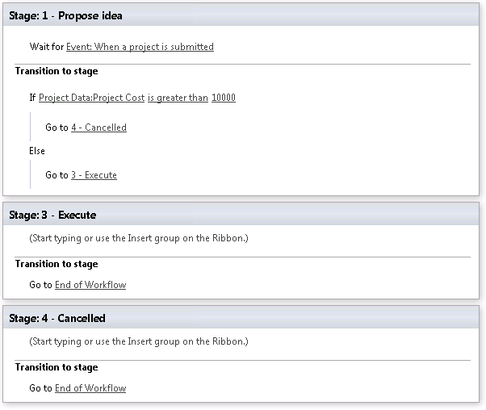

# Add a custom field to a project detail page
 **Summary:** Learn how to add a custom field to a project detail page. 
**Applies to:** Project Server 2016, Project Server 2013
  
By adding a custom field to a project detail page, you can collect customized project information as part of a Project Web App workflow. In this article we'll look at an example of collecting a cost estimate in the first stage of the workflow.
  
## Before you begin

Before starting, make sure:
  
- If you are using an on-premises deployment of Project Server, you have set up the [SharePoint 2013 workflow platform](/SharePoint/governance/workflow-in-sharepoint-server).
    
- You have created the sample workflow, stages, and enterprise project type as described in [Create a sample Project Web App workflow](create-a-sample-project-web-app-workflow.md).
    
## Create the custom field

In this example, we'll create a custom field called Project Cost that we'll use in the workflow to gather preliminary cost information about the project.
  
### To create a custom field

1. In Project Web App, click **Settings** > **PWA Settings**.
    
2. Under **Enterprise Data**, click **Enterprise Custom Fields and Lookup Tables**.
    
3. Under **Enterprise Custom Fields**, click **New Field**.
    
4. For **Name**, type Project Cost.
    
5. Under **Entity and Type**, choose **Cost** from the **Type** dropdown list.
    
6. Under **Behavior**, select the **Behavior controlled by workflow** check box.
    
7. Click **Save**.
    
## Add the custom field to a project detail page

Once the field has been created in Project Web App, we need to add it to the project detail page. In this example, we'll use the ProjectInformation page that comes with Project Web App.
  
### To add a custom field to a project detail page

1. In Project Web App, click **Settings** > **PWA Settings**.
    
2. Under **Workflow and Project Detail Pages**, click **Project Detail Pages**.
    
3. On the Project Detail Pages page, click the **ProjectInformation** page.
    
4. On the ribbon, on the **Page** tab, click **Edit Page**.
    
5. In the upper right corner of the **Basic Info** area, open the dropdown menu and choose **Edit Web Part**.
    
6. Under **Displayed Project Fields**, click **Modify**.
    
7. In the **Project Fields** list, find the **Project Cost** field that you just created, and then click the add ( **>**) button to add it to the **Selected Project Fields** list.
    
8. Click **OK**.
    
9. Scroll down until you see the **OK** button and click **OK**.
    
10. On the ribbon, click **Stop Editing**.
    
## Build a workflow

We've added the custom field to the project detail page, but by default it's not a required field on that page. Required fields are configured as part of the workflow stage in which the project detail page appears. Because we want to use the field in a workflow calculation, we need to make sure it's a required field by modifying the stage.
  
### To modify a stage

1. In Project Web App, click **Settings** > **PWA Settings**.
    
2. Under **Workflow and Project Detail Pages**, click **Workflow Stages**.
    
3. Click the **1 - Propose idea** stage.
    
4. Scroll down to the **Required Custom Fields** area.
    
5. Select **Project Cost** in the **Choose Custom Fields** list and click the add ( **>**) button.
    
6. At the bottom of the page, click **Save**.
    
Building the workflow itself is the next step. We'll be using the Sample Workflow that you created in [Create a sample Project Web App workflow](create-a-sample-project-web-app-workflow.md) to build a workflow that looks like this:
  

  
If you've completed the procedures in other articles in this series, you may already have part of this workflow in place. The complete steps for creating this workflow are in the following procedure.
  
### To create a workflow

1. Start SharePoint Designer.
    
2. Connect to your Project Web App site.
    
3. On the left, click **Workflows**.
    
4. Click **Sample Workflow**.
    
5. Click **Edit workflow**.
    
6. On the ribbon, click **Stage**, and then click **1 - Propose idea**.
    
7. Place the orange cursor in the top section of **Stage 1** and, on the ribbon, click **Action**, and then, under **Project Web App Actions**, click **Wait for Project Event**.
    
8. Click **this project event**, and choose **Event: When a project is submitted** from the dropdown menu.
    
9. Place the orange cursor below Stage 1, click **Stage**, and then click **3 - Execute**.
    
10. Place the orange cursor below Stage 3, click **Stage**, and then click **4 - Cancelled**.
    
11. Place the orange cursor in the **Transition to stage** area of Stage 1, and then, on the ribbon, click **Condition**, and then click **If any value equals value**.
    
12. Click the first **value** link, and then click **fx**.
    
13. Leave the **Data source** set to **Project Data** and choose **Project Cost** from the **Field from source** dropdown list.
    
14. Click **OK**.
    
15. Click the **equals** link, and then choose **is greater than** from the dropdown list.
    
16. Click the second **value** link, and type10000 in the text box.
    
17. Place the orange cursor in the If branch of the If / Else statement.
    
18. On the ribbon, click **Action**, and then choose **Go to a stage**.
    
19. Click the **a stage** link, and then choose **4 - Cancelled**.
    
20. Place the orange cursor in the Else branch of the If / Else statement.
    
21. On the ribbon, click **Action**, and then choose **Go to a stage**.
    
22. Click the **a stage** link, and then choose **3 - Execute**.
    
23. Click **a stage**, and then choose **3 - Execute** from the dropdown menu.
    
24. Place the orange cursor in the **Transition to stage** area of Stage 3, and then, on the ribbon, click **Action**, and then click **Go to a stage**.
    
25. Click **a stage**, and then choose **End of Workflow** from the dropdown menu.
    
26. Place the orange cursor in the **Transition to stage** area of Stage 4, and then, on the ribbon, click **Action**, and then click **Go to a stage**.
    
27. Click **a stage**, and then choose **End of Workflow** from the dropdown menu.
    
28. On the ribbon, click **Publish**.
    
## Test it out

Now that the workflow has been published, let's create a test project and see how our custom field for project cost works.
  
### To create a project

1. In Project Web App, in the left navigation, click **Projects**.
    
2. On the ribbon, click the **Projects** tab.
    
3. Click **New**, and then click **Sample Project Type**.
    
4. Name the project **Custom Field**, and then type 5000 in the **Project Cost** field.
    
5. Click **Save**.
    
Note that the **Current Workflow Stage** is **1 - Propose idea**. Click **Submit** on the ribbon to move the project to the next stage. Because the project cost is below the $10,000 limit that we set in the workflow, the **Current Workflow Stage** moves to **3 - Execute**.
  
Create another project, this time using 15000 for the **Project Cost** field. Note that the **Current Workflow Stage** moves to **4 - Cancelled** when you submit the project because the cost exceeds the $10,000 limit.
  
In the next article, we'll take a look at [assigning an approval task in a workflow](assign-an-approval-task-in-a-workflow.md).
  
## See also

#### 

[Create a sample Project Web App workflow](create-a-sample-project-web-app-workflow.md)
  
[Have a workflow wait for a Project Web App event](have-a-workflow-wait-for-a-project-web-app-event.md)
  
[Set the stage status in a Project Web App workflow](set-the-stage-status-in-a-project-web-app-workflow.md)
  
[Assign an approval task in a workflow](assign-an-approval-task-in-a-workflow.md)
  
[Customize approval options for Project Web App workflows](customize-approval-options-for-project-web-app-workflows.md)