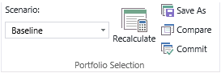
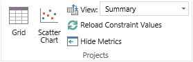
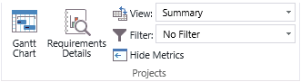

# Analyzing portfolios

**Summary:** Learn how to create a portfolio analysis using Project Web App. 
**Applies to:** Project Server Subscription Edition, Project Server 2019, Project Server 2016, Project Server 2013
  
Creating a portfolio analysis is the process of selecting a group of project ideas and, using the business drivers that you have defined, determining which are the best projects to do given your budget.
  
In Project Web App, you can create multiple analyses for a given set of projects and compare them to each other to help determine the best value for the budget that you have available.
  
## Create a portfolio analysis

You create a portfolio analysis in Project Web App. You'll need to be an administrator or a member of the Portfolio Managers group to do it.
  
Before you start, be sure you've [created your business drivers](portfolio-analysis-business-drivers.md) and [prioritized them](portfolio-analysis-driver-prioritization.md).
  
### To create a portfolio analysis

1. In Project Web App, click **Portfolio Analyses** in the left navigation.
    
2. On the ribbon, click **New**.
    
3. Complete the form as follows:
    
| | |
|:-----|:-----|
|**Name and Description**   |Type a name and description for this portfolio analysis.    |
|**Department**   |Optional. If you select a department, only custom fields and resources for that department will be available for the analysis. If you don't select a department, all fields and resources will be available.    |
|**Prioritization Type**   |Choose whether to use business drivers (recommended) or custom fields to prioritize your projects. If you choose business drivers, then choose the prioritization that you want to use from the drop-down list.    |
|**Prioritize these projects**   |Click **Select Projects** to choose the projects that you want to include in this portfolio analysis.   |
|**Analysis Primary Cost Constraint**   |Choose the custom field that you want to use for the project's overall budget.    |
|**Time-phased Resource Planning**   |Select this check box if you want to include resource planning in this portfolio analysis. Your projects must include resource assignments for this to work.    |
|**Planning Horizon and Granularity**   |Choose the date range for which resource scheduling information will be available for the portfolio analysis.    (This option is only available if you selected **Time-phased Resource Planning**.)    |
|**Resource role custom field**   |Choose the custom field that defines the resource's role.    (This option is only available if you selected **Time-phased Resource Planning**.)    |
|**Resource filtering**   |Specify if you want to filter the resources that are available to this portfolio analysis by department or RBS value.    (This option is only available if you selected **Time-phased Resource Planning**.)    |
|**Resource capacity impact for projects outside the analysis**   |Choose if you want proposed assignments to affect resource availability in this portfolio.    (This option is only available if you selected **Time-phased Resource Planning**.)    |
|**Project start and finish dates**   |Choose if you want to use the project schedule for project start and finish dates, or custom fields.    (This option is only available if you selected **Time-phased Resource Planning**.)    |
|**Alias project Force-in and Force-out options**   |Use the options in this section to [Customizing the force in and out options](analyzing-portfolios.md#CustomizeForceInAndOut).    |
   
4. Click **Next: Prioritize Projects**.
    
5. Review the business driver settings for each project. You can configure or change the settings for a given project by selecting the cell and choosing a setting from the drop-down list. If you chose to prioritize using custom fields, you can choose the custom fields on this page by clicking **Modify**.
    
6. Click **Next: Review Priorities**.
    
7. Review the priority of the projects. If you want to make changes, click **Previous: Prioritize Projects**; otherwise, click **Next: Analyze Cost**.
    
Once you create a portfolio analysis, you can make changes to your projects, budget, and other project information to determine which set of projects will give you the best return on investment. In the following sections, we'll take a look at how to navigate the portfolio, adjust your budget, compare analyses, and force projects in or out of the portfolio.
  
### Navigate the portfolio

Use the controls in the **Navigate** section of the ribbon to move between the pages of the portfolio analysis wizard and change the settings that you chose when you created the portfolio analysis.
  

  
|**Control**|**Description**|
|:-----|:-----|
|**Define Properties**   |Clicking **Define Properties** takes you to the first page of the new portfolio analysis wizard, where you can change settings including the driver prioritization, the selected projects, and the primary cost constraint.   |
|**Prioritize Projects**   |Clicking **Prioritize Projects** takes you to the project prioritization page of the new portfolio analysis wizard, where you can change any of the business driver settings for the projects in the portfolio.   |
|**Review Priorities**   |Clicking **Review Priorities** takes you to the priority list for the projects in this portfolio, where you can see how the projects in the portfolio have been prioritized based on the business driver settings.   |
|**Analyze Cost**   |Clicking **Analyze Cost** takes you to the cost analysis page and enables the **Portfolio Selection** and **Projects** sections of the ribbon, where you can analyze project and cost options to get the best return on your investment.   |
|**Analyze Resources**   |Clicking **Analyze Resources** takes you to the resource analysis page. This button is available if you chose the **Analyze time-phased project resource requirements against organizational resource capacity** option.   |
   
### Analyze Cost

The cost analysis page allows you to move projects in and out of your portfolio based on budget and compliance needs. Using the features on this page, you can plan out the projects that you're going to do based on the size of your budget and the strategic value of each project that you specified using your business drivers.
  
#### Portfolio selection

Use the controls in the **Portfolio Selection** section of the ribbon to save and compare different analysis scenarios, and to recalculate the cost analysis after making changes to the project budget.
  

  
|**Control**|**Description**|
|:-----|:-----|
|**Scenario**   |Use the **Scenario** drop-down list to select from the different cost scenarios that you have saved.   |
|**Recalculate**   |Click **Recalculate** to recalculate the strategic value and selected projects after you change the **Cost Limits**.    |
|**Save As**   |Click **Save As** to save a new scenario after you make changes to the **Cost Limits**.    |
|**Compare**   |Click **Compare** to compare the selected projects and strategic value of the different scenarios that you've saved.   |
|**Commit**   |Click **Commit** to commit the selected projects in the currently selected portfolio.   |
   
#### Work with the portfolio analysis view

Use the controls in the **Projects** section of the ribbon to change the view that you're looking at or to reload constraint values if they were changed outside the analysis.
  

  
|**Control**|**Description**|
|:-----|:-----|
|**Grid**   |Click **Grid** to display a grid of projects, their priorities, costs, and other project data.   |
|**Scatter Chart**   |Click **Scatter Chart** to display a chart of project cost versus value.   |
|**View**   |Use the **View** menu to select a view. You can add new views on the PWA Settings page.   |
|**Reload Constraint Values**   |Click **Reload Constraint Values** to reload the constraint values from the Project Web App database. Use this option if the values have been updated since you started the analysis.   |
|**Hide Metrics**   |Click **Hide Metrics** to hide the Metrics table and the Efficient Frontier chart. Click **Hide Metrics** again to show these.   |
   
### Analyze Resources

The resource analysis page allows you to move projects in and out of your portfolio based on resource availability and compliance needs. Using the features on this page, you can plan out the projects that you're going to do based on the resources that you have available.
  
#### Portfolio selection

Use the controls in the **Portfolio Selection** section of the ribbon to save and compare different analysis scenarios, and to recalculate the resource analysis after making changes to the project budget.
  

  
|**Control**|**Description**|
|:-----|:-----|
|**Scenario**   |Use the **Scenario** drop-down list to select from the different resource scenarios that you have saved.   |
|**Recalculate**   |Click **Recalculate** to recalculate the strategic value and selected projects after you change the **Hire Resources** setting.   |
|**Save As**   |Click **Save As** to save a new scenario after you make changes to the **Hire Resources** setting.   |
|**Compare**   |Click **Compare** to compare the selected projects and strategic value of the different scenarios that you've saved.   |
|**Commit**   |Click **Commit** to commit the selected projects in the currently selected portfolio.   |
|**Reports**   |Click **Reports** to view reports for resource surpluses and deficits, and hired resources. The reports will replace the Gantt chart view on the page.   |
   
#### Work with the resource analysis view

Use the controls in the **Projects** section of the ribbon to change the view that you're looking at or to reload constraint values if they were changed outside the analysis.
  

  
|**Control**|**Description**|
|:-----|:-----|
|**Gantt Chart**   |Click **Gantt Chart** to display a Gantt chart of the projects in the portfolio. The Gantt chart will replace the Reports view if it is active on the page.   |
|**Requirements Details**   |Click **Requirements Details** to display project requirements and resource availability details.   |
|**View**   |Use the **View** menu to select a view. You can add new views on the PWA Settings page.   |
|**Filter**   |Click **Filter** to filter a report by project, role, or time period.   |
|**Hide Metrics**   |Click **Hide Metrics** to hide the Metrics table and the Scenario Chart. Click **Hide Metrics** again to show these.   |
   
#### Analyzing resource availability

There are basically two things that you can do in the resource analysis view to analyze your different resource options. You can add resources, and you can move project schedules.
  
 **Adding resources**
  
By adding one or more resources in the resource analysis view, you can see the effect on your overall project portfolio. Just type the number of resources that you want to add in the **Hire Resources** box, and then click **Recalculate** on the ribbon. The resource analysis view will update to show you how many more projects you can do, and the **Hired Resources Report** (under **Reports** on the ribbon) will update to show which resource roles you need to hire to achieve that effect.
  
Adding and removing resources in the resource analysis view won't affect the resource allocation of your projects. It's just an analysis tool for you to use in determining your best option.
  
 **Moving project schedules**
  
You can move projects forward or backward on the calendar to see how this affects your resource allocation. Experimenting with various project schedules can help you fit more projects into the portfolio.
  
To move a project's start date, click **Gantt Chart** on the ribbon, then choose a **New Start** month for the project that you want to move, then click **Recalculate**. (You might need to scroll right in the **Projects** list to see the **New Start** column.)
  
Once you've chosen a new start date for the projects that you want to move, you can click **Requirements Details** to see the effect on your overall resource allocation.
  
Changing the start date in the Gantt chart doesn't affect the actual start date of your projects. It's just a way for you to get a look at resource availability in different scenarios.
  
### Force projects in or out of the portfolio

If necessary, you can tell Project Web App to force a particular project in or out of the analysis. This is useful if certain projects must be included for compliance or other reasons. You can do this in both the cost analysis and resource analysis views.
  
#### Using the default force in and out options

The **Force in/out** setting has three values by default:
  
- **Auto** - causes Project Web App to determine if the project should be done or not based on the project's business driver and prioritization settings.
    
- **Forced-in** - causes Project Web App to force the project into the **Selected Projects** list by moving other projects out if necessary.
    
- **Forced-out** - causes Project Web App to force the project into the **Unselected Projects** list.
    
The default value is **Auto**, which allows Project Web App to determine whether the project should be done based on its priority rating. However, if you want to force a particular project in or out of the portfolio, you can click in the **Force in/out** column for that project and choose **Forced-in** or **Forced-out**.
  
#### Customizing the force in and out options

If you want to use values for the **Force in/out** column other than the default, for example to provide more details about why a project was forced in or out of the portfolio, you can use a custom lookup table to provide additional values.
  
### To create a custom lookup table for force in/out options

1. In Project Web App, choose **Settings**, and then choose **PWA Settings**.
    
2. Under **Enterprise Data**, choose **Enterprise Custom Fields and Lookup Tables**.
    
3. Under **Lookup Tables for Custom Fields**, choose **New Lookup Table**.
    
4. Type a name for the lookup table, such as "Force-in Options."
    
5. In the **Lookup Table** section, type the options that you want to use for force-in or force-out in the **Value** column.
    
6. Keep the default values for the remaining settings.
    
7. Click **Save**.
    
Once you have created the custom lookup table, you can configure a portfolio analysis to use this table when displaying the force in and out options for a project. (You can use the same table for different portfolio analyses or you can create additional tables, depending on your needs.)
  
### To connect a lookup table to the force in/out options

1. In your portfolio analysis, choose **Define Properties** in the **Navigate** section of the ribbon. (If you're creating a new portfolio analysis, the Define Properties page is the first in the wizard.)
    
2. At the bottom of the page, expand **Alias project Force-in and Force-out options**.
    
3. Select the **Alias Force-in** and/or the **Alias Force-out** check boxes, and choose the lookup table that you want to use from the drop-down list.
    
4. Click **Save**.
    
5. If you are creating a new portfolio analysis, click **Next: Prioritize Projects**, and complete the wizard. If you're updating an existing portfolio analysis, click **Analyze Cost** on the ribbon to return to the cost analysis page, or **Analyze Resources** to return to the resource analysis page.
    

