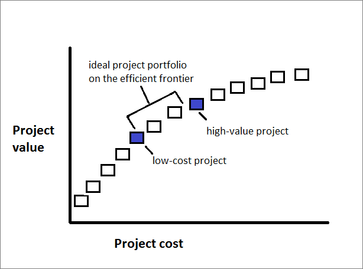
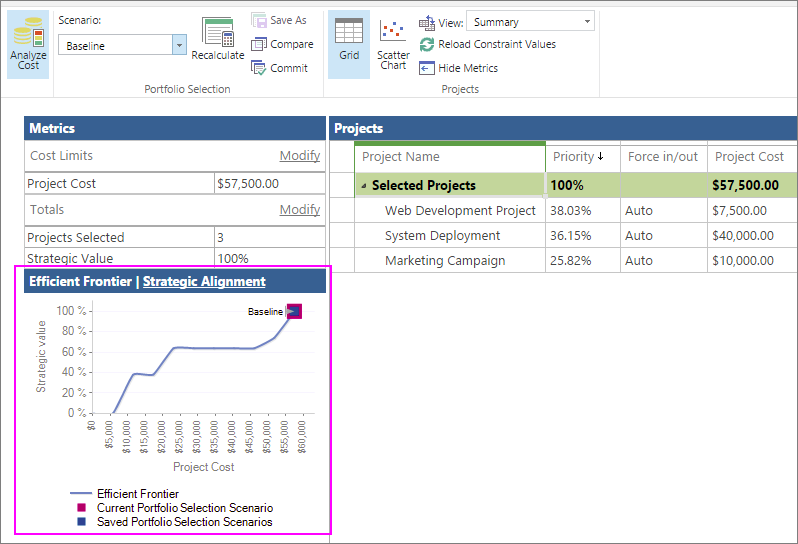

# Use the efficient frontier chart

As a project portfolio manager, you strive to make sure that the collection of projects executed serve your organization's best interests, and that the projects are fulfilling strategic goals. With the portfolio analysis tools in Project Web App for Project Online, you can set up project information to help you to make informed decisions about the projects which should be included in the portfolio. Specifically, you can analyze the projects plotted along the efficient frontier chart and implement those projects that offer the most value to the organization in exchange for the budget expended.
  
    
    

In this topic
-  [What is efficient frontier analysis?](b291739e-5c20-4538-9706-0969b951c154.md#_what)
    
  
-  [Set up business drivers and projects for portfolio analysis](b291739e-5c20-4538-9706-0969b951c154.md#_set)
    
  
-  [Interpret your efficient frontier chart in Project Online](b291739e-5c20-4538-9706-0969b951c154.md#_interpret)
    
  

## What is efficient frontier analysis?

When you run a portfolio analysis in Project Web App for Project Online, you can see the projects in the portfolio along the efficient frontier. The efficient frontier chart shows the project portfolio's value versus cost. The projects are plotted along a graph, with the horizontal axis being the cost of doing the project and the vertical axis being the value of the project based on the impact and alignment with your strategic business drivers.
  
    
    
There's a certain area along the resulting curve in this graph that represents the efficient frontier. The projects that fall along that efficient frontier represent your ideal project portfolio. These projects offer the best possible expected return for your money, effort, and risk invested in the project because they are most aligned with your strategic business drivers and priorities.
  
    
    

  
    
    

  
    
    

  
    
    

  
    
    

  
    
    
In Project Online, the efficient frontier chart can help you decide on the best new projects to implement given your available budget. This chart can also help you analyze your existing portfolio of in-process projects and determine whether any adjustments should be made to move the portfolio closer to the efficient frontier and gain more value for your organization.
  
    
    

> [!NOTE]
> Users identified as Portfolio Managers or Administrators for Project Web App have the permissions necessary to create portfolio analyses in Project Online. Users identified as Portfolio Viewers can review the portfolio dashboard and analyses. If you're the Project Online administrator, to work with user permissions, on the Settings menu, choose Site Settings. Under Users and Permissions, choose People and groups or Site permissions. 
  
    
    

 [As a project portfolio manager, you strive to make sure that the collection of projects executed serve your organization's best interests, and that the projects are fulfilling strategic goals. With the portfolio analysis tools in Project Web App for Project Online, you can set up project information to help you to make informed decisions about the projects which should be included in the portfolio. Specifically, you can analyze the projects plotted along the efficient frontier chart and implement those projects that offer the most value to the organization in exchange for the budget expended.In this topicWhat is efficient frontier analysis?Set up business drivers and projects for portfolio analysisInterpret your efficient frontier chart in Project Online](b291739e-5c20-4538-9706-0969b951c154.md#_top)
  
    
    

## Set up business drivers and projects for portfolio analysis

To use Project Web App for Project Online to run portfolio analyses, including cost analyses that generate the efficient frontier chart, you need to set up your project portfolio in a specific way. 
  
    
    
To get started, be sure that you can access the portfolio analysis links on the Quick Launch. If you don't see a **Strategy** section on the Quick Launch, ask your Project Online administrator to add it.
  
    
    

1. On the **Settings** menu, choose **PWA Settings**.
    
  
2. Under **Look and Feel**, choose **Quick Launch**.
    
  
3. In the **Modify Quick Launch Items** table, select the check boxes next to **Strategy**, **Driver Library**, **Driver Prioritization**, and **Portfolio Analyses**.
    
  
4. On the **Quick Launch** tab, in the **Commit** group, choose **Save &amp; Close**.
    
    The **Strategy** section appears on the Quick Launch.
    
    
  
    
    

  
    
    

  
    
    

  
    
    

    
  
Now that you have the links you need, the portfolio analysis setup process includes the following five steps in Project Web App:
  
    
    

1. Add your organization's strategic business drivers.
    
  
2. Prioritize the business drivers.
    
  
3. Develop each project plan or proposed project along with cost information.
    
  
4. Rate how well each proposed project aligns with those business drivers.
    
  
5. Analyze your portfolio.
    
  
See below for more details on these steps.
  
    
    

### Add strategic business drivers

A business driver is a strategic goal that your organization has decided that it wants to accomplish, for example, increase product quality, expand its reach into the market, or diversify its service offerings. Business drivers should be specific and measurable, so you can readily determine whether and how much your various projects fulfill them. Organizations typically define their business goals during periodic strategic planning sessions.
  
    
    
In portfolio analysis, Project Web App uses business drivers to help rank the value of various projects so you can more objectively decide which projects will help your organization meet its strategic goals.
  
    
    

1. On the Quick Launch, choose **Driver Library**.
    
  
2. On the **Driver** tab, in the **Driver** group, choose **New**.
    
  
3. Complete the page that appears with your organization's business drivers. Get more details about  [business drivers for your Project Online portfolio analysis](https://technet.microsoft.com/en-us/library/dn641989.aspx).
    
  
4. On the **Driver** tab, in the **Driver** group, choose **Save**.
    
  

### Prioritize the business drivers

After you've defined your business drivers, you need to prioritize them.
  
    
    

1. On the Quick Launch, choose **Driver Prioritization**.
    
  
2. On the **Prioritizations** tab, in the **Prioritizations** group, choose **New**.
    
  
3. Complete the page that appears and work through the succeeding pages and the business driver prioritization process. Learn more about  [business driver prioritization](https://technet.microsoft.com/en-us/library/dn641992.aspx).
    
  
4. On the **Prioritization** tab, in the **Prioritization** group, choose **Save**.
    
  

> [!TIP]
> You can create multiple sets of business drivers and driver prioritizations. 
  
    
    

### Create the projects

If you haven't yet created the projects for a proposed portfolio, now's the time to do it. Be sure that each project includes project costs and resource information. 
  
    
    

### Rate each project's strategic impact

With the projects in place, rate the strategic impact for each one.
  
    
    

1. On the Quick Launch, choose **Projects**.
    
  
2. On the **Project Center,** choose the project for which you want to rate strategic impact and include in the portfolio analysis.
    
  
3. On the Quick Launch, choose **Strategic Impact**.
    
    This link appears with your Quick Launch project links after you create and save the business drivers.
    
  
4. Rate the impact of the project against each of the business drivers. 
    
  
5. On the **Project** tab, in the **Project** group, choose **Save**.
    
  

### Analyze your portfolio

After you've rated all projects you want to include in the portfolio analysis against the business drivers, you're ready to create the portfolio analysis. 
  
    
    

1. On the Quick Launch, choose **Portfolio Analyses**.
    
  
2. On the **Analyses** tab, in the **Analysis** group, choose **New**. 
    
  
3. Work through the pages that appear and define the analysis. This includes the driver prioritization you set, choosing and prioritizing the projects to be included in the analysis, reviewing the priorities, and analyzing costs. Learn more about  [creating your portfolio analysis](https://technet.microsoft.com/en-us/library/dn641990.aspx).
    
  
4. On the **Analysis** tab, in the **Analysis** group, choose **Save**.
    
  
 [As a project portfolio manager, you strive to make sure that the collection of projects executed serve your organization's best interests, and that the projects are fulfilling strategic goals. With the portfolio analysis tools in Project Web App for Project Online, you can set up project information to help you to make informed decisions about the projects which should be included in the portfolio. Specifically, you can analyze the projects plotted along the efficient frontier chart and implement those projects that offer the most value to the organization in exchange for the budget expended.In this topicWhat is efficient frontier analysis?Set up business drivers and projects for portfolio analysisInterpret your efficient frontier chart in Project Online](b291739e-5c20-4538-9706-0969b951c154.md#_top)
  
    
    

## Interpret your efficient frontier chart in Project Online

The portfolio analysis includes the efficient frontier chart, which is part of the cost constraint analysis.
  
    
    

1. On the Quick Launch, choose **Portfolio Analyses**.
    
  
2. In the table that appears, choose the analysis you want to review.
    
  
3. If the cost analysis page is not already open, on the **Analysis** tab, in the **Portfolio Selection** group, click in the **Scenario** box, and select the scenario you want to analyze, for example, **Baseline**.
    
  
4. On the **Analysis** tab, in the **Navigate** group, choose **Analyze Cost**.
    
    The portfolio cost analysis page opens, and includes the **Efficient Frontier** chart along with the projects selected for this analysis and associated cost metrics.
    
    
  
    
    

  
    
    

  
    
    

  
    
    

    
  
5. Review the chart to determine which projects fall along the efficient frontier for your portfolio. Use this information to help decide which projects should be implemented to help your organization best meet its strategic goals.
    
  
If you're analyzing the efficient frontier chart for an existing portfolio of projects to decide what changes, if any, should be made, consider these questions: 
  
    
    

- Are we spending too much money, time, and resources on this portfolio compared with the value we're expecting to realize?
    
  
- Should we change our current portfolio so it moves toward the efficient frontier? Are there projects that should be canceled or delayed? Should we replace or add new projects?
    
  
- Is there any way we can realize a higher value and better performance toward our strategic goals while spending less money on our current portfolio?
    
  
If you're deciding on which proposed projects should be given the go-ahead for implementation, use the efficient frontier chart to review the projects along and outside the efficient frontier. The projects plotted along the efficient frontier curve are the ones that will move the organization forward in meeting its business goals, and are likely to form your optimal portfolio of projects.
  
    
    
While working in the portfolio analysis tools, you can adjust the project mix to see if this improves the portfolio's efficient frontier. 
  
    
    
 [As a project portfolio manager, you strive to make sure that the collection of projects executed serve your organization's best interests, and that the projects are fulfilling strategic goals. With the portfolio analysis tools in Project Web App for Project Online, you can set up project information to help you to make informed decisions about the projects which should be included in the portfolio. Specifically, you can analyze the projects plotted along the efficient frontier chart and implement those projects that offer the most value to the organization in exchange for the budget expended.In this topicWhat is efficient frontier analysis?Set up business drivers and projects for portfolio analysisInterpret your efficient frontier chart in Project Online](b291739e-5c20-4538-9706-0969b951c154.md#_top)
  
    
    

## See also

#### Other Resources

  
    
    
 [Portfolio analysis business drivers](https://technet.microsoft.com/en-us/library/dn641989.aspx)
  
    
    
 [Portfolio analysis driver prioritization](https://technet.microsoft.com/en-us/library/dn641992.aspx)
  
    
    
 [Analyzing portfolios](https://technet.microsoft.com/en-us/library/dn641990.aspx)
  
    
    
 [Project Server 2013 - Strategy and Project Portfolio](https://social.technet.microsoft.com/wiki/contents/articles/17089.project-server-2013-strategy-and-project-portfolio.aspx)
  
    
    
 [Portfolio Analysis with Microsoft Server 2010](https://technet.microsoft.com/en-us/library/gg715564%28v=office.14%29.aspx)