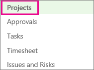
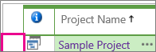
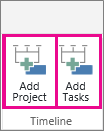
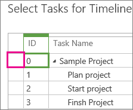
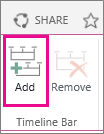
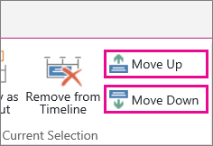

# Add projects and tasks to the Project Center timeline

The timeline at the top of the Project Center provides a simple way to show all of the projects and major tasks going on in your organization. You can use this timeline to craft a visual executive summary of your portfolio of projects.
  
    
    

> [!NOTE]
> In addition to Project Center,  [Add tasks to a project timeline](285b8052-ac5f-4936-9207-dcce549da4ba.md) is another option available in Project Web App.
  
    
    

1. On the Quick Launch, click **Projects**.
    
    
  
    
    

  
    
    

  
    
    

  
    
    

    
  
2. Click anywhere on the timeline you wish to add a project to, and then click the row header for the desired project. 
    
    
  
    
    

  
    
    

  
    
    

  
    
    

    
  
3. On the **Projects** tab, in the **Timeline** group, click **Add Project** or **Add Tasks**. 
    
    
  
    
    

  
    
    

  
    
    

  
    
    

    
    If you are just adding a project, continue to step 4, but if you are adding tasks, select the task row(s) that you want to add to the timeline, and then click **OK.**
    
    
  
    
    

  
    
    

  
    
    

  
    
    

    
    > [!TIP]
      > Don't see the task you wanted to add? Try expanding the summary tasks in the **Task Name** column to drill down to the subtask level(s).
4. To add another timeline, click the current timeline, and then click **Add** in the **Timeline Bar** group on the **Timeline** tab.
    
    > [!NOTE]
      > Multiple timelines are available in Project Online and Project Server 2016. 

    
  
    
    

  
    
    

  
    
    

  
    
    

    
  
5. To move projects between timelines, click the project, and then click **Move Up** or **Move Down** in the **Current Selection** group on the **Timeline** tab.
    
    
  
    
    

  
    
    

  
    
    

  
    
    

    
  
