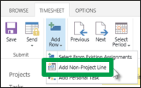

# Capture vacation, sick leave, and other non-project hours

|||
|:-----|:-----|
|Hard work frequently results in one of two things: a well-deserved vacation, or a miserable, knock-you-off-your-feet head cold.    Okay, maybe there isn't a direct correlation, but in the course of working on a project, you will surely have some time that you've spent doing things other than working on your tasks. Sometimes it's vacation, sometimes it's sick leave, and sometimes it's work-related (but non project-related) things like training or business travel.    |
  
    
    

  
    
    

  
    
    

  
    
    
   |
   

## Ahead of time

There are a couple of things that you can do ahead of time, when you know you're not going to be working on your tasks for a certain day or set of days. You can let your project manager know, for planning purposes, and you may be able to assign someone to enter time and task progress for you while you're out.
  
    
    

### Let your project manager know

If you know ahead of time that you're going to be out of the office, or not able to work on your tasks for some other reason, you can do your project manager a huge favor by sharing that information as soon as you know you're going to be out.
  
    
    

|||
|:-----|:-----|
|
  
    
    

  
    
    

  
    
    

  
    
    
   |Your project manager can enter your planned time away into a calendar that reflects your working hours. This calendar is used to determine the project schedule, and your task work will be automatically pushed out until you get back.    |
   

### Assign someone to enter your time and task progress

Depending on how your organization is set up, you may be able to identify someone who can enter and submit time and task progress on your behalf while you're out. This person is known as a "delegate."
  
    
    
Before you leave for vacation (or whatever else has you away from your project for a short period),  [Assign someone else to enter your time and task progress](1329dd71-8a6c-467d-8802-ed6f8437a937.md), so that someone else can log in for you while you're out.
  
    
    
 **Not every organization uses delegates,** so if you need things turned in while you're gone and you can't set up a delegation, be sure to chat with your project manager before you head out.
  
    
    

## While you're out

|||
|:-----|:-----|
|Time spent away from your project tasks can make for a refreshing change of pace…especially if that time is spent poolside with a tasty beverage. But even if your time away is spent in a training session, or under a blanket on the couch with a box of tissues, you'll probably find that when you return to your task work, you have a new perspective.    |
  
    
    

  
    
    

  
    
    

  
    
    
   |
   
Really, the only think you need to worry about while you're out is making sure that your time and task progress gets submitted on time. In some cases, you can submit your information ahead of time, but not always. Some organizations require that you submit things only on specific days or dates. That's where your delegate comes in, if you have one.
  
    
    
If you  [Assign someone else to enter your time and task progress](1329dd71-8a6c-467d-8802-ed6f8437a937.md), that person can log in by clicking **Settings**
  
    
    

  
    
    
 > **PWA Settings**, and then clicking **Act as a Delegate** under **Personal Settings**.
  
    
    

## After you're back

Welcome back to your tasks! Now that you're back, you need to account for your time away on your timesheet. Time spent on non-project work, including vacation and sick time, is called **administrative time**.
  
    
    

1. Click **Timesheet** on the Quick Launch.
    
    
  
    
    

  
    
    

  
    
    

  
    
    

    
  
2. Fill out the **Actual** row, on the right side of the grid, for vacation, sick time, or another category of administrative time.
    
    
  
    
    

  
    
    

  
    
    

  
    
    

    
    If the administrative task you need isn't listed on your timesheet, click **Timesheet** > **Add Row** > **Add Non-Project Line**.
    
    
  
    
    

  
    
    

  
    
    

  
    
    

    
  
3. Continue filling out the rest of your timesheet, and submit it whenever you're ready.  [Step 2: Turn in a timesheet](f49a8e4a-29d2-4601-ac5a-437c232c31f1.md)
    
  
