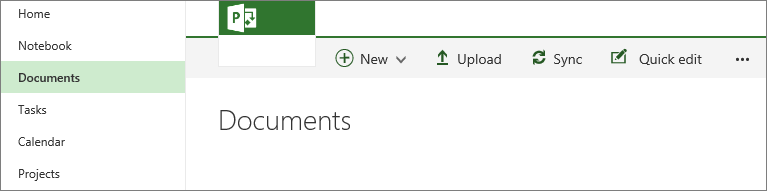
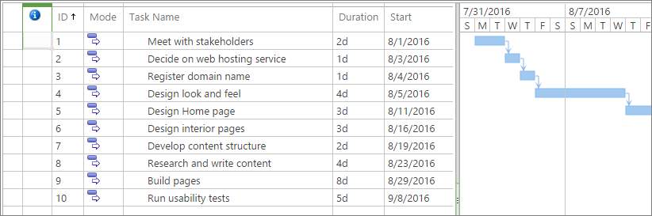
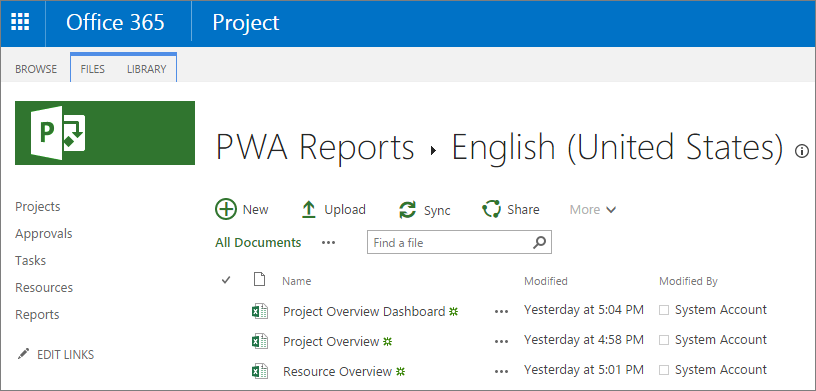

# Best practices for project communication in Project Online

As the project manager, you communicate with many project stakeholders—from the team members carrying out project tasks to organization executives and project customers. Because communication is so crucial to the success of your project, and because you communicate different types of information to different types of stakeholders, you need a solid project communication plan. You can use Project Web App through your Project Online subscription to implement many aspects of your communication plan and to exchange the right kinds of information with the right people.
  
    
    

In this article
-  [Why is project communication so important?](cbac57bb-3420-4108-875f-8ba8ddbfed5e.md#_why)
    
  
-  [Best practices for communication in a project](cbac57bb-3420-4108-875f-8ba8ddbfed5e.md#_best)
    
  
-  [Post the communication plan in Project Online](cbac57bb-3420-4108-875f-8ba8ddbfed5e.md#_post)
    
  
-  [Show team members how to access the project schedule](cbac57bb-3420-4108-875f-8ba8ddbfed5e.md#_show)
    
  
-  [Identify and set up the right reports](cbac57bb-3420-4108-875f-8ba8ddbfed5e.md#_identify)
    
  

## Why is project communication so important?

With so many people involved in a single project, large or small, communication has a tremendous role in project success or failure. When communication is lacking, your project might experience missteps like assumptions, duplication of effort or its opposite, gaps in effort. In addition, stakeholders might feel that they're in isolated silos, unheard and unsupported, which can lead to poor morale and declining productivity.
  
    
    
On the other hand, when communication is good, your project can experience efficiencies in process, identification and prevention of problems and risks, innovative problem-solving, and decision-making based on sound facts. Fostering good communication in a project improves the likelihood of your project staying on schedule and within its budget. 
  
    
    
What is good communication, anyway? It's exchanging the right information with the right people. Ensuring that stakeholders at all levels are being heard. Having channels in place for formal as well as informal conversations that move the project forward toward its goal.
  
    
    
 [As the project manager, you communicate with many project stakeholders—from the team members carrying out project tasks to organization executives and project customers. Because communication is so crucial to the success of your project, and because you communicate different types of information to different types of stakeholders, you need a solid project communication plan. You can use Project Web App through your Project Online subscription to implement many aspects of your communication plan and to exchange the right kinds of information with the right people.In this articleWhy is project communication so important?Best practices for communication in a projectPost the communication plan in Project OnlineShow team members how to access the project scheduleIdentify and set up the right reports](cbac57bb-3420-4108-875f-8ba8ddbfed5e.md#_top)
  
    
    

## Best practices for communication in a project

The right time to think about project communication is when you're in the planning phase of your project. In fact, adding communication process development among the first few tasks of your project can signal to the team that communicating effectively is the job of every team member and is key to the project's success. 
  
    
    
The following sections detail four questions to consider about how communication will be handled through the life of your project and how to compile your answers into a communication plan that works for everyone.
  
    
    
With whom do you need to communicate?
  
    
    
You need to communicate with everyone who has an interest or holds a stake in the success of the project, that is, the project stakeholders. Think about who those stakeholders are. They're likely to be at various levels in the organization, and some might be external to your organization. Here are some possible project stakeholders:
  
    
    

- **Project team members**. These people are doing the actual work of the project.
    
  
- **Project portfolio manager**. If yours is a larger organization that runs a lot of projects at once, you might need to communicate with a portfolio manager.
    
  
- **Resource manager**. As with a portfolio manager, if your organization is largely project-based, you might need to work closely with a resource manager who ensures the people with the right skill sets for the various projects are available.
    
  
- **Executive management**. Upper management typically needs to know how the project is going, especially in terms of schedule and cost.
    
  
- **Sponsor or customer**. There might be a sponsor or customer who's different from management and who's paying for the project.
    
  
- **End user representative**. This person represents the ones who the project is likely to benefit or otherwise affect when it's completed. 
    
  

### What kinds of information do they need?

Because the first rule of communication is to know your audience, you get the most return on your communication investment when you tailor your communication to what each set of stakeholders need to know. 
  
    
    
For example, project team members need to know the tasks they're assigned to and who is depending on their tasks to, in turn, do their work. They probably also need to occasionally see the full project schedule to maintain a good sense of scope and focused direction.
  
    
    
Unlike team members who need the vital details, executives or project sponsors require a very high-level summary of how the project is going. They are most concerned with performance against the project schedule and budget, and want to know whether the project is on track to fulfill its goals.
  
    
    
Look at your list of stakeholders and think about the project from their points of view. This will help you determine what information to exchange with them, and what form that communication should take. Also, talk with your stakeholders and find out what and how they prefer to communicate.
  
    
    

### How often do the different kinds of communication need to happen?

Try to strike the right balance: too little communication and the project risks more mishaps than it should; too much communication and annoyed stakeholders feel the efforts are busywork which interfere with the time to implement or oversee the project.
  
    
    
Weekly status reports and timesheets are something of a standard for project team updates to the schedule, although often 20-minute daily "stand-up" meetings are preferred. Likewise, sponsors and customers might also want a weekly summary of project schedule and cost performance. If you're checking in with a portfolio manager or an end-user representative, maybe the communication can be monthly or even quarterly.
  
    
    
Every project and its communication needs are different. Carefully consider the frequency of communication with the different stakeholders on your project. Again, talk to your stakeholders about what they need and be willing to make adjustments to fit the project and its people.
  
    
    

### What technology will be used to exchange information?

Understand the organization's technology resources available to you and your stakeholders. Periodic face-to-face meetings and exchanging information by email are often the norm. But meeting with a tool like Skype for Business might be essential for geographically dispersed stakeholders and can include audio, video, screen-sharing, and a virtual whiteboard. Instant messaging (IM) can be more immediate and to the point than email, and can help stakeholders more quickly get the information they need. With a tool like Yammer, your team can connect with each other in a private social network. You can share information, chat about process, solve problems, and make decisions.
  
    
    
Whatever you decide, try to use the technology tools that everyone is comfortable with. But don't be reluctant to try a new technology if it fits the needs of the project and the team, or to return to an "old-fashioned" method of communication if that's best. The point is to facilitate better collaboration in your project team.
  
    
    

### Create a project communication plan

After you've identified your stakeholders and determined what types of information exchanges are needed with them and how often, you're ready to create the project communication plan. It doesn't need to be elaborate. It can just be a one-page summary or a simple table which distills what you've learned and sets the stage for good communication throughout the project lifecycle. 
  
    
    
Post the communication plan with your project so that all stakeholders have access to it at any time. Revisit it periodically. Changing conditions in the project might warrant a change to your regular communication strategies. Moving between project phases, for example, from planning to execution or from execution to closing, might also call for different communication needs. 
  
    
    
 [As the project manager, you communicate with many project stakeholders—from the team members carrying out project tasks to organization executives and project customers. Because communication is so crucial to the success of your project, and because you communicate different types of information to different types of stakeholders, you need a solid project communication plan. You can use Project Web App through your Project Online subscription to implement many aspects of your communication plan and to exchange the right kinds of information with the right people.In this articleWhy is project communication so important?Best practices for communication in a projectPost the communication plan in Project OnlineShow team members how to access the project scheduleIdentify and set up the right reports](cbac57bb-3420-4108-875f-8ba8ddbfed5e.md#_top)
  
    
    

## Post the communication plan in Project Online

You have many choices for facilitating good communication when working with Project Web App in Project Online. To start, you can add the communication plan—as well as any other documents associated with your project—to the document library for the project. 
  
    
    

1. In the Quick Launch, choose **Projects**.
    
  
2. In the **Project Center**, choose the name of the project to which you want to add the communication plan.
    
    
  
    
    

  
    
    

  
    
    

  
    
    

    
  
3. In the Quick Launch, choose **Documents**. The **Documents** page for the project opens.
    
    
  
    
    

  
    
    

  
    
    

  
    
    

    
  
4. On the menu bar, choose **Upload**.
    
  
5. Navigate through your file system to find and choose the communication plan, and then choose **Open**. Your file is added to the document library for the project.
    
    
  
    
    

  
    
    

  
    
    

  
    
    

    
  
 [As the project manager, you communicate with many project stakeholders—from the team members carrying out project tasks to organization executives and project customers. Because communication is so crucial to the success of your project, and because you communicate different types of information to different types of stakeholders, you need a solid project communication plan. You can use Project Web App through your Project Online subscription to implement many aspects of your communication plan and to exchange the right kinds of information with the right people.In this articleWhy is project communication so important?Best practices for communication in a projectPost the communication plan in Project OnlineShow team members how to access the project scheduleIdentify and set up the right reports](cbac57bb-3420-4108-875f-8ba8ddbfed5e.md#_top)
  
    
    

## Show team members how to access the project schedule

Your team members mostly use Project Online to submit their timesheets or enter progress toward tasks. But they can also access the complete schedule—essential to seeing the big picture of the project as well as understanding who is waiting for their tasks to be completed. 
  
    
    

1. In the Quick Launch, choose **Projects**.
    
  
2. In the **Project Center**, choose the name of the project. The project opens and shows all tasks, who's assigned to the tasks, when they're scheduled to start and finish, which tasks are dependent on each other, and more.
    
    
  
    
    

  
    
    

  
    
    

  
    
    

    
  
 [As the project manager, you communicate with many project stakeholders—from the team members carrying out project tasks to organization executives and project customers. Because communication is so crucial to the success of your project, and because you communicate different types of information to different types of stakeholders, you need a solid project communication plan. You can use Project Web App through your Project Online subscription to implement many aspects of your communication plan and to exchange the right kinds of information with the right people.In this articleWhy is project communication so important?Best practices for communication in a projectPost the communication plan in Project OnlineShow team members how to access the project scheduleIdentify and set up the right reports](cbac57bb-3420-4108-875f-8ba8ddbfed5e.md#_top)
  
    
    

## Identify and set up the right reports

A major aspect of project communication is reporting. You identify, set up, and periodically run reports needed by team members, the portfolio manager, resource manager, upper management, customers, and other stakeholders.
  
    
    
Project Web App comes with a set of sample reports to get you started with some reporting basics. These sample reports are:
  
    
    

- Project Overview Dashboard
    
  
- Project Overview
    
  
- Resource Overview
    
  

1. To see the sample reports, on the Quick Launch, choose **Reports**.
    
  
2. In the **PWA Reports** page which appears, choose your language. The three sample reports are listed.
    
    
  
    
    

  
    
    

  
    
    

  
    
    

    
  
3. To open the report in Excel Online, click a report name.
    
  
 [As the project manager, you communicate with many project stakeholders—from the team members carrying out project tasks to organization executives and project customers. Because communication is so crucial to the success of your project, and because you communicate different types of information to different types of stakeholders, you need a solid project communication plan. You can use Project Web App through your Project Online subscription to implement many aspects of your communication plan and to exchange the right kinds of information with the right people.In this articleWhy is project communication so important?Best practices for communication in a projectPost the communication plan in Project OnlineShow team members how to access the project scheduleIdentify and set up the right reports](cbac57bb-3420-4108-875f-8ba8ddbfed5e.md#_top)
  
    
    

## See also

#### Other Resources

  
    
    
 [Set up timesheets](3e20822d-de27-494e-8821-c25b1174586e.md)
  
    
    
 [What can team members do in Project Online?](e10f3d44-0428-4591-ac33-c888386442c4.md)
  
    
    
 [Sample reports in Project Online](ceab4edc-13f4-4b64-81e1-a0f3a5c607bc.md)
  
    
    
 [What reporting tools can I use with project data?](002eaac1-35ef-4bab-b977-a02b39715ec3.md)
  
    
    
 [Video: What is Skype for Business?](http://technet.microsoft.com/library/3a21eca4-434d-41f1-ab06-3d4a268573b7%28Office.14%29.aspx)
  
    
    
 [Say hello to Yammer](http://technet.microsoft.com/library/02AC514E-CF1D-4060-9CDE-6038CA812EDE%28Office.14%29.aspx)