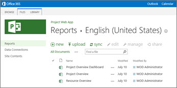
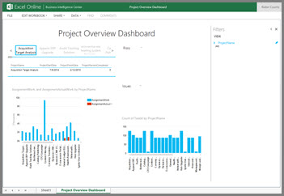
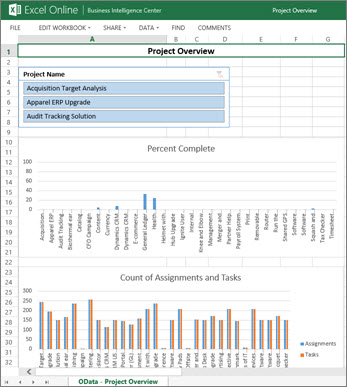
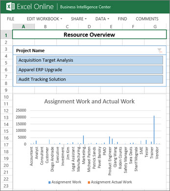

# Sample reports in Project Online

 * [Project help](afac1e38-1219-4a88-bd22-81534778d528.md)* 
  
    
    

Project Online comes with sample reports that you can use as a starting point for reporting on your projects. Read this article to get an overview of these reports and how you can use them.
## Where are the reports?

Your sample reports are available in a Reports library in your Project Online site. To view them, in your Project Online site, click **Reports**. 
  
    
    

  
    
    

  
    
    
Or, click **Settings** > **Site Contents**, and then choose **Reports**. Open the language folder that applies to you, and there you'll see your sample reports.
  
    
    

## What's in the set of sample reports?

In Project Online, you get three sample reports that provide high-level details about all your projects. Each report uses some combination of the six prebuilt OData data connections that come with Project Online. Using OData data sources enables people to refresh the data while viewing each workbook in a browser window. The following sections provide more details about the sample reports.
  
    
    

-  [Project Overview Dashboard](ceab4edc-13f4-4b64-81e1-a0f3a5c607bc.md#pjoverviewdb)
    
  
-  [Project Overview](ceab4edc-13f4-4b64-81e1-a0f3a5c607bc.md#pjoverview)
    
  
-  [Resource Overview](ceab4edc-13f4-4b64-81e1-a0f3a5c607bc.md#resourceoverview)
    
  

### Project Overview Dashboard

The Project Overview Dashboard looks like this:
  
    
    

  
    
    

  
    
    
This workbook includes several useful views about assignments and tasks. 
  
    
    

- **Projects** In the upper left corner, you'll find a list of projects. If you select a project, you'll see its start date and finish date and percent complete data.
    
  
- **AssignmentWork, and AssignmentActualWork by ProjectName** An assignment is a unique pairing between a resource and a task. For example, if you have one task and you assign two resources to that task, you have two assignments for your project. This view shows planned assignment work alongside completed assignment work.
    
  
- **Count of TaskId by ProjectName** This view tells how many tasks there are for each project.
    
  
Risks and Issues information about your projects will also show up in this report.
  
    
    
The Project Overview Dashboard workbook contains a Data Model that uses the following OData connections: Issues, Projects, Risks, and Tasks .
  
    
    

### Project Overview

The Project Overview report looks like this:
  
    
    

  
    
    

  
    
    
This workbook contains a slicer two charts:
  
    
    

- **Project Name** This slicer enables you to select a project and then view information for just that project in the charts.
    
  
- **Percent Complete** This chart shows you, in percentages, the degree of completion for your projects. You can see at a glance which project is the most complete, and which ones are least complete.
    
  
- **Count of Assignments and Tasks** This chart shows you how many tasks and assignment there are for each project.
    
  
The Project Overview workbook contains a Data Model that uses the following OData connections: Assignments, Issues, Projects, Risks, and Tasks.
  
    
    

### Resource Overview

The Resource Overview report looks like this:
  
    
    

  
    
    

  
    
    
This workbook contains one slicer and two charts:
  
    
    

- **Project Name** This slicer enables you to select a project and then view information for just that project in the charts.
    
  
- **Assignment Work and Actual Work** This chart shows planned, assigned work and actual work done across different project resources.
    
  
- **Count of Tasks by Resource** This chart shows how many tasks there are for project resources.
    
  
The Resource Overview report contains a Data Model that uses the following OData connections: Assignments, Resources, and Tasks.
  
    
    

## What if more reports are needed?

Most likely, you'll want to create your own reports to view and track your projects. The sample reports are intended to provide a starting point for you; those reports are not intended to be your overall project reporting solution. You can easily create new reports that you can use in addition to (or instead of) the sample reports. 
  
    
    
See the following resources:
  
    
    

  
    
    
>  [What reporting tools can I use with project data?](002eaac1-35ef-4bab-b977-a02b39715ec3.md)
    
  

  
    
    
>  [Use Excel 2013 to create a new Project Online report](d523d604-940c-4c57-a190-59b793ac9d49.md)
    
  
