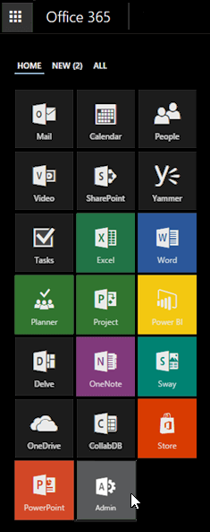

# Set up another Project Online site

 * [Project help](afac1e38-1219-4a88-bd22-81534778d528.md)* 
  
    
    

You may decide that you want to set up an additional Project Online site, to manage projects in a separate environment from your first Project Online site. You can do this by creating another site collection with Project Web App. **To set up another Project Online site:**
1.  [Where to sign in to Office 365 for business](http://technet.microsoft.com/library/e9eb7d51-5430-4929-91ab-6157c5a050b4%28Office.14%29.aspx) with your work or school account.
    
  
2. Select the app launcher icon 
  
    
    

  
    
    
 in the upper-left and choose **Admin**.
    
    
  
    
    

  
    
    

  
    
    

  
    
    

    
    > [!TIP]
      > The **Admin** tile appears only to Office 365 administrators.
3. In the lower-left navigation, expand **Admin Centers** and open the **SharePoint** admin center.
    
  
4. Click **New** > **Private Site Collection with Project Web App**.
    
    
  
    
    

  
    
    

  
    
    

  
    
    

    
  
5. Type a name for the new site collection in the **Title** box.
    
    
  
    
    

  
    
    

  
    
    

  
    
    

    
  
6. Select the web site where you want to create the site collection in the **Public Website Address** list, and then type the part of the URL that points directly to the site collection in the box that follows.
    
    For example, select **https://contoso.microsoftonline.com** from the **Public Website Address** list, and then type **pwa** in the box next to the address. The address for the site collection will be https://contoso.microsoftonline.com/pwa.
    
  
7. Fill out the rest of the boxes, including the following:
    
  - **Administrator** Enter the name of the administrator for the site collection.
    
  
  - **Storage Quota** Enter the maximum amount of memory you want to dedicate to storage for Project Online. The recommendation is at least 200 MB. This figure affects performance.
    
  
  - Server Resource Quota Enter the maximum number of server resources you want to use in Project Online. The recommendation is at least 300 server resources. This figure affects performance.
    
  
8. Click **OK** to create the site collection, with Project Online enabled.
    
  

> [!NOTE]
>  After setting up the site, wait 15 minutes before using it, so that Project Online can finish installing.
  
    
    

