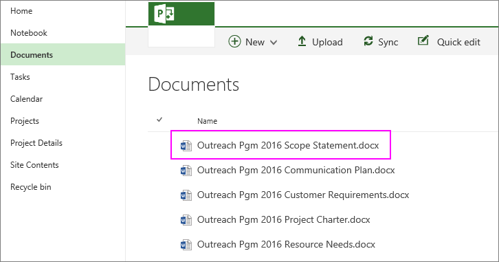
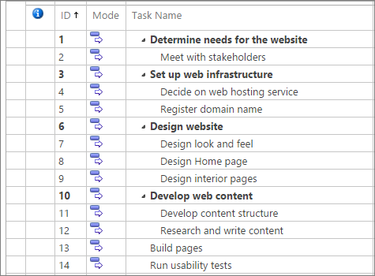
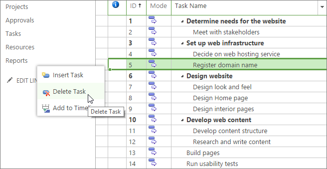
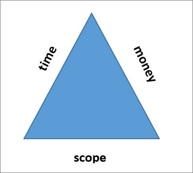
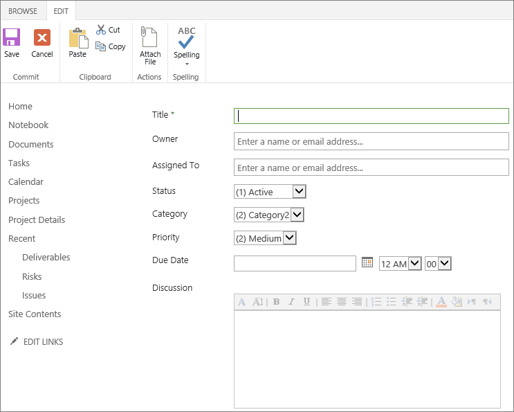

# Best practices for managing project scope in Project Online

The project scope defines what your project is doing—and just as importantly—what it's not doing. Managing your project scope can be tricky, because you're under constant pressure from managing stakeholders, your team members, and even yourself, to add "just this one small task." Although your project scope is bound to evolve throughout the project lifecycle, you want to ensure that the right tradeoffs are made. You can use capabilities in Project Web App for Project Online to help you manage scope so that even with the approved scope changes, project goals are still being met, especially those goals having to do with project schedule, budget, and outcomes.
  
    
    

In this topic
-  [What is project scope and where does it come from?](d5c1b77d-aa86-4c30-af0a-7904f46d2693.md#_what)
    
  
-  [Define the project scope and post the scope statement in Project Online](d5c1b77d-aa86-4c30-af0a-7904f46d2693.md#_define)
    
  
-  [Develop the work breakdown structure and task list in Project Online](d5c1b77d-aa86-4c30-af0a-7904f46d2693.md#_develop)
    
  
-  [Prevent scope creep](d5c1b77d-aa86-4c30-af0a-7904f46d2693.md#_prevent)
    
  
-  [Manage scope changes as issues in Project Online](d5c1b77d-aa86-4c30-af0a-7904f46d2693.md#_manage)
    
  

## What is project scope and where does it come from?

Project scope defines the boundaries of your project. It specifies what the project will do to accomplish its stated goal.
  
    
    
Your project stands a better chance of success if you, as the project manager, can maintain the discipline needed to keep the project within the bounds of its defined scope. It's too easy to slip in extra tasks here and there that seem to improve the overall project. The project scope grows larger and larger, sometimes imperceptibly, while the budget, schedule, and staffing remain the same. Often the managing stakeholder who's paying for the project is not aware that the project scope has grown so much. 
  
    
    
The remedy is scope management, which ensures that you and your project team do all the work required to complete the project scope—no more and no less. Scope management includes these major components:
  
    
    

- Defining scope and having it approved
    
  
- Developing the work breakdown structure (WBS) to detail the tasks to be done
    
  
- Preventing scope creep
    
  
- Managing scope changes throughout the project lifecycle and balancing the project triangle
    
  
 [The project scope defines what your project is doing—and just as importantly—what it's not doing. Managing your project scope can be tricky, because you're under constant pressure from managing stakeholders, your team members, and even yourself, to add "just this one small task." Although your project scope is bound to evolve throughout the project lifecycle, you want to ensure that the right tradeoffs are made. You can use capabilities in Project Web App for Project Online to help you manage scope so that even with the approved scope changes, project goals are still being met, especially those goals having to do with project schedule, budget, and outcomes.In this topicWhat is project scope and where does it come from?Define the project scope and post the scope statement in Project OnlineDevelop the work breakdown structure and task list in Project OnlinePrevent scope creepManage scope changes as issues in Project Online](d5c1b77d-aa86-4c30-af0a-7904f46d2693.md#_top)
  
    
    

## Define the project scope and post the scope statement in Project Online

Your project's scope definition is the project's "north star," the guide that keeps your project sailing straight toward the desired outcomes. Creating the scope statement ensures that everyone, from the project customer or sponsor to all your team members, understands what this project is striving to accomplish. 
  
    
    
The scope statement can be a concise summary or a detailed comprehensive document, depending on your organization's processes and the needs of the project. At minimum, your scope statement should include the following elements:
  
    
    

- **Project goal:** A brief statement that distills the purpose of the project.
    
  
- **Project outcome:** The features, functions, and other characteristics of the product, service, or result that the project is to achieve. This is the product scope.
    
  
- **Project boundaries:** Where the project begins and where it ends; what is being included and excluded from the project.
    
  
- **Project deliverables:** The tangible items being produced through project execution, for example, documents, processes, prototypes, training, or the final product.
    
  
- **Project limitations:** Any limitations that constrain project options, for example, time, budget, resource availability, regulations, and so on.
    
  
After you've developed your project scope statement, have upper management or the customer review and approve it. It's essential that the managing stakeholders—the ones paying the project bills—have the same vision of the project that you do…before you build the team and start executing the project. 
  
    
    
Then, in Project Web App for Project Online, post the scope statement in the document library for the project. After the scope statement is stored, it's readily accessible to you, your team members, and the managing stakeholders. 
  
    
    

1. In the Quick Launch, choose **Projects**.
    
  
2. In the **Project Center**, choose the name of the project to which the scope statement pertains.
    
    
  
    
    

  
    
    

  
    
    

  
    
    

    
  
3. In the Quick Launch, choose **Documents**. The **Documents** page for the project opens.
    
  
4. On the menu bar, choose **Upload**.
    
  
5. Navigate through your file system to find and choose the scope statement, and then choose **Open**. Your file is added to the document library for the project.
    
    
  
    
    

  
    
    

  
    
    

  
    
    

    
  
 [The project scope defines what your project is doing—and just as importantly—what it's not doing. Managing your project scope can be tricky, because you're under constant pressure from managing stakeholders, your team members, and even yourself, to add "just this one small task." Although your project scope is bound to evolve throughout the project lifecycle, you want to ensure that the right tradeoffs are made. You can use capabilities in Project Web App for Project Online to help you manage scope so that even with the approved scope changes, project goals are still being met, especially those goals having to do with project schedule, budget, and outcomes.In this topicWhat is project scope and where does it come from?Define the project scope and post the scope statement in Project OnlineDevelop the work breakdown structure and task list in Project OnlinePrevent scope creepManage scope changes as issues in Project Online](d5c1b77d-aa86-4c30-af0a-7904f46d2693.md#_top)
  
    
    

## Develop the work breakdown structure and task list in Project Online

With the scope statement written and approved, the project is more tangibly defined than it was when it was just an idea or a set of requirements. 
  
    
    
Now you develop the work breakdown structure (WBS) and detail all the tasks that must be completed to produce the deliverables that fulfill the scope. Simply put, the WBS is the outline of project phases, tasks, and subtasks that also describe project milestones and deliverables. Here's the process for developing the WBS:
  
    
    

1. Create a list of all the tasks that need to be done. You can  [Create a new task](99b036ba-8207-4702-a3fc-14c49f913683.md) in Project Web App for Project Online, or you can work outside of Project Online for now, whichever's easier for you.
    
  
2. Organize the task list into the logical structure (again, phases, tasks, subtasks, and so on).
    
    > [!TIP]
      > It's not necessary to add who's responsible for the tasks, budget information, or schedule information. All that can come later. The important thing is to break down the project goal into the individual, actionable tasks. 
3. Work through a few iterations of the WBS to get it right. Have your project stakeholders, especially your team members (or likely team members), review it for accuracy, completeness, and realism. Make sure it reflects the project scope.
    
  
4. Have your managing stakeholders approve the WBS.
    
  
When the WBS is approved,  [Create a new task](99b036ba-8207-4702-a3fc-14c49f913683.md) or make any necessary changes in Project Web App for Project Online. With the tasks added, you're starting to build the project according to the scope-based WBS.
  
    
    

  
    
    

  
    
    

  
    
    

  
    
    

  
    
    
 [The project scope defines what your project is doing—and just as importantly—what it's not doing. Managing your project scope can be tricky, because you're under constant pressure from managing stakeholders, your team members, and even yourself, to add "just this one small task." Although your project scope is bound to evolve throughout the project lifecycle, you want to ensure that the right tradeoffs are made. You can use capabilities in Project Web App for Project Online to help you manage scope so that even with the approved scope changes, project goals are still being met, especially those goals having to do with project schedule, budget, and outcomes.In this topicWhat is project scope and where does it come from?Define the project scope and post the scope statement in Project OnlineDevelop the work breakdown structure and task list in Project OnlinePrevent scope creepManage scope changes as issues in Project Online](d5c1b77d-aa86-4c30-af0a-7904f46d2693.md#_top)
  
    
    

## Prevent scope creep

During the planning and execution of your project, you're bound to see new ideas spring up. Often these new ideas reflect function and features about the product, service, or result that the project is producing. Scope is always under constant pressure to expand, as more is always wanted from a project. However, after the scope statement and the resulting WBS have been approved by the managing stakeholders, adding more to the scope invariably affects the project cost and schedule.
  
    
    
Adding tasks that often seem small or trivial to the project scope can lead to scope creep, which is the addition of tasks to the project scope without examining the effect of those additions on the project schedule, budget, or resources, and without obtaining customer approval. Scope creep is a huge problem, so much so that it's the reason many projects run late, go over budget, or fail completely.
  
    
    
Whether a team member or managing stakeholder suggests that a new task or set of tasks become part of the project work, ask the following questions:
  
    
    

- How does this task fit in to the project scope?
    
  
- How long will it take to accomplish?
    
  
- When will it need to be done?
    
  
- Who will be responsible for the task, and do they have time for the task?
    
  
- Will this task depend on the completion of other tasks and will other tasks depend on the completion of this task?
    
  
- If this task causes the schedule to run late or over-budget, what other tasks will have to be given up to meet the agreed-upon deadline and budget? Or, can more time and budget be made available?
    
  
By articulating the scope statement and having it approved by your managing stakeholders, the project already has a good chance of resisting scope creep. When these same managing stakeholders ask you to do more, you can point out that this indeed increases scope, and the scope statement can back you up.
  
    
    
This doesn't mean, of course, that after you have your scope statement and WBS approved, nothing must ever change. You invariably make discoveries during the course of project execution that warrant legitimate changes. However, become adept at recognizing the differences between scope creep and justified changes, and be sure you have a process for dealing with both. 
  
    
    
If you've added tasks to the schedule and you now see that some of them are beyond the project scope, you can delete them.
  
    
    

1. In the Project Online Quick Launch, choose ** Projects**.
    
  
2. In the **Project Center**, choose the name of the project. The project opens and shows all tasks.
    
  
3. Right-click the row heading for the task you want to delete. The row heading is the far-left cell of the task row.
    
    
  
    
    

  
    
    

  
    
    

  
    
    

    
  
4. In the shortcut menu which appears, choose **Delete Task**. The selected task is removed.
    
    > [!TIP]
      > To delete multiple adjacent tasks, select the row heading for the first task, hold down the Shift key, and then select the row heading for the last task. This selects all tasks between the first and last rows. To delete multiple nonadjacent tasks, select the row heading for the first task, hold down the Ctrl key, and then select the row headings for the other tasks you want to delete. Right-click in one of the row headings, and then choose **Delete Task**. 
5. On the **Task** tab, in the **Project** group, choose **Save.** You can also press Ctrl+S.
    
  
6. When you're ready to publish the changes you've made to the schedule for everyone else to see, on the **Task** tab, in the **Project** group, choose **Publish**.
    
  

> [!NOTE]
> Although your project team members can add rows to their timesheets, they cannot add new tasks to the schedule from their timesheet. They can only add tasks they're already assigned to, personal tasks, or administrative time tasks. 
  
    
    

 [The project scope defines what your project is doing—and just as importantly—what it's not doing. Managing your project scope can be tricky, because you're under constant pressure from managing stakeholders, your team members, and even yourself, to add "just this one small task." Although your project scope is bound to evolve throughout the project lifecycle, you want to ensure that the right tradeoffs are made. You can use capabilities in Project Web App for Project Online to help you manage scope so that even with the approved scope changes, project goals are still being met, especially those goals having to do with project schedule, budget, and outcomes.In this topicWhat is project scope and where does it come from?Define the project scope and post the scope statement in Project OnlineDevelop the work breakdown structure and task list in Project OnlinePrevent scope creepManage scope changes as issues in Project Online](d5c1b77d-aa86-4c30-af0a-7904f46d2693.md#_top)
  
    
    

## Manage scope changes as issues in Project Online

It's unrealistic to expect that the scope you have at project closure will be identical to the one you had at project initiation. New discoveries are always made during project planning and execution. New ideas improve on old ideas. Other activities create process efficiencies with a little adjustment. The project needs to respond to change to remain viable.
  
    
    
However, all stakeholders need to be aware that every change comes with an effect. A good way to envision this is with the project triangle. The three sides of the project triangle are scope, time, and money.
  
    
    

  
    
    

  
    
    

  
    
    

  
    
    

  
    
    
If the scope side of the triangle is lengthened, but the time and money sides are unchanged, the triangle is unbalanced and the project is headed for trouble. When there's a scope change, the time side, money side, or both sides need to be correspondingly lengthened.
  
    
    
This means that when one of your stakeholders wants to add something to the project, you have to remind them that this change will probably delay the project or make it cost more. 
  
    
    
A good way to handle these requests is through a change management process. Having a change review board brings everyone involved to the table to examine the facts of the addition, review the scope statement, and keep the project triangle balanced. 
  
    
    
The change management process starts with a change request, in which the requester describes the proposed change and answers  [questions about the effect of the change on the project](d5c1b77d-aa86-4c30-af0a-7904f46d2693.md#_questions). 
  
    
    
The change review board should at least include the project sponsor, the project manager, the team member(s) who would be responsible for carrying out the additional tasks, and the person making the change request. The board discusses the change and makes its decision. This decision is documented and stored with the other project documents that can be accessed by project stakeholders. 
  
    
    
Through this change control process, scope creep is prevented, and legitimate scope changes are accounted for in terms of schedule, budget, resources, quality, risk, overall project goals, and success criteria.
  
    
    

### Track change requests as issues

In Project Web App for Project Online, you can use the issue tracking capability to enter change requests and their resolution.
  
    
    
With issue tracking, you can enter the title of the change request, assign it to a responsible team member (possibly you as project manager, the team member affected by the change, or a change review manager), and give it a due date (possibly the date of the change review meeting). You can also enter a status and priority on the change request. 
  
    
    
You can attach the change request form and other related documentation to the issue. You can dedicate an issue category to change requests so you can list them together. When a change request is resolved, you can mark its status as Closed. 
  
    
    
Team members, upper management, and other stakeholders with permission can also view and edit change requests in the Project Web App issue tracking system. 
  
    
    

### Record an issue

1. In Project Online, in the Quick Launch, choose **Projects**.
    
  
2. On the ** Project Center** page, under the **Project Name** column, choose the name of the project for which you want to add or edit a change request.
    
  
3. In the left pane, choose **Issues**.
    
  
4. On the **Issues** page, click **new item**.
    
  
5. Complete the form which appears. The only required field is **Title**. Additional fields include **Owner**, **Assigned To**, **Status**, **Category**, **Priority**, **Due Date**, **Discussion**, and **Resolution**. Complete any of the other fields for which you have information. You can always add more information later.
    
    
  
    
    

  
    
    

  
    
    

  
    
    

    
  
6. You can attach a file to the issue record, for example, the change request form. On the **Edit** tab, in the **Actions** group, choose **Attach File**. Select **Choose File**, navigate to and select the file, and then click **Open.** Click ** OK**. 
    
  
7. At the bottom of the page, choose the **Save** button.
    
  

### Modify issue information

1. In Project Online, in the Quick Launch, choose **Projects**.
    
  
2. On the **Project Center** page, under the **Project Name** column, choose the name of the project for which you want to modify a change request.
    
  
3. In the left pane, choose **Issues**.
    
  
4. On the **Issues** page, choose the name of the risk you want to modify.
    
  
5. On the **View** tab, in the **Manage** group, choose **Edit Item**. 
    
  
6. Change or complete any of the fields.
    
  
7. At the bottom of the page, choose the **Save** button.
    
  

### View the list of issues on a project

1. In Project Online, in the Quick Launch, choose **Projects**.
    
  
2. On the **Project Center** page, under the **Project Name** column, choose the name of the project for which you want to modify a change request.
    
  
3. In the left pane, choose **Issues**.
    
  
4. On the **Issues** page, review the issues entered for the current project.
    
  
5. To sort in ascending order by a field, for example, **Assigned To**, **Status**, **Category**, or **Due Date**, select the column heading. To sort in descending order, select the column heading a second time. 
    
    
  
    
    

  
    
    

  
    
    

  
    
    

    
  
 [The project scope defines what your project is doing—and just as importantly—what it's not doing. Managing your project scope can be tricky, because you're under constant pressure from managing stakeholders, your team members, and even yourself, to add "just this one small task." Although your project scope is bound to evolve throughout the project lifecycle, you want to ensure that the right tradeoffs are made. You can use capabilities in Project Web App for Project Online to help you manage scope so that even with the approved scope changes, project goals are still being met, especially those goals having to do with project schedule, budget, and outcomes.In this topicWhat is project scope and where does it come from?Define the project scope and post the scope statement in Project OnlineDevelop the work breakdown structure and task list in Project OnlinePrevent scope creepManage scope changes as issues in Project Online](d5c1b77d-aa86-4c30-af0a-7904f46d2693.md#_top)
  
    
    

## See also

#### Other Resources

  
    
    
 [Create a new task](99b036ba-8207-4702-a3fc-14c49f913683.md)
  
    
    
 [The project triangle](http://technet.microsoft.com/library/8C892E06-D761-4D40-8E1F-17B33FDCF810%28Office.14%29.aspx)
  
    
    
 [Link risks, issues, files, or deliverables to tasks](3ef3059a-5041-4f6e-9cc8-0341fd6b1aea.md)