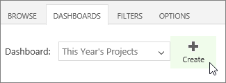
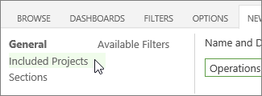
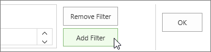
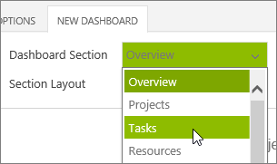
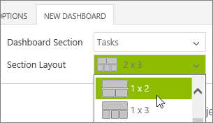
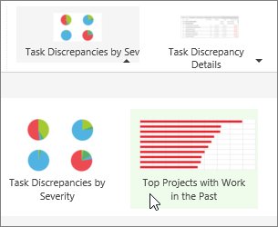
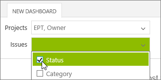
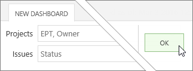

# Create a portfolio dashboard

If the dashboards that are included with Office 365 Project Portfolio Dashboard aren't quite showing what you'd like them to, you can create your own new dashboard that is shared with your organization.
  
    
    

1. Choose **Dashboards** > **Create**.
    
    
  
    
    

  
    
    

  
    
    

  
    
    

    
  
2. On the **New Dashboard** tab, give the dashboard a **Name** and **Description**.
    
  
3. Choose **Included Projects** on the left side of the **New Dashboard** tab, to continue setting up your new dashboard.
    
    
  
    
    

  
    
    

  
    
    

  
    
    

    
  
4. In the **Available Filters** section, use the **Select Field** and **Allowed Values** boxes to build criteria, and then click **Add Filter** to include the criteria in the **Active Filters** box. Projects that meet the criteria are included in the dashboard.
    
    
  
    
    

  
    
    

  
    
    

  
    
    

    
  
5. Choose **Sections** on the left side of the **New Dashboard** tab, and then build each section of the dashboard:
    
  - Use the **Dashboard Section** list to choose which section you're customizing. Sections are listed on the left side of the dashboard.
    
    
  
    
    

  
    
    

  
    
    

  
    
    

    
  
  - Choose the **Section Layout** you want to use to display the [Portfolio dashboard elements](706dd1f5-c3a3-47a2-a40f-43e86343a877.md) in the section you selected.
    
    
  
    
    

  
    
    

  
    
    

  
    
    

    
  
  - Choose which  [Portfolio dashboard elements](706dd1f5-c3a3-47a2-a40f-43e86343a877.md) you want to display in each portion of the section layout you selected.
    
    
  
    
    

  
    
    

  
    
    

  
    
    

    
  
6. Choose **Available Filters** on the left side of the **New Dashboard** tab, and then choose which filters you want to make available to help narrow down the information available on the dashboard.
    
    
  
    
    

  
    
    

  
    
    

  
    
    

    
  
7. When you're done setting up your new dashboard, choose **OK**.
    
    
  
    
    

  
    
    

  
    
    

  
    
    

    
  
Your new dashboard will be included in the **Dashboard** list on the **Dashboards** tab.
  
    
    

  
    
    

  
    
    

  
    
    
