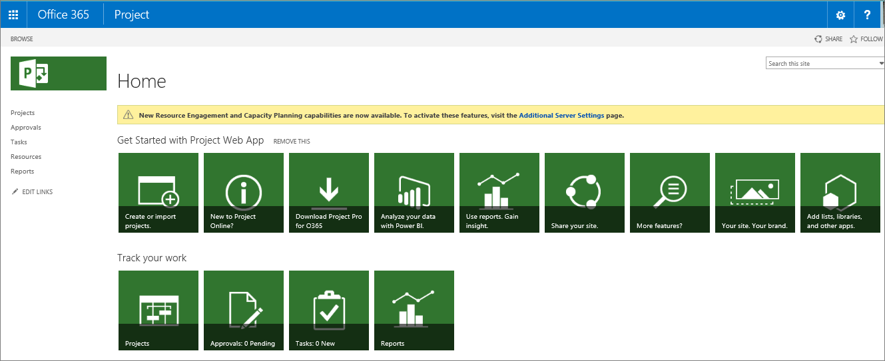
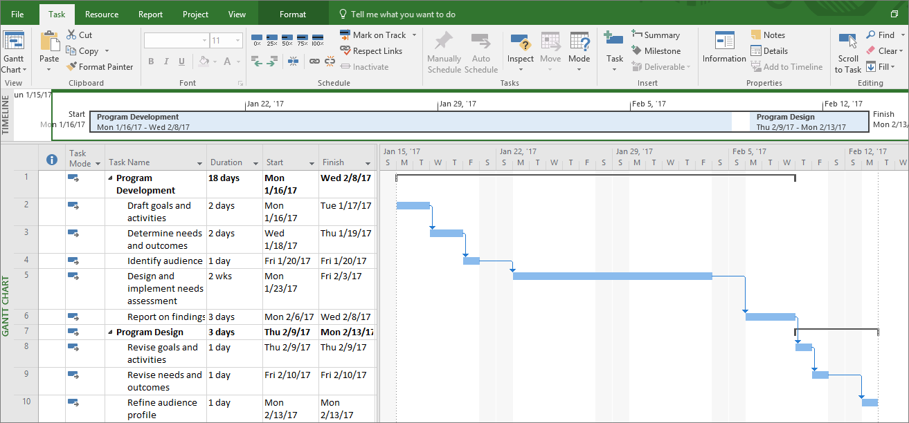

# Feature comparison: Project Online vs. Project Professional

Project Online and Project Professional are two different solutions that meet different project management needs. How do you know which one is the right one for your organization? In short, Project Online is a web-based service that's ideal for project team collaboration, time tracking, and project portfolio management. On the other hand, Project Professional is a desktop application which offers robust tools for the professional project manager.
  
    
    

> [!NOTE]
> Project Online is not a web-based version of Project Professional. Instead, the two are different solutions for different project management needs. 
  
    
    

## In this topic

-  [What you get with Project Online](ee6fac40-307b-49da-a74a-b8f3604d1d20.md#_what1)
    
  
-  [What you get with Project Professional](ee6fac40-307b-49da-a74a-b8f3604d1d20.md#_what2)
    
  
-  [Compare features side by side](ee6fac40-307b-49da-a74a-b8f3604d1d20.md#_compare)
    
  

## What you get with Project Online

Project Online is the web-based solution that the entire project team can use for all aspects of project management, resource management, and project portfolio management (PPM) of multiple projects across the organization:
  
    
    

- **Project managers** can set up their project schedules and assign tasks to team members.
    
  
- **Resource managers** can balance broad sets of resource requirements by setting up resource pools with detailed information about skill sets, availability, and costs.
    
  
- **Team members** can track their work in timesheets and submit status information against their assigned tasks, and also see the big picture of their project and task dependencies.
    
  
- **Portfolio managers** can view and analyze the collection of projects for schedule, cost, resources, and more.
    
  
- **Executives can** see the high-level view of projects and their priorities, and make sure that projects align with the organization's strategic goals.
    
  
As a cloud-hosted PPM service, you get Project Online through Office 365. It's an alternative to Project Server, the on-premises PPM product. With Project Online hosted, you have no up-front infrastructure costs to implement PPM for your organization, and you can immediately configure and use Project Web App to manage projects, resources, and portfolios.
  
    
    

  
    
    

  
    
    

  
    
    

  
    
    

  
    
    
Here are more details about what you get with Project Online:
  
    
    

- A platform built on SharePoint
    
  
- Built-in reporting tools, including business intelligence (BI) tools and dashboard
    
  
- Project team collaboration tools including integration with Skype for Business and Yammer
    
  
- Mobile capabilities so managers can check status and team members can submit updates
    
  
 [Project Online and Project Professional are two different solutions that meet different project management needs. How do you know which one is the right one for your organization? In short, Project Online is a web-based service that's ideal for project team collaboration, time tracking, and project portfolio management. On the other hand, Project Professional is a desktop application which offers robust tools for the professional project manager.Project Online is not a web-based version of Project Professional. Instead, the two are different solutions for different project management needs. ](ee6fac40-307b-49da-a74a-b8f3604d1d20.md#_top)
  
    
    

## What you get with Project Professional

Project Professional is the desktop solution which offers robust tools for professional project managers to schedule and track projects. Unlike a PPM environment in which many users access the application, project managers typically are the only ones using Project Professional, although they can easily share information through views and reports with the project team and stakeholders.
  
    
    
Project Professional is a desktop project management application. When included with your Project Online subscription, the application is continually updated and available as long as the subscription is current.
  
    
    

  
    
    

  
    
    

  
    
    

  
    
    

  
    
    
Here are more details about what you get with Project Professional:
  
    
    

- Detailed project planning capabilities including several Gantt chart views, a PERT chart view, work breakdown structure (WBS) codes, and the ability to save multiple baselines
    
  
- Resource management tools including working time calendar management, resource leveling of over-allocations and under-allocations, and a variety of resource views
    
  
- The ability to create a master project with subprojects
    
  
- Custom project, resource, and assignment fields
    
  
- Advanced cost and schedule analysis with earned value fields
    
  
- A project best practice analyzer
    
  
 [Project Online and Project Professional are two different solutions that meet different project management needs. How do you know which one is the right one for your organization? In short, Project Online is a web-based service that's ideal for project team collaboration, time tracking, and project portfolio management. On the other hand, Project Professional is a desktop application which offers robust tools for the professional project manager.Project Online is not a web-based version of Project Professional. Instead, the two are different solutions for different project management needs. ](ee6fac40-307b-49da-a74a-b8f3604d1d20.md#_top)
  
    
    

## Compare features side by side

The following table shows the major features available in Project Online, Project Professional, and both. 
  
    
    

||||
|:-----|:-----|:-----|
|**Feature**   |**Project Online**   |**Project Professional**   |
|Plan project schedule and costs    | X   | X   |
|Manage tasks    |X    |X    |
|Manage resources    |X    |X    |
|Get business intelligence and generate reports    |X    |X    |
|Sync with SharePoint tasks    |X    |X    |
|Collaborate by using Skype for Business presence    |X    |X    |
|Download version upgrades    |X    |X    |
|Execute the right portfolio of projects with demand management    |X    ||
|Submit timesheets for team members    |X    ||
|Share documents    |X    ||
|Select and optimize the project portfolio    |X    ||
|Install the full Project application on up to five computers    ||X    |
|Install with click-to-run deployment    ||X    |
|Sync with Project Online or Project Server    ||X    |
   

> [!TIP]
> If your subscription includes both Project Online and Project Professional, the two can work together with synchronized tasks, resources, and assignments. 
  
    
    

 [Project Online and Project Professional are two different solutions that meet different project management needs. How do you know which one is the right one for your organization? In short, Project Online is a web-based service that's ideal for project team collaboration, time tracking, and project portfolio management. On the other hand, Project Professional is a desktop application which offers robust tools for the professional project manager.Project Online is not a web-based version of Project Professional. Instead, the two are different solutions for different project management needs. ](ee6fac40-307b-49da-a74a-b8f3604d1d20.md#_top)
  
    
    

## See also

#### Other Resources

  
    
    
 [Project Online Service Description](https://technet.microsoft.com/en-us/library/project-online-service-description.aspx)