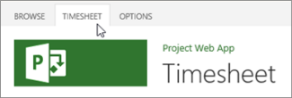
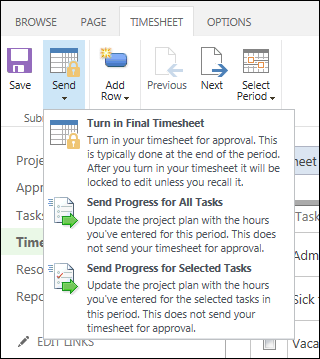
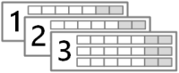
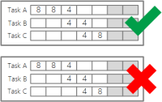
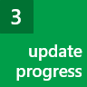

# Step 2: Turn in a timesheet

 [
  
    
    
](71708a8a-dcb1-4b18-b9eb-cbbd23321db3.md)
  
    
    

  
    
    
 [
  
    
    
](ca5c3826-85bf-4a31-9351-3b83fd7c8fe0.md)
  
    
    

Timesheets are the core of what you, as a team member, do in Project Online.
## How do I fill out my timesheet?

1. On the Quick Launch, click **Timesheet**.
    
    
  
    
    

  
    
    

  
    
    

  
    
    

    
    The Timesheet view includes two sides, and a splitter in the middle of the table.
    
    
  
    
    

  
    
    

  
    
    

  
    
    

    
    The left side lists your tasks, as well as things like sick time and vacation.
    
    The right side is where you enter the actual hours that you spent each day on your tasks.
    
    > [!TIP]
      >  Slide the splitter in the middle to see more of either side of the view.> 
  
    
    

  
    
    

  
    
    

  
    
    

2. Now that you're in the Timesheet view, here are some things you can do:
    
  -  [Enter hours on your timesheet](a44e4d20-a5f0-4f36-94c0-d0abeca8366f.md)
    
  
  -  [Add a task to your timesheet](4fed12e4-7b1a-4a6e-acd9-eca29eb78304.md)
    
  
  -  [Add a task to your timesheet](4fed12e4-7b1a-4a6e-acd9-eca29eb78304.md)
    
  
3. After you've entered your hours on a timesheet, the next step is to submit it to your manager for approval.
    
    Click the **Timesheet** tab on the ribbon.
    
    
  
    
    

  
    
    

  
    
    

  
    
    

    
  
4. Click **Send** > **Turn in Final Timesheet**.
    
    
  
    
    

  
    
    

  
    
    

  
    
    

    
    > [!TIP]
      >  When you choose **Turn in Final Timesheet**, your timesheet is locked for editing. If you're not ready to commit to that, click **Send Progress for All Tasks** or **Send Progress for Selected Tasks**. 

## Why are timesheets important?

 **Nobody loves filling out timesheets.** If you're working on a lot of different tasks at the same time, it can be hard to figure out how much of your day was spent on each task. It's also sometimes tough to commit to having worked a set number of hours. Maybe you feel like you should be working more hours, or maybe you feel like you're working too much. In either case, you might not feel inclined to draw attention to your work hours.
  
    
    
When it comes to managing projects, the focus really isn't on your work ethic, although of course that's still important. **The focus is about making sure the right things get done on time and within budget.** It's about making sure there are enough people to get the work done without burning anyone out, or costing the organization more money than planned.
  
    
    
Project managers use timesheet data to help them figure out how many people need to be assigned to similar tasks in future projects. Your HR department might use this data to make sure they have appropriate headcount allocated to certain roles. And yes, timesheets can translate to dollars in your pocket if you're paid hourly. But it's important to remember that's not all your timesheet data is… **there are bigger-picture benefits for your organization, that result in better planning and efficiency going forward.**
  
    
    
And you'll see the benefit of that better planning and efficiency too, because **you won't end up having to put in** **lots** **of overtime trying to get your work done on time.** Your project manager will have a realistic expectation of how long things take to get done, or how many people are actually needed on a given task, and you might end up getting your weekend back!
  
    
    

## How do timesheets work in Project Online?

Behind the scenes, an administrator sets up the timesheet periods for your organization. For example, each week might be a separate timesheet.
  
    
    

  
    
    

  
    
    

  
    
    

  
    
    

  
    
    
When your project manager assigns you to a task, that task shows up on your timesheet during the period when it is scheduled in the project plan.
  
    
    

  
    
    

  
    
    

  
    
    

  
    
    

  
    
    
You fill out the actual hours you spend on each task during the timesheet period, and then you submit it.
  
    
    

  
    
    

  
    
    

  
    
    

  
    
    

  
    
    
Every person in Project Online is assigned a timesheet manager (sometimes more than one). Your timesheet manager might be the project manager, or it might be someone else, like a resource manager that is responsible for people across your organization.
  
    
    
Your timesheet manager receives the timesheet that you turned in, and reviews it. If everything looks good, your timesheet is approved. If things look different than expected, your timesheet manager might reject it and add some comments about why it's being rejected.
  
    
    

  
    
    

  
    
    

  
    
    

  
    
    

  
    
    
If your timesheet is approved, the time you submitted counts toward the total amount of work done on the task, and the amount of work remaining on the task is reduced. This is recorded in the overall project plan, so that the project manager can accurately account for whether the project is progressing as planned.
  
    
    

## NEXT STEP...

Next, learn about  [Step 3: Update progress](ca5c3826-85bf-4a31-9351-3b83fd7c8fe0.md).
  
    
    
 [
  
    
    
](71708a8a-dcb1-4b18-b9eb-cbbd23321db3.md)
  
    
    

  
    
    
 [
  
    
    
](ca5c3826-85bf-4a31-9351-3b83fd7c8fe0.md)
  
    
    
