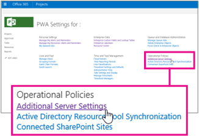

# Turn on notifications in Project Web App

 * [Project help](afac1e38-1219-4a88-bd22-81534778d528.md)* 
  
    
    

Project Web App can be set up to send email notifications, helping people stay on top of what's going on in a project. When notifications are turned on, users can decide which notifications they'd like Project Web App to send.
> [!NOTE]
> This article covers how an administrator turns on notifications across all of Project Web App.  [Get email reminders about your work in Project Web App](2372c181-1c98-416a-9306-ac28f027334b.md)
  
    
    

 **To turn on notifications**
1. In Project Web App, choose **Settings**
  
    
    

  
    
    
 > **PWA Settings**.
    
  
2. Under **Operational Policies**, choose **Additional Server Settings**.
    
    
  
    
    

  
    
    

  
    
    

  
    
    

    
  
3. Under **Notification Email Settings** (at the bottom of the page), select the **Turn on notifications** check box, and then choose **Save**.
    
  
