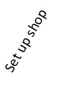

# Project Online setup sequence

  
    
    

  
    
    

  
    
    

  
    
    
 [
  
    
    
](3fda2b6f-3145-46fa-af02-e39a00450ec1.md) [
  
    
    
](e65c6c3b-68af-4d13-9504-5626b73e54ce.md) [
  
    
    
](463db028-1ec6-4d19-9f7b-4ecbf9122cca.md)
## Wait, so what is Project Online?

|||
|:-----|:-----|
|
  
    
    

  
    
    

  
    
    

  
    
    
   |**[Project Online](https://go.microsoft.com/fwlink/p/?linkid=402127) is web-based, and is great for:**    Managing multiple projects.    Tracking work on timesheets.    Balancing broad resource needs.    *(If you're looking for a hosted version of Project Server, this is it!)*    |
|||
||**[Project Online Desktop Client](https://go.microsoft.com/fwlink/p/?linkid=402129) is a downloaded desktop program, and is great for:**    Detailed project planning.    Managing resource calendars.    Rich analysis of project work.    *(If you're looking for a subscription-based version of Project Professional, this is it!)*    |
   
 **To be clear, Project Online is NOT a web-based version of Project Professional.** Project Online is an entirely separate service that offers full portfolio and project management tools on the web. It includes Project Web App, and can, if you're a subscriber, also include Project Online Desktop Client.
  
    
    

## Got the wrong thing?

 **If you need to cancel and subscribe to something else,** choose **Billing** > **Subscriptions** in the Office 365 admin center, choose the subscription you want to cancel, and then click **Cancel subscription** in the pane on the right. Then, you can find the right product to subscribe to and add that to your existing Office 365 account.
  
    
    

## Need help?

Take a look through the  [Find information about Project Online](http://technet.microsoft.com/library/e33e2273-dfaf-4eb7-aacc-393e80e58a97%28Office.14%29.aspx) on Office.com. If you're still stuck, try posting your questions and issues on the [Project Online discussion forum](https://social.technet.microsoft.com/Forums/projectserver/en-US/home?forum=projectonline).
  
    
    
 [
  
    
    
](https://social.technet.microsoft.com/forums/en-us/category/project)
  
    
    
